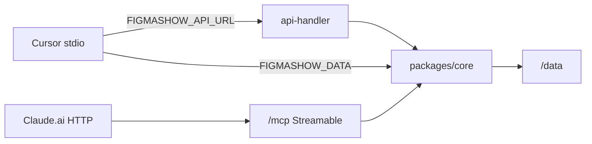

# Auditoria FigmaShow pós-1.0.1 + Claude

## Veredito

Os commits `e9a9a46` (1.0.1) e `8f1ae53` (Claude) entregaram **de verdade** o núcleo do roadmap: CAS+mutex, operations, poll `/revision`, hardening do editor, tools MCP novas e **Streamable HTTP** em `/mcp` para Claude.ai. O CHANGELOG descreve o pacote como fechado, mas há itens **parciais** e pelo menos **um bug concreto** (`create_version` remoto sem `expectedRevision` → 400).

## O que está DONE

- **Persistência:** mutex in-process, `expectedRevision` obrigatório, thumbs atômicos, GC `*.tmp`, `normalizeComponents` na gravação
- **API:** `/revision` + ETag, `POST .../operations`, versions GET/POST, health com version/commit/mcp, logs JSON
- **Editor:** dirty seguro, modal 409, hooks `useBoardSync`/`useHistory`/`useSelection`, debounce props, rename home, confirm delete
- **MCP:** `delete_screen`, lifecycle projeto, `batch_operations`, `add_nodes`, factory `createFigmashowMcpServer()`, HTTP mount + smoke
- **Ops:** CI, backup script, smoke Docker, versão `1.0.1`

## PARTIAL / bugs a fechar (prioridade)

| Item | Problema | Path |
|------|----------|------|
| `create_version` remoto | POST sem `expectedRevision` → 400 | [`remote.js`](figmashow/packages/mcp/src/remote.js) |
| SSE | Só no Express prod; em `npm run web` EventSource falha → só poll | [`server.js`](figmashow/apps/server/server.js) vs [`api-handler.js`](figmashow/apps/web/api-handler.js) |
| Retry 409 | Só no PUT de `commitBoard`; `batch_operations` não retenta | [`createServer.js`](figmashow/packages/mcp/src/createServer.js) |
| `/mcp` auth | Basic Auth opcional; sem credencial = superfície de escrita pública | [`httpMount.js`](figmashow/packages/mcp/src/httpMount.js), [`server.js`](figmashow/apps/server/server.js) |
| Renderer único | Home + protótipo usam `BoardNodeView`; canvas (`PhoneFrame`) ainda duplicado | [`PhoneFrame.jsx`](figmashow/apps/web/src/PhoneFrame.jsx) |
| E2E | Smoke API/navegação; não edita canvas nem protótipo | [`e2e/smoke.spec.js`](figmashow/e2e/smoke.spec.js) |
| Fase 4 UI | Tokens/auto-layout/versions existem em schema/ops/MCP; **sem UI** de editor; assets só static; sem `restore_version` | core + MCP |

## Três modos MCP (sólido)

| Modo | Entrada | Dados |
|------|---------|-------|
| Stdio local | Cursor + `FIGMASHOW_DATA` | Disco |
| Stdio remoto | Cursor + `FIGMASHOW_API_URL` | HTTP → API |
| Streamable HTTP | Claude.ai → `https://dominio/mcp` | Disco no container (anti-loop apaga `FIGMASHOW_API_URL`) |

Documentação boa em [`DEPLOY.md`](figmashow/DEPLOY.md) §7b; README ainda atrasado nas tools novas.

## Próximos movimentos (curtos)

1. **Hotfix:** `createVersionRemote` com `expectedRevision` + smoke `tools/call`.
2. **Paridade dev/prod:** SSE no `api-handler` (ou plugin Vite).
3. **Confiabilidade MCP:** retry 409 em operations; Basic Auth obrigatório quando `/mcp` estiver exposto (ou token dedicado).
4. **Qualidade:** E2E canvas + unificar `PhoneFrame` com `BoardNodeView`.
5. **Só então:** UI de tokens/auto-layout/`restore_version` e upload de assets.
