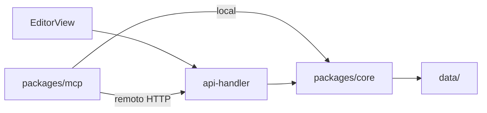

# Roadmap FigmaShow pós-1.0 (atualizado)

## Estado atual

- Fluxo crítico validado em produção: editor manual, MCP remoto, persistência em `/data`, escrita atômica temp+rename, revisão/CAS, protótipos e telas complexas criadas ao vivo via MCP.
- Versão do pacote ainda `0.1.0` em [`figmashow/package.json`](figmashow/package.json) — alinhar na release 1.0.1.
- Revisão de arquitetura ([Revisar arquitetura e MCP](598308e6-cc11-44e3-82a4-0110ba2793f7)) confirma base sólida para **single-user/VPS pessoal**, com riscos concretos abaixo.
- Revisão de editor/UX ([Revisar editor e UX](ab8a4d09-0767-41cc-8cdd-71556368fbcf)) confirmou **4 bugs P0** no editor antes de empilhar features.

## Riscos técnicos (consolidados)

| Risco | Severidade | Evidência | Mitigação no roadmap |
|-------|------------|-----------|----------------------|
| **TOCTOU no CAS** — leitura e gravação sem lock; MCP local + Vite no mesmo `data/` podem sobrescrever | Alta | [`board.js`](figmashow/packages/core/src/board.js) L75–99 | Mutex por `boardPath` na Fase 1.0.1 |
| **`expectedRevision` opcional** — PUT sem revision bypassa CAS | Alta | [`api-handler.js`](figmashow/apps/web/api-handler.js) L209–210, L285–286 | Exigir revision (400 se ausente) na 1.0.1 |
| **`index.json` sem CAS** — criações paralelas perdem entrada | Média | [`projects.js`](figmashow/packages/core/src/projects.js) | Serializar writes do catálogo na 1.0.1 |
| **Poll full-board 500 ms** | Alta (I/O) | [`EditorView.jsx`](figmashow/apps/web/src/EditorView.jsx) L203, L626 | `GET .../revision` na 1.0.2; SSE/ETag na 1.2 |
| **409 na UI = perda de edição** | Alta (UX) | [`EditorView.jsx`](figmashow/apps/web/src/EditorView.jsx) | Modal manter/aceitar na 1.0.2 |
| **MCP remoto = GET→muta→PUT inteiro** | Alta (409) | [`remote.js`](figmashow/packages/mcp/src/remote.js), [`server.js`](figmashow/packages/mcp/src/server.js) | API transacional na 1.1 |
| **Lacunas MCP vs UI** — sem `delete_screen`, lifecycle de projeto, retry 409 | Média | [`server.js`](figmashow/packages/mcp/src/server.js) (grep vazio para essas tools) | Paridade MCP na 1.0.2 / 1.1 |
| **Thumbs não atômicos** | Baixa | [`api-handler.js`](figmashow/apps/web/api-handler.js) L183 `writeFileSync` | `writeFileAtomic` na 1.0.1 |
| **`.tmp` órfãos no Windows** | Baixa | `data/active.json.*.tmp` no git status | GC de tmp + teste Windows na 1.0.1 |
| **Revisions legadas tipo timestamp** | Baixa | projetos com revision ~1.7e12 | Migração one-shot opcional na 1.1 |

---

## Fase 1 — Congelar e operar o 1.0 (1.0.1)

**Release e operação**
- Alinhar versões para `1.0.0`, criar `CHANGELOG.md`, expor versão/commit em `/api/health`.
- CI: `npm test`, build Vite, smoke Docker (health, SPA fallback, body limit, runtime).
- Backup/restauração verificável de `/data`: snapshot compactado, retenção, validação JSON, exercício documentado de restore; export/import de projeto individual.
- Logs estruturados mínimos (startup, gravação, conflito 409, erro, shutdown).
- Documentar decisões em [`figmashow/DEPLOY.md`](figmashow/DEPLOY.md): app pública, Basic Auth opcional, container root.

**Endurecimento de persistência** (novo, da revisão de arquitetura)
- **Mutex por `boardPath`** em `writeBoardIfRevision` — fila in-process serializa read-check-write.
- **Mutex/serialização para `index.json` e `active.json`** em [`projects.js`](figmashow/packages/core/src/projects.js).
- **`expectedRevision` obrigatório** em `PUT /api/projects/:id` (400 se ausente); manter exceção só para criação inicial de board vazio.
- **Thumbs atômicos** — trocar `writeFileSync` por [`writeFileAtomic`](figmashow/packages/core/src/atomic.js) no POST thumb.
- **GC de `*.tmp` órfãos** no startup + teste Windows em [`board.test.js`](figmashow/packages/core/src/board.test.js) ou teste dedicado.
- **Testes de concorrência**: dois writers simultâneos no mesmo board → exatamente um vence, outro recebe 409.

---

## Fase 1.5 — Hardening do editor (1.0.2)

Prioridade imediata após 1.0.1 — baixo esforço, alto impacto manual + MCP.

| Bug | Ação | Paths |
|-----|------|-------|
| Dirty timeout perde edição | Remover auto-clear de dirty; fila/retry PUT; `beforeunload` se save pendente | [`EditorView.jsx`](figmashow/apps/web/src/EditorView.jsx) |
| Props spam histórico | Debounce/commit-on-blur em X/Y/nome/texto | [`PropertiesPanel.jsx`](figmashow/apps/web/src/PropertiesPanel.jsx) |
| 409 descarta local | Modal: manter local / aceitar remoto / tentar de novo | [`EditorView.jsx`](figmashow/apps/web/src/EditorView.jsx) |
| Export instâncias | Reusar `resolveInstanceTree` em CSS/React | [`export.js`](figmashow/packages/core/src/export.js) |
| Rename na home | Usar `PATCH` existente | [`HomePage.jsx`](figmashow/apps/web/src/home/HomePage.jsx) |
| Apagar tela fácil | Confirm antes de delete frame | [`EditorView.jsx`](figmashow/apps/web/src/EditorView.jsx), [`LayersPanel.jsx`](figmashow/apps/web/src/LayersPanel.jsx) |

**Alívio de I/O (arquitetura)**
- Endpoint leve **`GET /api/projects/:id/revision`** (ou `HEAD` + `ETag`) — poll da UI consulta só revision quando idle/dirty=false.
- Reduzir `POLL_MS` efetivo: full board só quando revision mudou.

**Paridade MCP mínima** (antes da API transacional completa)
- Tools: `delete_screen`, `rename_project`, `trash_project`, `restore_project`.
- **Retry 1× em 409** no MCP remoto: reload board pinado → reaplicar mutação pura → falhar com mensagem clara se persistir.

---

## Fase 2 — MCP transacional e confiável (1.1)

- API de **operações atômicas** por projeto em [`api-handler.js`](figmashow/apps/web/api-handler.js): `expectedRevision` + lista de ops + uma gravação CAS.
- Serializar mutações por `projectId` no servidor; retry limitado só para ops idempotentes.
- Tools MCP de alto nível: `add_nodes`, `batch_operations`, criação de árvore/grupo em uma chamada.
- **`normalizeComponents` dentro de `normalizeBoard`** — defs consistentes no disco.
- **Migração opcional** de revisions timestamp → sequencial.
- **Deprecar `/api/board` legado** — tudo via `/api/projects/:id`.
- Testes integração MCP stdio: local + remoto, pin, timeout, 409, batch, rollback.

---

## Fase 3 — Sincronização e arquitetura do editor (1.2)

- Substituir poll agressivo por **SSE** (servidor único) ou long-poll com `ETag`.
- Extrair `useBoardSync`, `useHistory`, `useSelection` de [`EditorView.jsx`](figmashow/apps/web/src/EditorView.jsx).
- Renderer único: [`PhoneFrame.jsx`](figmashow/apps/web/src/PhoneFrame.jsx), [`PrototypePreview.jsx`](figmashow/apps/web/src/PrototypePreview.jsx), [`boardPreviewCore.jsx`](figmashow/apps/web/src/home/boardPreviewCore.jsx).
- Playwright E2E: home → criar → editar → reload → protótipo → lixeira.

---

## Fase 4 — Produtividade de design (1.3)

Versões/snapshots, tokens, auto-layout, assets locais, protótipos avançados, export semântico.

---

## Fase 5 — Multiusuário (2.0)

Contas, ACL, token MCP separado do browser, store além de JSON flat, colaboração real.

---

## Critérios de avanço

- **1.0.1:** CI verde, backup restaurado, mutex CAS validado, `expectedRevision` obrigatório, thumbs atômicos.
- **1.0.2:** editor não perde edição silenciosamente; poll leve; MCP com `delete_screen` e retry 409.
- **1.1:** agente monta tela complexa sem scripts manuais e sem conflitos evitáveis.
- **1.2:** sync sem poll full-board; renderizadores unificados.

## Ordem recomendada imediata

1. **1.0.1** — release + **endurecimento de persistência** (mutex, CAS obrigatório, thumbs, tmp GC, testes concorrência).
2. **1.0.2** — bugs P0 do editor + poll leve + paridade MCP mínima.
3. **1.1** — API transacional + batch MCP.
4. **1.2** — SSE + renderer único + E2E.
5. **1.3+** — tokens, auto-layout, assets, versões.
