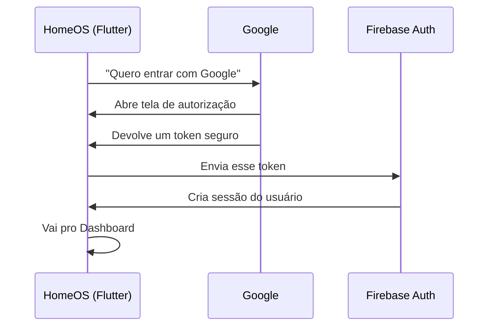
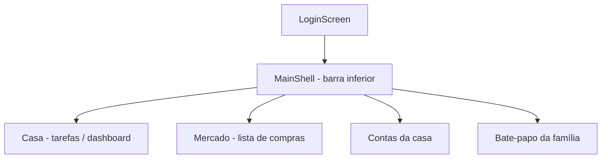

# Application context
_Exported on 03/07/2026 at 22:50:19 BRT from Cursor (3.9.16)_

---

**User**

@contextoGoogleGemini.txt @contextoGPT.txt 

Esse arquivos são o contexto do aplicativo que eu quero criar

@dashboard.png @login.png 

Isso é um esboço que fiz com IA, mas vou fazer um modelo no figma mais proximo disso. Pra isso vamos usar o MCP dele pra gente ir fazendo o aplicaitvo passo a passo.

Enfim analisa tudo ai e me diz.

---

**Cursor**

Vou ler os arquivos de contexto para entender bem o projeto antes de te dar um retorno completo.

Vou verificar o que o MCP do Figma tem disponível para entender o que podemos fazer.

Perfeito. Li tudo com atenção. Deixa eu te dar um resumo completo do que absorvi e como vamos trabalhar.

---

## O que entendi do projeto

**HomeOS** — Sistema Operacional Doméstico para você, Natália e o Bradley. A ideia é centralizar tudo da casa num único app: tarefas, mercado, finanças e futuramente IA. Começando simples, crescendo com disciplina.

### Stack definida (já validada pelas IAs anteriores)
| Camada | Tecnologia | Por quê |
|---|---|---|
| App | **Flutter + Dart** | A IA gera código limpo, testa no celular via QR Code |
| Banco + Tempo real | **Firebase Firestore** | Atualiza em tempo real sem WebSocket manual |
| Autenticação | **Firebase Auth** | Login Google/Facebook, entrega nome, foto e UID de brinde |
| Notificações | **Firebase FCM** | Push sem configurar servidor |
| IDE | **VS Code + Cursor** | VibeCoding com assistência de IA |

### Arquitetura do banco (já refinada)
```
🏠 House { id, name }
   └── 👤 Users { id, house_id, name, role, avatar }
   └── ✅ Tasks { id, house_id, created_by, assigned_to, title, status, due_date, created_at }
   └── 📊 HouseState → calculado dinamicamente (não armazenado)
```

### Roadmap de versões
- **V0** → Login + usuários + lista de tarefas (base)
- **V1** → Criar/atribuir/concluir tarefas + notificações
- **V2** → Lista de mercado compartilhada
- **V3** → Dashboard com estado da casa
- **V4** → Tempo real forte
- **V5** → IA como administradora

### 3 telas do MVP (esboços já feitos com IA)

Você tem o login e o dashboard nas imagens que mandou:


---

## Sobre o MCP do Figma

O MCP do Figma que está configurado aqui tem duas funções:

1. **`get_figma_data`** — Lê um arquivo do Figma e extrai toda a estrutura: layouts, cores, tipografia, componentes, espaçamentos
2. **`download_figma_images`** — Baixa assets (ícones, imagens) do arquivo

Ou seja, o fluxo vai ser:

```
Você design no Figma → Me passa o link → 
Eu leio via MCP → Implemento em Flutter com fidelidade ao design
```

---

## Como vamos trabalhar passo a passo

**Agora (seu trabalho no Figma):**
- Cria um arquivo Figma com as telas (Login, Dashboard, Nova Tarefa)
- Pode usar os esboços das imagens como referência visual
- Não precisa ser perfeito — pode ser wireframe com cor

**Depois (nossa parte aqui):**
- Você me passa o link do arquivo Figma
- Eu uso o MCP para ler a estrutura exata
- Implementamos tela a tela em Flutter, fiel ao design

**A pergunta chave antes de você ir pro Figma:**

Você já tem conta no Figma e sabe usar? Quer que eu te oriente sobre como estruturar o arquivo lá (ex: como organizar as frames, usar componentes) antes de começar?

---

**User**

Daqui a pouco eu desenho. O primeiro passo é, como eu não entendo nada de android, preciso aprender a configurar. 

Por exemplo, a tela de login vai ter login com o google. Por enquanto quero só esse. Como que faz isso ?

----

Os firebases, como que configura ? 

---

**Cursor**

Vou checar o que já está instalado na sua máquina para te orientar com passos reais, não só teoria.


Boa pergunta — e dá pra fazer isso sem precisar “entender Android” no começo. O que você precisa é montar o **ambiente** e depois ligar o **Firebase + Google Login**.

Chequei sua máquina agora:

| Item | Status |
|---|---|
| Android Studio | ✅ instalado |
| Android SDK | ✅ instalado (API 35 e 36) |
| Java 17 | ✅ instalado |
| `adb` | ✅ funcionando |
| Flutter | ❌ ainda não instalado |

Ou seja: **metade do caminho já está pronta**. Falta principalmente o Flutter e a configuração do Firebase.

---

## Visão geral: como o login com Google funciona

Não é o app que pede sua senha do Google. O fluxo é assim:



O Firebase te entrega automaticamente:
- **UID** (id único do usuário)
- **nome**
- **e-mail**
- **foto** (URL do avatar)

Isso já preenche boa parte da tabela `Users` do HomeOS.

---

## Passo 1 — Instalar o Flutter no Windows

### 1.1 Baixar
1. Acesse: https://docs.flutter.dev/get-started/install/windows/mobile
2. Baixe o **Flutter SDK** (arquivo `.zip`)
3. Extraia para um caminho simples, por exemplo:
   ```
   C:\src\flutter
   ```

### 1.2 Adicionar ao PATH
1. No Windows, pesquise: **“Variáveis de ambiente”**
2. Em **Path**, adicione:
   ```
   C:\src\flutter\bin
   ```
3. Feche e abra o terminal de novo

### 1.3 Validar
No PowerShell:

```powershell
flutter doctor
```

Esse comando mostra o que falta. O ideal é aparecer:
- Flutter
- Android toolchain
- VS Code / Android Studio

Se pedir licenças do Android:

```powershell
flutter doctor --android-licenses
```

Aceite tudo com `y`.

---

## Passo 2 — Preparar o VS Code

No VS Code, instale as extensões:
- **Flutter**
- **Dart**

Depois teste se o Flutter enxerga seu celular ou emulador:

```powershell
flutter devices
```

Se não tiver celular plugado, crie um emulador no Android Studio:
**Device Manager → Create Virtual Device**

---

## Passo 3 — Criar o projeto HomeOS

No terminal:

```powershell
cd C:\wamp64\www\_ideias
flutter create home_os
cd home_os
```

Isso cria a base do app Android.

O Android vai usar um **package name**, algo como:
```
com.example.home_os
```

Depois você pode trocar para algo mais profissional, tipo:
```
com.rafael.homeos
```

Mas no começo pode deixar o padrão.

---

## Passo 4 — Criar o Firebase

### 4.1 Criar projeto
1. Acesse: https://console.firebase.google.com
2. Clique em **Adicionar projeto**
3. Nome: `HomeOS`
4. Pode desativar Google Analytics por enquanto (opcional)

### 4.2 Adicionar app Android
1. No projeto Firebase, clique no ícone **Android**
2. Preencha:
   - **Package name**: o mesmo do Flutter  
     Exemplo: `com.example.home_os`
   - **Apelido do app**: `HomeOS`
3. Baixe o `google-services.json` se o assistente pedir  
   (depois o `flutterfire configure` também pode fazer isso)

### 4.3 Ativar Authentication com Google
1. No Firebase: **Build → Authentication**
2. Clique em **Get started**
3. Aba **Sign-in method**
4. Ative **Google**
5. Escolha um e-mail de suporte do projeto
6. Salve

### 4.4 Criar Firestore
1. **Build → Firestore Database**
2. **Create database**
3. Comece em **Test mode** por enquanto
4. Escolha a região mais próxima (ex: `southamerica-east1`)

---

## Passo 5 — A parte que mais dá erro: SHA-1

Para o **Google Login funcionar no Android**, o Firebase precisa conhecer a “impressão digital” do seu app.

No PowerShell:

```powershell
keytool -list -v -alias androiddebugkey -keystore "$env:USERPROFILE\.android\debug.keystore" -storepass android -keypass android
```

Vai aparecer algo como:
```
SHA1: AB:CD:EF:12:34:...
```

Copie esse **SHA1**.

No Firebase:
1. **Configurações do projeto** (ícone de engrenagem)
2. Role até **Seus apps**
3. Clique no app Android
4. **Adicionar impressão digital**
5. Cole o SHA1
6. Salve

Sem isso, o botão “Entrar com Google” costuma falhar com erro de autenticação.

---

## Passo 6 — Conectar Flutter ao Firebase

Instale a CLI do FlutterFire:

```powershell
dart pub global activate flutterfire_cli
```

Se der erro de comando não encontrado, adicione ao PATH:
```
C:\Users\rafaelrodrigofs\AppData\Local\Pub\Cache\bin
```

Dentro do projeto:

```powershell
cd C:\wamp64\www\_ideias\home_os
flutterfire configure
```

Esse comando:
- lista seus projetos Firebase
- você escolhe `HomeOS`
- gera o arquivo `lib/firebase_options.dart`
- configura Android automaticamente

Depois instale os pacotes:

```powershell
flutter pub add firebase_core firebase_auth google_sign_in cloud_firestore
```

---

## Passo 7 — O que o app precisa ter para login com Google

No começo, só isso:

### Tela de Login
- 1 botão: **“Continuar com Google”**

### Lógica
1. Usuário clica no botão
2. Abre a conta Google
3. Firebase autentica
4. App salva a sessão
5. Vai para o Dashboard

### Código mínimo (conceito)

```dart
import 'package:firebase_auth/firebase_auth.dart';
import 'package:google_sign_in/google_sign_in.dart';

Future<UserCredential?> signInWithGoogle() async {
  final googleUser = await GoogleSignIn().signIn();
  if (googleUser == null) return null;

  final googleAuth = await googleUser.authentication;

  final credential = GoogleAuthProvider.credential(
    accessToken: googleAuth.accessToken,
    idToken: googleAuth.idToken,
  );

  return FirebaseAuth.instance.signInWithCredential(credential);
}
```

Depois do login, você pega os dados assim:

```dart
final user = FirebaseAuth.instance.currentUser;

print(user?.uid);        // id único
print(user?.displayName); // nome
print(user?.email);       // email
print(user?.photoURL);    // foto
```

Esses dados você salva no Firestore na coleção `users`.

---

## Passo 8 — Estrutura mínima de pastas (pra não virar bagunça)

```text
home_os/
├── lib/
│   ├── main.dart
│   ├── firebase_options.dart
│   ├── screens/
│   │   ├── login_screen.dart
│   │   └── home_screen.dart
│   ├── services/
│   │   └── auth_service.dart
│   └── models/
│       └── user_model.dart
```

Regra simples:
- **screens** = telas
- **services** = login, banco, regras
- **models** = formato dos dados

---

## Ordem certa pra você seguir hoje

1. Instalar Flutter
2. Rodar `flutter doctor`
3. Criar projeto `home_os`
4. Criar projeto no Firebase
5. Ativar Google Auth
6. Cadastrar SHA-1
7. Rodar `flutterfire configure`
8. Só depois implementar a tela de login

---

## Erros comuns (pra você não perder tempo)

| Erro | Causa provável |
|---|---|
| `PlatformException(sign_in_failed)` | SHA-1 não cadastrado no Firebase |
| `API key not valid` | `flutterfire configure` não foi feito direito |
| App não abre no celular | USB debugging desativado |
| `flutter` não reconhecido | PATH não configurado |
| Login abre e fecha | `google-services.json` / package name diferente |

---

## Resumo prático

Você **não precisa aprender Android nativo agora**.

O que importa no início:
1. Flutter instalado
2. Firebase criado
3. Google Auth ativado
4. SHA-1 cadastrado
5. Projeto conectado com `flutterfire configure`

Com isso, o login com Google já funciona.

---

Quando quiser, no próximo passo eu posso te guiar **comando por comando**, na ordem, enquanto você instala — tipo um checklist ao vivo. Se quiser começar agora, o primeiro movimento é:

```powershell
# baixar e extrair Flutter para C:\src\flutter
# adicionar ao PATH
flutter doctor
```

Me manda o resultado do `flutter doctor` que eu te digo exatamente o que falta na sua máquina.

---

**User**

Windows PowerShell                                                                                                      Copyright (C) Microsoft Corporation. Todos os direitos reservados.                                                                                                                                                                              Experimente a nova plataforma cruzada PowerShell https://aka.ms/pscore6                                                                                                                                                                         PS C:\Windows\system32> flutter doctor                                                                                  Building flutter tool...                                                                                                Running pub upgrade...                                                                                                  Resolving dependencies... (1.3s)                                                                                        Downloading packages... (2:29.1s)                                                                                       Got dependencies.                                                                                                       Doctor summary (to see all details, run flutter doctor -v):                                                             [√] Flutter (Channel stable, 3.44.4, on Microsoft Windows [versÆo 10.0.19045.6466], locale pt-BR)                       [√] Windows Version (10 Pro 64 bits, 22H2, 2009)                                                                        [!] Android toolchain - develop for Android devices (Android SDK version 36.1.0-rc1)                                        X cmdline-tools component is missing.                                                                                     Try installing or updating Android Studio.                                                                              Alternatively, download the tools from https://developer.android.com/studio#command-line-tools-only and make sure       to set the ANDROID_HOME environment variable.                                                                           See https://developer.android.com/studio/command-line for more details.                                               X Android license status unknown.                                                                                         Run `flutter doctor --android-licenses` to accept the SDK licenses.                                                     See https://flutter.dev/to/windows-android-setup for more details.                                                [√] Chrome - develop for the web                                                                                        [√] Visual Studio - develop Windows apps (Visual Studio Community 2022 17.14.16)                                        [√] Connected device (3 available)                                                                                      [√] Network resources                                                                                                                                                                                                                           ! Doctor found issues in 1 category.                                                                                    PS C:\Windows\system32>            

---

**Cursor**

Flutter instalou, mas faltam duas coisas no Android. Vou checar o SDK e te passar os comandos exatos para corrigir.


Ótimo sinal: o Flutter **já está instalado e funcionando**. O `doctor` mostrou só **2 pendências no Android**, e ambas são normais de resolver.

## O que seu resultado significa

| Item | Status |
|---|---|
| Flutter 3.44.4 | ✅ OK |
| Windows | ✅ OK |
| Chrome | ✅ OK |
| Visual Studio | ✅ OK |
| Dispositivos conectados (3) | ✅ OK |
| Android toolchain | ⚠️ falta ajustar |

Os 2 problemas são:
1. **`cmdline-tools` ausente** — ferramentas de linha de comando do Android SDK
2. **Licenças do Android não aceitas**

Sem isso, o Flutter não consegue compilar o app para Android.

---

## Correção 1 — Instalar `cmdline-tools` (mais fácil pelo Android Studio)

1. Abra o **Android Studio**
2. Na tela inicial: **More Actions → SDK Manager**  
   (ou **File → Settings → Languages & Frameworks → Android SDK**)
3. Aba **SDK Tools**
4. Marque:
   - **Android SDK Command-line Tools (latest)**
   - (se quiser garantir) **Android SDK Build-Tools**
5. Clique em **Apply → OK**
6. Aguarde o download terminar

Isso vai criar a pasta:
```
C:\Users\rafaelrodrigofs\AppData\Local\Android\Sdk\cmdline-tools\latest
```

---

## Correção 2 — Aceitar as licenças do Android

No PowerShell (pode ser o mesmo que você usou):

```powershell
flutter doctor --android-licenses
```

Vai aparecer vários termos. Digite **`y`** e Enter em cada um até terminar.

Depois rode de novo:

```powershell
flutter doctor
```

O ideal é ficar assim:

```
[√] Flutter
[√] Android toolchain
[√] Chrome
[√] Visual Studio
[√] Connected device
```

---

## Se o `flutter` não abrir em outro terminal

Vi que o Flutter está em `C:\src\flutter`. Se em algum terminal der “comando não reconhecido”, confira se o PATH tem:

```
C:\src\flutter\bin
```

---

## Depois que o `flutter doctor` ficar verde

Aí sim seguimos para o Firebase + Google Login, nesta ordem:

### 1. Criar o projeto Flutter
```powershell
cd C:\wamp64\www\_ideias
flutter create home_os
cd home_os
```

### 2. Criar projeto no Firebase
- https://console.firebase.google.com
- Projeto: **HomeOS**
- Adicionar app **Android**
- Package name: o que o Flutter criar (ex: `com.example.home_os`)

### 3. Ativar login Google
- Firebase → **Authentication → Sign-in method**
- Ativar **Google**

### 4. Cadastrar SHA-1 (obrigatório pro Google Login)
```powershell
keytool -list -v -alias androiddebugkey -keystore "$env:USERPROFILE\.android\debug.keystore" -storepass android -keypass android
```
Copie o **SHA1** e cole em:
**Firebase → Configurações do projeto → App Android → Adicionar impressão digital**

### 5. Conectar Flutter ao Firebase
```powershell
dart pub global activate flutterfire_cli
flutterfire configure
flutter pub add firebase_core firebase_auth google_sign_in cloud_firestore
```

---

## Resumo do que fazer agora

1. Instalar **Android SDK Command-line Tools** no Android Studio  
2. Rodar `flutter doctor --android-licenses`  
3. Rodar `flutter doctor` de novo  
4. Me mandar o resultado

Quando o Android toolchain estiver ✅, no próximo passo eu te guio na criação do Firebase e no login com Google, passo a passo, sem pular nada.

---

**User**

PS C:\Windows\system32> flutter doctor --android-licenses                                                               [=======================================] 100% Computing updates...                                                     5 of 7 SDK package licenses not accepted.                                                                               Review licenses that have not been accepted (y/N)? y                                                                                                                                                                                            1/5: License android-googletv-license:                                                                                  ---------------------------------------                                                                                 Terms and Conditions                                                                                                                                                                                                                            This is the Google TV Add-on for the Android Software Development Kit License Agreement.                                                                                                                                                        1. Introduction                                                                                                                                                                                                                                 1.1 The Google TV Add-on for the Android Software Development Kit (referred to in this License Agreement as the "Google TV Add-on" and specifically including the Android system files, packaged APIs, and Google APIs add-ons) is licensed to you subject to the terms of this License Agreement. This License Agreement forms a legally binding contract between you and Google in relation to your use of the Google TV Add-on.                                                                                                                                                                                      1.2 "Google" means Google Inc., a Delaware corporation with principal place of business at 1600 Amphitheatre Parkway, Mountain View, CA 94043, United States.                                                                                                                                                                                                           2. Accepting this License Agreement                                                                                                                                                                                                             2.1 In order to use the Google TV Add-on, you must first agree to this License Agreement. You may not use the Google TV Add-on if you do not accept this License Agreement.                                                                                                                                                                                             2.2 You can accept this License Agreement by:                                                                                                                                                                                                   (A) clicking to accept or agree to this License Agreement, where this option is made available to you; or                                                                                                                                       (B) by actually using the Google TV Add-on. In this case, you agree that use of the Google TV Add-on constitutes acceptance of the License Agreement from that point onwards.                                                                                                                                                                                           2.3 You may not use the Google TV Add-on and may not accept the Licensing Agreement if you are a person barred from receiving the Google TV Add-on under the laws of the United States or other countries including the country in which you are resident or from which you use the Google TV Add-on.                                                                                                                                                                                           2.4 If you are agreeing to be bound by this License Agreement on behalf of your employer or other entity, you represent and warrant that you have full legal authority to bind your employer or such entity to this License Agreement. If you do not have the requisite authority, you may not accept the Licensing Agreement or use the Google TV Add-on on behalf of your employer or other entity.                                                                                                                                                                                                                   3. Google TV Add-on License from Google                                                                                                                                                                                                         3.1 Subject to the terms of this License Agreement, Google grants you a limited, worldwide, royalty-free, non- assignable and non-exclusive license to use the Google TV Add-on solely to develop applications to run on the Google TV platform.                                                                                                                        3.2 You agree that Google or third parties own all legal right, title and interest in and to the Google TV Add-on, including any Intellectual Property Rights that subsist in the Google TV Add-on. "Intellectual Property Rights" means any and all rights under patent law, copyright law, trade secret law, trademark law, and any and all other proprietary rights. Google reserves all rights not expressly granted to you.                                                                                                                                                                                        3.3 Except to the extent required by applicable third party licenses, you may not copy (except for backup purposes), modify, adapt, redistribute, decompile, reverse engineer, disassemble, or create derivative works of the Google TV Add-on or any part of the Google TV Add-on. Except to the extent required by applicable third party licenses, you may not load any part of the Google TV Add-on onto a mobile handset, television, or any other hardware device except a personal computer, combine any part of the Google TV Add-on with other software, or distribute any software or device incorporating a part of the Google TV Add-on.                                                                                                                                                                                                                    3.4 Use, reproduction and distribution of components of the Google TV Add-on licensed under an open source software license are governed solely by the terms of that open source software license and not this License Agreement.                                                                                                                                       3.5 You agree that the form and nature of the Google TV Add-on that Google provides may change without prior notice to you and that future versions of the Google TV Add-on may be incompatible with applications developed on previous versions of the Google TV Add-on. You agree that Google may stop (permanently or temporarily) providing the Google TV Add-on (or any features within the Google TV Add-on) to you or to users generally at Google's sole discretion, without prior notice to you.                                                                                                                                                                                                                                       3.6 Nothing in this License Agreement gives you a right to use any of Google's or its licensors trade names, trademarks, service marks, logos, domain names, or other distinctive brand features.                                                                                                                                                                       3.7 You agree that you will not remove, obscure, or alter any proprietary rights notices (including copyright and trademark notices) that may be affixed to or contained within the Google TV Add-on.                                                                                                                                                                   4. Use of the Google TV Add-on by You                                                                                                                                                                                                           4.1 Google agrees that it obtains no right, title or interest from you (or your licensors) under this License Agreement in or to any software applications that you develop using the Google TV Add-on, including any intellectual property rights that subsist in those applications.                                                                                                                                                                                                          4.2 You agree to use the Google TV Add-on and write applications only for purposes that are permitted by (a) this License Agreement and (b) any applicable law, regulation or generally accepted practices or guidelines in the relevant jurisdictions (including any laws regarding the export of data or software to and from the United States or other relevant countries).                                                                                                                                                                                                                                         4.3 You agree that if you use the Google TV Add-on to develop applications for general public users, you will protect the privacy and legal rights of those users. If the users provide you with user names, passwords, or other login information or personal information, your must make the users aware that the information will be available to your application, and you must provide legally adequate privacy notice and protection for those users. If your application stores personal or sensitive information provided by users, it must do so securely. If the user provides your application with Google Account information, your application may only use that information to access the user's Google Account when, and for the limited purposes for which, the user has given you explicit permission to do so.                                                                                                                                                                4.4 You agree that you will not engage in any activity with the Google TV Add-on, including the development or distribution of an application, that interferes with, disrupts, damages, or accesses in an unauthorized manner the servers, networks, or other properties or services of any third party including, but not limited to, Google, Multichannel Video Program Distributors or any mobile communications carrier.                                                                                                                                                                                            4.5 You agree that you are solely responsible for (and that Google has no responsibility to you or to any third party for) any data, content, or resources that you create, transmit or display through the Google TV platform and/or applications for the Google TV platform, and for the consequences of your actions (including any loss or damage which Google may suffer) by doing so.                                                                                                                                                                                                                             4.6 You agree that you are solely responsible for (and that Google has no responsibility to you or to any third party for) any breach of your obligations under this License Agreement, any applicable third party contract or Terms of Service, or any applicable law or regulation, and for the consequences (including any loss or damage which Google or any third party may suffer) of any such breach.                                                                                                                                                                                                            5. Your Developer Credentials                                                                                                                                                                                                                   5.1 You agree that you are responsible for maintaining the confidentiality of any developer credentials that may be issued to you by Google or which you may choose yourself and that you will be solely responsible for all applications that are developed under your developer credentials.                                                                                                                                                                                                  6. Privacy and Information                                                                                                                                                                                                                      6.1 In order to continually innovate and improve the Google TV Add-on, Google may collect certain usage statistics from the software including but not limited to a unique identifier, associated IP address, version number of the software, and information on which tools and/or services in the Google TV Add-on are being used and how they are being used. Before any of this information is collected, the Google TV Add-on will notify you and seek your consent. If you withhold consent, the information will not be collected.                                                                                                                                                                                                       6.2 The data collected is examined in the aggregate to improve the Google TV Add-on and is maintained in accordance with Google's Privacy Policy.                                                                                                                                                                                                                       7. Third Party Applications for the Google TV Platform                                                                                                                                                                                          7.1 If you use the Google TV Add-on to run applications developed by a third party or that access data, content or resources provided by a third party, you agree that Google is not responsible for those applications, data, content, or resources. You understand that all data, content or resources which you may access through such third party applications are the sole responsibility of the person from which they originated and that Google is not liable for any loss or damage that you may experience as a result of the use or access of any of those third party applications, data, content, or resources.                                                                                                                                                                                                                                           7.2 You should be aware the data, content, and resources presented to you through such a third party application may be protected by intellectual property rights which are owned by the providers (or by other persons or companies on their behalf). You may not modify, rent, lease, loan, sell, distribute or create derivative works based on these data, content, or resources (either in whole or in part) unless you have been specifically given permission to do so by the relevant owners.                                                                                                                                                                                                                                           7.3 You acknowledge that your use of such third party applications, data, content, or resources may be subject to separate terms between you and the relevant third party. In that case, this License Agreement does not affect your legal relationship with these third parties.                                                                                                                                                                                                               8. Using Google TV APIs                                                                                                                                                                                                                         8.1 If you use any Google TV API to retrieve data from Google, you acknowledge that the data (Google TV API Content) may be protected by intellectual property rights which are owned by Google or those parties that provide the data (or by other persons or companies on their behalf). Your use of any such API may be subject to additional Terms of Service. You may not modify, rent, lease, loan, sell, distribute or create derivative works based on this data (either in whole or in part) unless allowed by the relevant Terms of Service. Some portions of the Google TV API Content are licensed to Google by third parties, including but not limited to Tribune Media Services                                                                                                                                                                          8.2 If you use any API to retrieve a user's data from Google, you acknowledge and agree that you shall retrieve data only with the user's explicit consent and only when, and for the limited purposes for which, the user has given you permission to do so.                                                                                                                                                                                                                                   8.3 Except as explicitly permitted in Section 3 (Google TV Add-on License from Google), you must:                                                                                                                                               (a) not modify nor format the Google TV API Content except to the extent reasonably and technically necessary to optimize the display such Google TV API Content in your application;                                                                                                                                                                                   (b) not edit the Google TV API Content in a manner that renders the Google TV API Content inaccurate of alters its inherent meaning (provided that displaying excerpts will not violate the foregoing); or                                                                                                                                                              (c) not create any commercial audience measurement tool or service using the Google TV API Content                                                                                                                                              9. Terminating this License Agreement                                                                                                                                                                                                           9.1 This License Agreement will continue to apply until terminated by either you or Google as set out below.                                                                                                                                    9.2 If you want to terminate this License Agreement, you may do so by ceasing your use of the Google TV Add-on and any relevant developer credentials.                                                                                                                                                                                                                  9.3 Google may at any time, terminate this License Agreement with you if:                                                                                                                                                                       (A) you have breached any provision of this License Agreement; or                                                                                                                                                                               (B) Google is required to do so by law; or                                                                                                                                                                                                      (C) the partner with whom Google offered certain parts of Google TV Add-on (such as APIs) to you has terminated its relationship with Google or ceased to offer certain parts of the Google TV Add-on to you; or                                                                                                                                                        (D) Google decides to no longer providing the Google TV Add-on or certain parts of the Google TV Add-on to users in the country in which you are resident or from which you use the service, or the provision of the Google TV Add-on or certain Google TV Add-on services to you by Google is, in Google's sole discretion, no longer commercially viable.                                                                                                                                     9.4 When this License Agreement comes to an end, all of the legal rights, obligations and liabilities that you and Google have benefited from, been subject to (or which have accrued over time whilst this License Agreement has been in force) or which are expressed to continue indefinitely, shall be unaffected by this cessation, and the provisions of paragraph 14.7 shall continue to apply to such rights, obligations and liabilities indefinitely.                                                                                                                                                         10. DISCLAIMER OF WARRANTIES                                                                                                                                                                                                                    10.1 YOU EXPRESSLY UNDERSTAND AND AGREE THAT YOUR USE OF THE GOOGLE TV ADD-ON IS AT YOUR SOLE RISK AND THAT THE GOOGLE TV ADD-ON IS PROVIDED "AS IS" AND "AS AVAILABLE" WITHOUT WARRANTY OF ANY KIND FROM GOOGLE.                                                                                                                                                       10.2 YOUR USE OF THE GOOGLE TV ADD-ON AND ANY MATERIAL DOWNLOADED OR OTHERWISE OBTAINED THROUGH THE USE OF THE GOOGLE TV ADD-ON IS AT YOUR OWN DISCRETION AND RISK AND YOU ARE SOLELY RESPONSIBLE FOR ANY DAMAGE TO YOUR COMPUTER SYSTEM OR OTHER DEVICE OR LOSS OF DATA THAT RESULTS FROM SUCH USE.                                                                                                                                                                                            10.3 GOOGLE FURTHER EXPRESSLY DISCLAIMS ALL WARRANTIES AND CONDITIONS OF ANY KIND, WHETHER EXPRESS OR IMPLIED, INCLUDING, BUT NOT LIMITED TO THE IMPLIED WARRANTIES AND CONDITIONS OF MERCHANTABILITY, FITNESS FOR A PARTICULAR PURPOSE AND NON-INFRINGEMENT.                                                                                                                                                                                                                                   11. LIMITATION OF LIABILITY                                                                                                                                                                                                                     11.1 YOU EXPRESSLY UNDERSTAND AND AGREE THAT GOOGLE, ITS SUBSIDIARIES AND AFFILIATES, AND ITS LICENSORS SHALL NOT BE LIABLE TO YOU UNDER ANY THEORY OF LIABILITY FOR ANY DIRECT, INDIRECT, INCIDENTAL, SPECIAL CONSEQUENTIAL OR EXEMPLARY DAMAGES THAT MAY BE INCURRED BY YOU, INCLUDING ANY LOSS OF DATA, WHETHER OR NOT GOOGLE OR ITS REPRESENTATIVES HAVE BEEN ADVISED OF OR SHOULD HAVE BEEN AWARE OF THE POSSIBILITY OF ANY SUCH LOSSES ARISING.                                                                                                                                                                   12. Indemnification                                                                                                                                                                                                                             12.1 To the maximum extent permitted by law, you agree to defend, indemnify and hold harmless Google, its affiliates and their respective directors, officers, employees and agents from and against any and all claims, actions, suits or proceedings, as well as any and all losses, liabilities, damages, costs and expenses (including reasonable attorneys fees) arising out of or accruing from (a) your use of the Google TV Add-on, (b) any application you develop on the Google TV Add-on that infringes any copyright, trademark, trade secret, trade dress, patent or other intellectual property right of any person or defames any person or violates their rights of publicity or privacy, and (c) any non-compliance by you with this License Agreement.                                                                                                                                                                                                                        13. Changes to the License Agreement                                                                                                                                                                                                            13.1 Google may make changes to the License Agreement as it distributes new versions of the Google TV Add-on.                                                                                                                                   14. General Legal Terms                                                                                                                                                                                                                         14.1 This License Agreement constitute the whole legal agreement between you and Google and govern your use of the Google TV Add-on (excluding any services which Google may provide to you under a separate written agreement), and completely replace any prior agreements between you and Google in relation to the Google TV Add-on.                                                                                                                                                        14.2 You agree that if Google does not exercise or enforce any legal right or remedy which is contained in this License Agreement (or which Google has the benefit of under any applicable law), this will not be taken to be a formal waiver of Google's rights and that those rights or remedies will still be available to Google.                                                                                                                                                           14.3 If any court of law, having the jurisdiction to decide on this matter, rules that any provision of this License Agreement is invalid, then that provision will be removed from this License Agreement without affecting the rest of this License Agreement. The remaining provisions of this License Agreement will continue to be valid and enforceable.                                                                                                                                  14.4 You acknowledge and agree that Googles API data licensors and each member of the group of companies of which Google is the parent shall be third party beneficiaries to this License Agreement and that such other companies shall be entitled to directly enforce, and rely upon, any provision of this License Agreement that confers a benefit on (or rights in favor of) them. Other than this, no other person or company shall be third party beneficiaries to this License Agreement.                                                                                                                                                                                                                                               14.5 EXPORT RESTRICTIONS. THE GOOGLE TV ADD-ON IS SUBJECT TO UNITED STATES EXPORT LAWS AND REGULATIONS. YOU MUST COMPLY WITH ALL DOMESTIC AND INTERNATIONAL EXPORT LAWS AND REGULATIONS THAT APPLY TO THE GOOGLE TV ADD-ON. THESE LAWS INCLUDE RESTRICTIONS ON DESTINATIONS, END USERS AND END USE.                                                                                                                                                                                             14.6 The rights granted in this License Agreement may not be assigned or transferred by either you or Google without the prior written approval of the other party. Neither you nor Google shall be permitted to delegate their responsibilities or obligations under this License Agreement without the prior written approval of the other party.                                                                                                                                             14.7 This License Agreement, and your relationship with Google under this License Agreement, shall be governed by the laws of the State of California without regard to its conflict of laws provisions. You and Google agree to submit to the exclusive jurisdiction of the courts located within the county of Santa Clara, California to resolve any legal matter arising from this License Agreement. Notwithstanding this, you agree that Google shall still be allowed to apply for injunctive remedies (or an equivalent type of urgent legal relief) in any jurisdiction.                                                                                                                                                                                                                                                                                       August 15, 2011                                                                                                         ---------------------------------------                                                                                 Accept? (y/N): y                                                                                                                                                                                                                                2/5: License android-googlexr-license:                                                                                  ---------------------------------------                                                                                 To get started with the Android XR Emulator System Image SDK, you must agree to the following terms and conditions. As described below, please note that this is a preview, emulated version of the Android XR OS, subject to change, that you use at your own risk.                                                                                                                                                                                                                            This is the Android XR Emulator System Image SDK License Agreement                                                                                                                                                                              1. Introduction                                                                                                                                                                                                                                 1.1 The Android Android XR Emulator System Image SDK (referred to in the License Agreement as the "SDK" and specifically including the Android system files,, packaged APIs, library files (if and when they are made available), and Google applications and APIs add-ons) is licensed to you subject to the terms of the License Agreement. The License Agreement forms a legally binding contract between you and Google in relation to your use of the SDK.                                                                                                                                                         1.2 "Android" means the Android software stack for devices, as made available under the Android Open Source Project, which is located at the following URL: https://source.android.com/, as updated from time to time.                                                                                                                                                  1.3 "Google" means Google LLC, organized under the laws of the State of Delaware, USA, and operating under the laws of the USA with principal place of business at 1600 Amphitheatre Parkway, Mountain View, CA 94043, USA.                                                                                                                                             2. Accepting this License Agreement                                                                                                                                                                                                             2.1 In order to use the SDK, you must first agree to the License Agreement. You may not use the SDK if you do not accept the License Agreement.                                                                                                                                                                                                                         2.2 By clicking to accept and/or using this SDK, you hereby agree to the terms of the License Agreement.                                                                                                                                        2.3 You may not use the SDK and may not accept the License Agreement if you are a person barred from receiving the SDK under the laws of the United States or other countries, including the country in which you are resident or from which you use the SDK.                                                                                                                                                                                                                                   2.4 If you are agreeing to be bound by the License Agreement on behalf of your employer or other entity, you represent and warrant that you have full legal authority to bind your employer or such entity to the License Agreement. If you do not have the requisite authority, you may not accept the License Agreement or use the SDK on behalf of your employer or other entity.                                                                                                                                                                                                                                    3. SDK License from Google                                                                                                                                                                                                                      3.1 Subject to the terms of the License Agreement, Google grants you a limited, worldwide, royalty-free, non-assignable, non-exclusive, and non-sublicensable license to use the SDK solely to develop applications for Android XR.                                                                                                                                     3.2 You may not use this SDK to develop applications for other platforms or to develop another SDK. You are of course free to develop applications for other platforms provided that this SDK is not used for that purpose.                                                                                                                                             3.3 You agree that Google or third parties own all legal right, title and interest in and to the SDK, including any Intellectual Property Rights that subsist in the SDK. "Intellectual Property Rights" means any and all rights under patent law, copyright law, trade secret law, trademark law, and any and all other proprietary rights. Google reserves all rights not expressly granted to you.                                                                                                                                                                                                                  3.4 You may not use the SDK for any purpose not expressly permitted by the License Agreement. Except to the extent required by applicable third party licenses, you may not (a) copy (except for backup purposes), modify, adapt, redistribute, decompile, reverse engineer, disassemble, or create derivative works of the SDK or any part of the SDK; or (b) load any part of the SDK onto a mobile handset or any other hardware device except a personal computer, combine any part of the SDK with other software, or distribute any software or device incorporating a part of the SDK.                                                                                                                                                   3.5 Use, reproduction and distribution of components of the SDK licensed under an open source software license are governed solely by the terms of that open source software license and not the License Agreement. You agree to remain a licensee in good standing in regard to such open source software licenses under all the rights granted and to refrain from any actions that may terminate, suspend, or breach such rights.                                                                                                                                                                                    3.6 You agree that the form and nature of the SDK that Google provides may change without prior notice to you and that future versions of the SDK may be incompatible with applications developed on previous versions of the SDK. You agree that Google may stop (permanently or temporarily) providing the SDK (or any features within the SDK) to you or to users generally at Google's sole discretion, without prior notice to you.                                                                                                                                                                                3.7 Nothing in the License Agreement gives you a right to use any of Google's trade names, trademarks, service marks, logos, domain names, or other distinctive brand features.                                                                                                                                                                                         3.8 You agree that you will not remove, obscure, or alter any proprietary rights notices (including copyright and trademark notices) that may be affixed to or contained within the SDK.                                                                                                                                                                                4. Use of the SDK by You                                                                                                                                                                                                                        4.1 Google agrees that it obtains no right, title or interest from you (or your licensors) under the License Agreement in or to any software applications that you develop using the SDK, including any intellectual property rights that subsist in those applications.                                                                                                                                                                                                                        4.2 You agree to use the SDK and write applications only for purposes that are permitted by (a) the License Agreement and (b) any applicable law, regulation or generally accepted practices or guidelines in the relevant jurisdictions (including any laws regarding the export of data or software to and from the United States or other relevant countries).                                                                                                                               4.3 You agree that if you use the SDK to develop applications for general public users, you will protect the privacy and legal rights of those users. If the users provide you with user names, passwords, or other login information or personal information, you must make the users aware that the information will be available to your application, and you must provide legally adequate privacy notice and protection for those users. If your application stores personal or sensitive information provided by users, it must do so securely. If the user provides your application with Google Account information, your application may only use that information to access the user's Google Account when, and for the limited purposes for which, the user has given you permission to do so.                                                                                                                                                                                       4.4 You agree that you will not engage in any activity with the SDK, including the development or distribution of an application, that interferes with, disrupts, damages, or accesses in an unauthorized manner the servers, networks, or other properties or services of any third party including, but not limited to, Google or any mobile communications carrier.                                                                                                                          4.5 You agree that you are solely responsible for (and that Google has no responsibility to you or to any third party for) any data, content, or resources that you create, transmit or display through Android and/or applications for Android, and for the consequences of your actions (including any loss or damage which Google may suffer) by doing so.                                                                                                                                   4.6 You agree that you are solely responsible for (and that Google has no responsibility to you or to any third party for) any breach of your obligations under the License Agreement, any applicable third party contract or Terms of Service, or any applicable law or regulation, and for the consequences (including any loss or damage which Google or any third party may suffer) of any such breach.                                                                                                                                                                                                             4.7 The SDK is in development, and your testing and feedback are an important part of the development process. By using the SDK, you acknowledge that implementation of some features are still under development and that you should not rely on the SDK having the full functionality of a stable release.                                                                                                                                                                                    5. Your Developer Credentials                                                                                                                                                                                                                   5.1 You agree that you are responsible for maintaining the confidentiality of any developer credentials that may be issued to you by Google or which you may choose yourself and that you will be solely responsible for all applications that are developed under your developer credentials.                                                                                                                                                                                                  6. Privacy and Information                                                                                                                                                                                                                      6.1 In order to continually innovate and improve the SDK, Google may collect certain usage statistics from the software including but not limited to a unique identifier, associated IP address, version number of the software, and information on which tools and/or services in the SDK are being used and how they are being used. Before any of this information is collected, the SDK will notify you and seek your consent. If you withhold consent, the information will not be collected.                                                                                                                                                                                                                                              6.2 The data collected is examined in the aggregate to improve the SDK and is maintained in accordance with Google's Privacy Policy, which is located at the following URL: https://policies.google.com/privacy                                                                                                                                                         6.3 Anonymized and aggregated sets of the data may be shared with Google partners to improve the SDK.                                                                                                                                           7. Third Party Applications                                                                                                                                                                                                                     7.1 If you use the SDK to run applications developed by a third party or that access data, content or resources provided by a third party, you agree that Google is not responsible for those applications, data, content, or resources. You understand that all data, content or resources which you may access through such third party applications are the sole responsibility of the person from which they originated and that Google is not liable for any loss or damage that you may experience as a result of the use or access of any of those third party applications, data, content, or resources.                                                                                                                                7.2 You should be aware that the data, content, and resources presented to you through such a third party application may be protected by intellectual property rights which are owned by the providers (or by other persons or companies on their behalf). You may not modify, rent, lease, loan, sell, distribute or create derivative works based on these data, content, or resources (either in whole or in part) unless you have been specifically given permission to do so by the relevant owners.                                                                                                                                                                                                                                      7.3 You acknowledge that your use of such third party applications, data, content, or resources may be subject to separate terms between you and the relevant third party. In that case, the License Agreement does not affect your legal relationship with these third parties.                                                                                                                                                                                                                8. Using Android APIs                                                                                                                                                                                                                           8.1 Google Data APIs                                                                                                                                                                                                                            8.1.1 If you use any API to retrieve data from Google, you acknowledge that the data may be protected by intellectual property rights which are owned by Google or those parties that provide the data (or by other persons or companies on their behalf). Your use of any such API may be subject to additional Terms of Service. You may not modify, rent, lease, loan, sell, distribute or create derivative works based on this data (either in whole or in part) unless allowed by the relevant Terms of Service.                                                                                                                                                                                                                          8.1.2 If you use any API to retrieve a user's data from Google, you acknowledge and agree that you shall retrieve data only with the user's explicit consent and only when, and for the limited purposes for which, the user has given you permission to do so. If you use the Android Recognition Service API, documented at the following URL: https://developer.android.com/reference/android/speech/RecognitionService, as updated from time to time, you acknowledge that the use of the API is subject to the Data Processing Addendum for Products where Google is a Data Processor, which is located at the following URL: https://privacy.google.com/businesses/gdprprocessorterms/, as updated from time to time. By clicking to accept, you hereby agree to the terms of the Data Processing Addendum for Products where Google is a Data Processor.                                                                                                                                 9. Terminating this License Agreement                                                                                                                                                                                                           9.1 The License Agreement will continue to apply until terminated by either you or Google as set out below.                                                                                                                                     9.2 If you want to terminate the License Agreement, you may do so by ceasing your use of the SDK and any relevant developer credentials.                                                                                                                                                                                                                                9.3 Google may at any time, terminate the License Agreement with you if: (A) you have breached any provision of the License Agreement; or (B) Google is required to do so by law; or (C) the partner with whom Google offered certain parts of SDK (such as APIs) to you has terminated its relationship with Google or ceased to offer certain parts of the SDK to you; or (D) Google decides to no longer provide the SDK or certain parts of the SDK to users in the country in which you are resident or from which you use the service, or the provision of the SDK or certain SDK services to you by Google is, in Google's sole discretion, no longer commercially viable.                                                                                                                                                                                       9.4 When the License Agreement comes to an end, all of the legal rights, obligations and liabilities that you and Google have benefited from, been subject to (or which have accrued over time whilst the License Agreement has been in force) or which are expressed to continue indefinitely, shall be unaffected by this cessation, and the provisions of paragraph 14.7 shall continue to apply to such rights, obligations and liabilities indefinitely.                                                                                                                                                           10. DISCLAIMER OF WARRANTIES                                                                                                                                                                                                                    10.1 YOU EXPRESSLY UNDERSTAND AND AGREE THAT YOUR USE OF THE SDK IS AT YOUR SOLE RISK AND THAT THE SDK IS PROVIDED "AS IS" AND "AS AVAILABLE" WITHOUT WARRANTY OF ANY KIND FROM GOOGLE.                                                                                                                                                                                 10.2 YOUR USE OF THE SDK AND ANY MATERIAL DOWNLOADED OR OTHERWISE OBTAINED THROUGH THE USE OF THE SDK IS AT YOUR OWN DISCRETION AND RISK AND YOU ARE SOLELY RESPONSIBLE FOR ANY DAMAGE TO YOUR COMPUTER SYSTEM OR OTHER DEVICE OR LOSS OF DATA THAT RESULTS FROM SUCH USE.                                                                                                                                                                                                                      10.3 GOOGLE FURTHER EXPRESSLY DISCLAIMS ALL WARRANTIES AND CONDITIONS OF ANY KIND, WHETHER EXPRESS OR IMPLIED, INCLUDING, BUT NOT LIMITED TO THE IMPLIED WARRANTIES AND CONDITIONS OF MERCHANTABILITY, FITNESS FOR A PARTICULAR PURPOSE AND NON-INFRINGEMENT.                                                                                                                                                                                                                                   11. LIMITATION OF LIABILITY                                                                                                                                                                                                                     11.1 YOU EXPRESSLY UNDERSTAND AND AGREE THAT GOOGLE, ITS SUBSIDIARIES AND AFFILIATES, AND ITS LICENSORS SHALL NOT BE LIABLE TO YOU UNDER ANY THEORY OF LIABILITY FOR ANY DIRECT, INDIRECT, INCIDENTAL, SPECIAL, CONSEQUENTIAL OR EXEMPLARY DAMAGES THAT MAY BE INCURRED BY YOU, INCLUDING ANY LOSS OF DATA, WHETHER OR NOT GOOGLE OR ITS REPRESENTATIVES HAVE BEEN ADVISED OF OR SHOULD HAVE BEEN AWARE OF THE POSSIBILITY OF ANY SUCH LOSSES ARISING.                                                                                                                                                                  12. Indemnification                                                                                                                                                                                                                             12.1 To the maximum extent permitted by law, you agree to defend, indemnify and hold harmless Google, its affiliates and their respective directors, officers, employees and agents from and against any and all claims, actions, suits or proceedings, as well as any and all losses, liabilities, damages, costs and expenses (including reasonable attorneys fees) arising out of or accruing from (a) your use of the SDK, (b) any application you develop on the SDK that infringes any copyright, trademark, trade secret, trade dress, patent or other intellectual property right of any person or defames any person or violates their rights of publicity or privacy, and (c) any non-compliance by you with the License Agreement.                                                                                                                           13. Changes to the License Agreement                                                                                                                                                                                                            13.1 Google may make changes to the License Agreement as it distributes new versions of the SDK. When these changes are made, Google will make a new version of the License Agreement available on the website where the SDK is made available.                                                                                                                         14. General Legal Terms                                                                                                                                                                                                                         14.1 The License Agreement constitutes the whole legal agreement between you and Google and governs your use of the SDK (excluding any services which Google may provide to you under a separate written agreement), and completely replaces any prior agreements between you and Google in relation to the SDK.                                                                                                                                                                                14.2 You agree that if Google does not exercise or enforce any legal right or remedy which is contained in the License Agreement (or which Google has the benefit of under any applicable law), this will not be taken to be a formal waiver of Google's rights and that those rights or remedies will still be available to Google.                                                                                                                                                            14.3 If any court of law, having the jurisdiction to decide on this matter, rules that any provision of the License Agreement is invalid, then that provision will be removed from the License Agreement without affecting the rest of the License Agreement. The remaining provisions of the License Agreement will continue to be valid and enforceable.                                                                                                                                      14.4 You acknowledge and agree that each member of the group of companies of which Google is the parent shall be third party beneficiaries to the License Agreement and that such other companies shall be entitled to directly enforce, and rely upon, any provision of the License Agreement that confers a benefit on (or rights in favor of) them. Other than this, no other person or company shall be third party beneficiaries to the License Agreement.                                                                                                                                                         14.5 EXPORT RESTRICTIONS. THE SDK IS SUBJECT TO UNITED STATES EXPORT LAWS AND REGULATIONS. YOU MUST COMPLY WITH ALL DOMESTIC AND INTERNATIONAL EXPORT LAWS AND REGULATIONS THAT APPLY TO THE SDK. THESE LAWS INCLUDE RESTRICTIONS ON DESTINATIONS, END USERS AND END USE.                                                                                                                                                                                                                       14.6 The rights granted in the License Agreement may not be assigned or transferred by either you or Google without the prior written approval of the other party. Neither you nor Google shall be permitted to delegate their responsibilities or obligations under the License Agreement without the prior written approval of the other party.                                                                                                                                               14.7 The License Agreement, and your relationship with Google under the License Agreement, shall be governed by the laws of the State of California without regard to its conflict of laws provisions. You and Google agree to submit to the exclusive jurisdiction of the courts located within the county of Santa Clara, California to resolve any legal matter arising from the License Agreement. Notwithstanding this, you agree that Google shall still be allowed to apply for injunctive remedies (or an equivalent type of urgent legal relief) in any jurisdiction.                                          ---------------------------------------                                                                                 Accept? (y/N): y                                                                                                                                                                                                                                3/5: License android-sdk-arm-dbt-license:                                                                               ---------------------------------------                                                                                 Terms and Conditions                                                                                                                                                                                                                            This is the Android Software Development Kit License Agreement                                                                                                                                                                                  1. Introduction                                                                                                                                                                                                                                 1.1 The Android Software Development Kit (referred to in the License Agreement as the "SDK" and specifically including the Android system files, packaged APIs, and Google APIs add-ons) is licensed to you subject to the terms of the License Agreement. The License Agreement forms a legally binding contract between you and Google in relation to your use of the SDK.                                                                                                                                                                                                                                            1.2 "Android" means the Android software stack for devices, as made available under the Android Open Source Project, which is located at the following URL: http://source.android.com/, as updated from time to time.                                                                                                                                                   1.3 A "compatible implementation" means any Android device that (i) complies with the Android Compatibility Definition document, which can be found at the Android compatibility website (http://source.android.com/compatibility) and which may be updated from time to time; and (ii) successfully passes the Android Compatibility Test Suite (CTS).                                                                                                                                         1.4 "Google" means Google Inc., a Delaware corporation with principal place of business at 1600 Amphitheatre Parkway, Mountain View, CA 94043, United States.                                                                                                                                                                                                                                                                                                                                   2. Accepting the License Agreement                                                                                                                                                                                                              2.1 In order to use the SDK, you must first agree to the License Agreement. You may not use the SDK if you do not accept the License Agreement.                                                                                                                                                                                                                         2.2 By clicking to accept, you hereby agree to the terms of the License Agreement.                                                                                                                                                              2.3 You may not use the SDK and may not accept the License Agreement if you are a person barred from receiving the SDK under the laws of the United States or other countries, including the country in which you are resident or from which you use the SDK.                                                                                                                                                                                                                                   2.4 If you are agreeing to be bound by the License Agreement on behalf of your employer or other entity, you represent and warrant that you have full legal authority to bind your employer or such entity to the License Agreement. If you do not have the requisite authority, you may not accept the License Agreement or use the SDK on behalf of your employer or other entity.                                                                                                                                                                                                                                                                                                                                                            3. SDK License from Google                                                                                                                                                                                                                      3.1 Subject to the terms of the License Agreement, Google grants you a limited, worldwide, royalty-free, non-assignable, non-exclusive, and non-sublicensable license to use the SDK solely to develop applications for compatible implementations of Android.                                                                                                                                                                                                                                  3.2 You may not use this SDK to develop applications for other platforms (including non-compatible implementations of Android) or to develop another SDK. You are of course free to develop applications for other platforms, including non-compatible implementations of Android, provided that this SDK is not used for that purpose.                                                                                                                                                         3.3 You agree that Google or third parties own all legal right, title and interest in and to the SDK, including any Intellectual Property Rights that subsist in the SDK. "Intellectual Property Rights" means any and all rights under patent law, copyright law, trade secret law, trademark law, and any and all other proprietary rights. Google reserves all rights not expressly granted to you.                                                                                                                                                                                                                  3.4 You may not use the SDK for any purpose not expressly permitted by the License Agreement. Except to the extent required by applicable third party licenses, you may not copy (except for backup purposes), modify, adapt, redistribute, decompile, reverse engineer, disassemble, or create derivative works of the SDK or any part of the SDK.                                                                                                                                             3.5 Use, reproduction and distribution of components of the SDK licensed under an open source software license are governed solely by the terms of that open source software license and not the License Agreement.                                                                                                                                                     3.6 You agree that the form and nature of the SDK that Google provides may change without prior notice to you and that future versions of the SDK may be incompatible with applications developed on previous versions of the SDK. You agree that Google may stop (permanently or temporarily) providing the SDK (or any features within the SDK) to you or to users generally at Google's sole discretion, without prior notice to you.                                                                                                                                                                                3.7 Nothing in the License Agreement gives you a right to use any of Google's trade names, trademarks, service marks, logos, domain names, or other distinctive brand features.                                                                                                                                                                                         3.8 You agree that you will not remove, obscure, or alter any proprietary rights notices (including copyright and trademark notices) that may be affixed to or contained within the SDK.                                                                                                                                                                                                                                                                                                        4. Use of the SDK by You                                                                                                                                                                                                                        4.1 Google agrees that it obtains no right, title or interest from you (or your licensors) under the License Agreement in or to any software applications that you develop using the SDK, including any intellectual property rights that subsist in those applications.                                                                                                                                                                                                                        4.2 You agree to use the SDK and write applications only for purposes that are permitted by (a) the License Agreement and (b) any applicable law, regulation or generally accepted practices or guidelines in the relevant jurisdictions (including any laws regarding the export of data or software to and from the United States or other relevant countries).                                                                                                                               4.3 You agree that if you use the SDK to develop applications for general public users, you will protect the privacy and legal rights of those users. If the users provide you with user names, passwords, or other login information or personal information, you must make the users aware that the information will be available to your application, and you must provide legally adequate privacy notice and protection for those users. If your application stores personal or sensitive information provided by users, it must do so securely. If the user provides your application with Google Account information, your application may only use that information to access the user's Google Account when, and for the limited purposes for which, the user has given you permission to do so.                                                                                                                                                                                       4.4 You agree that you will not engage in any activity with the SDK, including the development or distribution of an application, that interferes with, disrupts, damages, or accesses in an unauthorized manner the servers, networks, or other properties or services of any third party including, but not limited to, Google or any mobile communications carrier.                                                                                                                          4.5 You agree that you are solely responsible for (and that Google has no responsibility to you or to any third party for) any data, content, or resources that you create, transmit or display through Android and/or applications for Android, and for the consequences of your actions (including any loss or damage which Google may suffer) by doing so.                                                                                                                                   4.6 You agree that you are solely responsible for (and that Google has no responsibility to you or to any third party for) any breach of your obligations under the License Agreement, any applicable third party contract or Terms of Service, or any applicable law or regulation, and for the consequences (including any loss or damage which Google or any third party may suffer) of any such breach.                                                                                                                                                                                                             4.7 This software enables the execution of intellectual property owned by Arm Limited. You agree that your use of the software, that allows execution of ARM Instruction Set Architecture (ISA) compliant executables for application development and debug only on x86 desktop, laptop, customer on-premise servers, and customer-procured cloud-based environments.                                                                                                                           5. Your Developer Credentials                                                                                                                                                                                                                   5.1 You agree that you are responsible for maintaining the confidentiality of any developer credentials that may be issued to you by Google or which you may choose yourself and that you will be solely responsible for all applications that are developed under your developer credentials.                                                                                                                                                                                                  6. Privacy and Information                                                                                                                                                                                                                      6.1 In order to continually innovate and improve the SDK, Google may collect certain usage statistics from the software including but not limited to a unique identifier, associated IP address, version number of the software, and information on which tools and/or services in the SDK are being used and how they are being used. Before any of this information is collected, the SDK will notify you and seek your consent. If you withhold consent, the information will not be collected.                                                                                                                                                                                                                                              6.2 The data collected is examined in the aggregate to improve the SDK and is maintained in accordance with Google's Privacy Policy.                                                                                                                                                                                                                                                                                                                                                            7. Third Party Applications                                                                                                                                                                                                                     7.1 If you use the SDK to run applications developed by a third party or that access data, content or resources provided by a third party, you agree that Google is not responsible for those applications, data, content, or resources. You understand that all data, content or resources which you may access through such third party applications are the sole responsibility of the person from which they originated and that Google is not liable for any loss or damage that you may experience as a result of the use or access of any of those third party applications, data, content, or resources.                                                                                                                                7.2 You should be aware the data, content, and resources presented to you through such a third party application may be protected by intellectual property rights which are owned by the providers (or by other persons or companies on their behalf). You may not modify, rent, lease, loan, sell, distribute or create derivative works based on these data, content, or resources (either in whole or in part) unless you have been specifically given permission to do so by the relevant owners.                                                                                                                                                                                                                                           7.3 You acknowledge that your use of such third party applications, data, content, or resources may be subject to separate terms between you and the relevant third party. In that case, the License Agreement does not affect your legal relationship with these third parties.                                                                                                                                                                                                                                                                                                                                        8. Using Android APIs                                                                                                                                                                                                                           8.1 Google Data APIs                                                                                                                                                                                                                            8.1.1 If you use any API to retrieve data from Google, you acknowledge that the data may be protected by intellectual property rights which are owned by Google or those parties that provide the data (or by other persons or companies on their behalf). Your use of any such API may be subject to additional Terms of Service. You may not modify, rent, lease, loan, sell, distribute or create derivative works based on this data (either in whole or in part) unless allowed by the relevant Terms of Service.                                                                                                                                                                                                                          8.1.2 If you use any API to retrieve a user's data from Google, you acknowledge and agree that you shall retrieve data only with the user's explicit consent and only when, and for the limited purposes for which, the user has given you permission to do so. If you use the Android Recognition Service API, documented at the following URL: https://developer.android.com/reference/android/speech/RecognitionService, as updated from time to time, you acknowledge that the use of the API is subject to the Data Processing Addendum for Products where Google is a Data Processor, which is located at the following URL: https://privacy.google.com/businesses/gdprprocessorterms/, as updated from time to time. By clicking to accept, you hereby agree to the terms of the Data Processing Addendum for Products where Google is a Data Processor.                                                                                                                                                                                                                                                         9. Terminating the License Agreement                                                                                                                                                                                                            9.1 The License Agreement will continue to apply until terminated by either you or Google as set out below.                                                                                                                                     9.2 If you want to terminate the License Agreement, you may do so by ceasing your use of the SDK and any relevant developer credentials.                                                                                                                                                                                                                                9.3 Google may at any time, terminate the License Agreement with you if: (A) you have breached any provision of the License Agreement; or (B) Google is required to do so by law; or (C) the partner with whom Google offered certain parts of SDK (such as APIs) to you has terminated its relationship with Google or ceased to offer certain parts of the SDK to you; or (D) Google decides to no longer provide the SDK or certain parts of the SDK to users in the country in which you are resident or from which you use the service, or the provision of the SDK or certain SDK services to you by Google is, in Google's sole discretion, no longer commercially viable.                                                                                                                                                                                       9.4 When the License Agreement comes to an end, all of the legal rights, obligations and liabilities that you and Google have benefited from, been subject to (or which have accrued over time whilst the License Agreement has been in force) or which are expressed to continue indefinitely, shall be unaffected by this cessation, and the provisions of paragraph 14.7 shall continue to apply to such rights, obligations and liabilities indefinitely.                                                                                                                                                                                                                                                                                   10. DISCLAIMER OF WARRANTIES                                                                                                                                                                                                                    10.1 YOU EXPRESSLY UNDERSTAND AND AGREE THAT YOUR USE OF THE SDK IS AT YOUR SOLE RISK AND THAT THE SDK IS PROVIDED "AS IS" AND "AS AVAILABLE" WITHOUT WARRANTY OF ANY KIND FROM GOOGLE.                                                                                                                                                                                 10.2 YOUR USE OF THE SDK AND ANY MATERIAL DOWNLOADED OR OTHERWISE OBTAINED THROUGH THE USE OF THE SDK IS AT YOUR OWN DISCRETION AND RISK AND YOU ARE SOLELY RESPONSIBLE FOR ANY DAMAGE TO YOUR COMPUTER SYSTEM OR OTHER DEVICE OR LOSS OF DATA THAT RESULTS FROM SUCH USE.                                                                                                                                                                                                                      10.3 GOOGLE FURTHER EXPRESSLY DISCLAIMS ALL WARRANTIES AND CONDITIONS OF ANY KIND, WHETHER EXPRESS OR IMPLIED, INCLUDING, BUT NOT LIMITED TO THE IMPLIED WARRANTIES AND CONDITIONS OF MERCHANTABILITY, FITNESS FOR A PARTICULAR PURPOSE AND NON-INFRINGEMENT.                                                                                                                                                                                                                                                                                                                                                           11. LIMITATION OF LIABILITY                                                                                                                                                                                                                     11.1 YOU EXPRESSLY UNDERSTAND AND AGREE THAT GOOGLE, ITS SUBSIDIARIES AND AFFILIATES, AND ITS LICENSORS SHALL NOT BE LIABLE TO YOU UNDER ANY THEORY OF LIABILITY FOR ANY DIRECT, INDIRECT, INCIDENTAL, SPECIAL, CONSEQUENTIAL OR EXEMPLARY DAMAGES THAT MAY BE INCURRED BY YOU, INCLUDING ANY LOSS OF DATA, WHETHER OR NOT GOOGLE OR ITS REPRESENTATIVES HAVE BEEN ADVISED OF OR SHOULD HAVE BEEN AWARE OF THE POSSIBILITY OF ANY SUCH LOSSES ARISING.                                                                                                                                                                                                                                                                                          12. Indemnification                                                                                                                                                                                                                             12.1 To the maximum extent permitted by law, you agree to defend, indemnify and hold harmless Google, its affiliates and their respective directors, officers, employees and agents from and against any and all claims, actions, suits or proceedings, as well as any and all losses, liabilities, damages, costs and expenses (including reasonable attorneys fees) arising out of or accruing from (a) your use of the SDK, (b) any application you develop on the SDK that infringes any copyright, trademark, trade secret, trade dress, patent or other intellectual property right of any person or defames any person or violates their rights of publicity or privacy, and (c) any non-compliance by you with the License Agreement.                                                                                                                                                                                                                                                   13. Changes to the License Agreement                                                                                                                                                                                                            13.1 Google may make changes to the License Agreement as it distributes new versions of the SDK. When these changes are made, Google will make a new version of the License Agreement available on the website where the SDK is made available.                                                                                                                                                                                                                                                 14. General Legal Terms                                                                                                                                                                                                                         14.1 The License Agreement constitutes the whole legal agreement between you and Google and governs your use of the SDK (excluding any services which Google may provide to you under a separate written agreement), and completely replaces any prior agreements between you and Google in relation to the SDK.                                                                                                                                                                                14.2 You agree that if Google does not exercise or enforce any legal right or remedy which is contained in the License Agreement (or which Google has the benefit of under any applicable law), this will not be taken to be a formal waiver of Google's rights and that those rights or remedies will still be available to Google.                                                                                                                                                            14.3 If any court of law, having the jurisdiction to decide on this matter, rules that any provision of the License Agreement is invalid, then that provision will be removed from the License Agreement without affecting the rest of the License Agreement. The remaining provisions of the License Agreement will continue to be valid and enforceable.                                                                                                                                      14.4 You acknowledge and agree that each member of the group of companies of which Google is the parent shall be third party beneficiaries to the License Agreement and that such other companies shall be entitled to directly enforce, and rely upon, any provision of the License Agreement that confers a benefit on (or rights in favor of) them. Other than this, no other person or company shall be third party beneficiaries to the License Agreement.                                                                                                                                                         14.5 EXPORT RESTRICTIONS. THE SDK IS SUBJECT TO UNITED STATES EXPORT LAWS AND REGULATIONS. YOU MUST COMPLY WITH ALL DOMESTIC AND INTERNATIONAL EXPORT LAWS AND REGULATIONS THAT APPLY TO THE SDK. THESE LAWS INCLUDE RESTRICTIONS ON DESTINATIONS, END USERS AND END USE.                                                                                                                                                                                                                       14.6 The rights granted in the License Agreement may not be assigned or transferred by either you or Google without the prior written approval of the other party. Neither you nor Google shall be permitted to delegate their responsibilities or obligations under the License Agreement without the prior written approval of the other party.                                                                                                                                               14.7 The License Agreement, and your relationship with Google under the License Agreement, shall be governed by the laws of the State of California without regard to its conflict of laws provisions. You and Google agree to submit to the exclusive jurisdiction of the courts located within the county of Santa Clara, California to resolve any legal matter arising from the License Agreement. Notwithstanding this, you agree that Google shall still be allowed to apply for injunctive remedies (or an equivalent type of urgent legal relief) in any jurisdiction.                                                                                                                                                                                                                                                                                          January 16, 2019                                                                                                        ---------------------------------------                                                                                 Accept? (y/N): y                                                                                                                                                                                                                                4/5: License google-gdk-license:                                                                                        ---------------------------------------                                                                                 This is a Developer Preview of the GDK that is subject to change.                                                                                                                                                                               Terms and Conditions                                                                                                                                                                                                                            This is the Glass Development Kit License Agreement.                                                                                                                                                                                            1. Introduction                                                                                                                                                                                                                                 1.1 The Glass Development Kit (referred to in this License Agreement as the "GDK" and specifically including the Android system files, packaged APIs, and GDK library files, if and when they are made available) is licensed to you subject to the terms of this License Agreement. This License Agreement forms a legally binding contract between you and Google in relation to your use of the GDK.                                                                                                                                                                                                                 1.2 "Glass" means Glass devices and the Glass software stack for use on Glass devices.                                                                                                                                                                                                                                                                                  1.3 "Android" means the Android software stack for devices, as made available under the Android Open Source Project, which is located at the following URL: http://source.android.com/, as updated from time to time.                                                                                                                                                   1.4 "Google" means Google Inc., a Delaware corporation with principal place of business at 1600 Amphitheatre Parkway, Mountain View, CA 94043, United States.                                                                                                                                                                                                           2. Accepting this License Agreement                                                                                                                                                                                                             2.1 In order to use the GDK, you must first agree to this License Agreement. You may not use the GDK if you do not accept this License Agreement.                                                                                                                                                                                                                       2.2 By clicking to accept, you hereby agree to the terms of this License Agreement.                                                                                                                                                             2.3 You may not use the GDK and may not accept the License Agreement if you are a person barred from receiving the GDK under the laws of the United States or other countries including the country in which you are resident or from which you use the GDK.                                                                                                                                                                                                                                    2.4 If you are agreeing to be bound by this License Agreement on behalf of your employer or other entity, you represent and warrant that you have full legal authority to bind your employer or such entity to this License Agreement. If you do not have the requisite authority, you may not accept the License Agreement or use the GDK on behalf of your employer or other entity.                                                                                                                                                                                                                                  3. GDK License from Google                                                                                                                                                                                                                      3.1 Subject to the terms of this License Agreement, Google grants you a limited, worldwide, royalty-free, non-assignable and non-exclusive license to use the GDK solely to develop applications to run on the Glass platform for Glass devices.                                                                                                                        3.2 You agree that Google or third parties own all legal right, title and interest in and to the GDK, including any Intellectual Property Rights that subsist in the GDK. "Intellectual Property Rights" means any and all rights under patent law, copyright law, trade secret law, trademark law, and any and all other proprietary rights. Google reserves all rights not expressly granted to you.                                                                                                                                                                                                                  3.3 You may not use the GDK for any purpose not expressly permitted by this License Agreement. Except to the extent required by applicable third party licenses, you may not: (a) copy (except for backup purposes), modify, adapt, redistribute, decompile, reverse engineer, disassemble, or create derivative works of the GDK or any part of the GDK; or (b) load any part of the GDK onto a mobile handset or wearable computing device or any other hardware device except a Glass device personal computer, combine any part of the GDK with other software, or distribute any software or device incorporating a part of the GDK.                                                                                                                                                                                                                               3.4 You agree that you will not take any actions that may cause or result in the fragmentation of Glass, including but not limited to distributing, participating in the creation of, or promoting in any way a software development kit derived from the GDK.                                                                                                                                                                                                                                  3.5 Use, reproduction and distribution of components of the GDK licensed under an open source software license are governed solely by the terms of that open source software license and not this License Agreement.                                                                                                                                                    3.6 You agree that the form and nature of the GDK that Google provides may change without prior notice to you and that future versions of the GDK may be incompatible with applications developed on previous versions of the GDK. You agree that Google may stop (permanently or temporarily) providing the GDK (or any features within the GDK) to you or to users generally at Google's sole discretion, without prior notice to you.                                                                                                                                                                                3.7 Nothing in this License Agreement gives you a right to use any of Google's trade names, trademarks, service marks, logos, domain names, or other distinctive brand features.                                                                                                                                                                                        3.8 You agree that you will not remove, obscure, or alter any proprietary rights notices (including copyright and trademark notices) that may be affixed to or contained within the GDK.                                                                                                                                                                                                                                                                                                        3.9 Your use of any Android system files, packaged APIs, or other components of the GDK which are part of the Android Software Development Kit is subject to the terms of the Android Software Development Kit License Agreement located at http://developer.android.com/sdk/terms.html. These terms are hereby incorporated by reference into this License Agreement.                                                                                                                          4. Use of the GDK by You                                                                                                                                                                                                                        4.1 Google agrees that it obtains no right, title or interest from you (or your licensors) under this License Agreement in or to any software applications that you develop using the GDK, including any intellectual property rights that subsist in those applications.                                                                                                                                                                                                                       4.2 You agree to use the GDK and write applications only for purposes that are permitted by (a) this License Agreement, (b) the Glass Platform Developer Policies (located at https://developers.google.com/glass/policies, and hereby incorporated into this License Agreement by reference), and (c) any applicable law, regulation or generally accepted practices or guidelines in the relevant jurisdictions (including any laws regarding the export of data or software to and from the United States or other relevant countries).                                                                                                                                                                                                      4.3 You agree that if you use the GDK to develop applications for general public users, you will protect the privacy and legal rights of those users. If the users provide you with user names, passwords, or other login information or personal information, you must make the users aware that the information will be available to your application, and you must provide legally adequate privacy notice and protection for those users. If your application stores personal or sensitive information provided by users, it must do so securely. If the user provides your application with Google Account information, your application may only use that information to access the user's Google Account when, and for the limited purposes for which, the user has given you permission to do so.                                                                                                                                                                                       4.4 You agree that you will not engage in any activity with the GDK, including the development or distribution of an application, that interferes with, disrupts, damages, or accesses in an unauthorized manner the servers, networks, or other properties or services of any third party including, but not limited to, Google.                                                                                                                                                               4.5 You agree that you are solely responsible for (and that Google has no responsibility to you or to any third party for) any data, content, or resources that you create, transmit or display through Glass and/or applications for Glass, and for the consequences of your actions (including any loss or damage which Google may suffer) by doing so.                                                                                                                                       4.6 You agree that you are solely responsible for (and that Google has no responsibility to you or to any third party for) any breach of your obligations under this License Agreement, any applicable third party contract or Terms of Service, or any applicable law or regulation, and for the consequences (including any loss or damage which Google or any third party may suffer) of any such breach.                                                                                                                                                                                                                                                                                                                                    4.7 The GDK is in development, and your testing and feedback are an important part of the development process. By using the GDK, you acknowledge that implementation of some features are still under development and that you should not rely on the GDK, Glass devices, Glass system software, Google Mirror API, or Glass services having the full functionality of a stable release.                                                                                                                                                                                                                                5. Your Developer Credentials                                                                                                                                                                                                                   5.1 You agree that you are responsible for maintaining the confidentiality of any developer credentials that may be issued to you by Google or which you may choose yourself and that you will be solely responsible for all applications that are developed under your developer credentials.                                                                                                                                                                                                  6. Privacy and Information                                                                                                                                                                                                                                                                                                                                              6.1 In order to continually innovate and improve the GDK, Google may collect certain usage statistics from the software including but not limited to a unique identifier, associated IP address, version number of the software, and information on which tools and/or services in the GDK are being used and how they are being used. Before any of this information is collected, the GDK will notify you and seek your consent. If you withhold consent, the information will not be collected.                                                                                                                                                                                                                                              6.2 The data collected is examined in the aggregate to improve the GDK and is maintained in accordance with Google's Privacy Policy.                                                                                                                                                                                                                                    7. Third Party Applications                                                                                                                                                                                                                     7.1 If you use the GDK to run applications developed by a third party or that access data, content or resources provided by a third party, you agree that Google is not responsible for those applications, data, content, or resources. You understand that all data, content or resources which you may access through such third party applications are the sole responsibility of the person from which they originated and that Google is not liable for any loss or damage that you may experience as a result of the use or access of any of those third party applications, data, content, or resources.                                                                                                                                7.2 You should be aware the data, content, and resources presented to you through such a third party application may be protected by intellectual property rights which are owned by the providers (or by other persons or companies on their behalf). You may not modify, rent, lease, loan, sell, distribute or create derivative works based on these data, content, or resources (either in whole or in part) unless you have been specifically given permission to do so by the relevant owners.                                                                                                                                                                                                                                           7.3 You acknowledge that your use of such third party applications, data, content, or resources may be subject to separate terms between you and the relevant third party. In that case, this License Agreement does not affect your legal relationship with these third parties.                                                                                                                                                                                                               8. Using Google APIs                                                                                                                                                                                                                            8.1 Google APIs                                                                                                                                                                                                                                 8.1.1 If you use any API to retrieve data from Google, you acknowledge that the data may be protected by intellectual property rights which are owned by Google or those parties that provide the data (or by other persons or companies on their behalf). Your use of any such API may be subject to additional Terms of Service. You may not modify, rent, lease, loan, sell, distribute or create derivative works based on this data (either in whole or in part) unless allowed by the relevant Terms of Service.                                                                                                                                                                                                                          8.1.2 If you use any API to retrieve a user's data from Google, you acknowledge and agree that you shall retrieve data only with the user's explicit consent and only when, and for the limited purposes for which, the user has given you permission to do so.                                                                                                                                                                                                                                 9. Terminating this License Agreement                                                                                                                                                                                                           9.1 This License Agreement will continue to apply until terminated by either you or Google as set out below.                                                                                                                                    9.2 If you want to terminate this License Agreement, you may do so by ceasing your use of the GDK and any relevant developer credentials.                                                                                                                                                                                                                               9.3 Google may at any time, terminate this License Agreement with you if: (A) you have breached any provision of this License Agreement; or (B) Google is required to do so by law; or (C) the partner with whom Google offered certain parts of GDK (such as APIs) to you has terminated its relationship with Google or ceased to offer certain parts of the GDK to you; or (D) Google decides to no longer provide the GDK or certain parts of the GDK to users in the country in which you are resident or from which you use the service, or the provision of the GDK or certain GDK services to you by Google is, in Google's sole discretion, no longer commercially viable.                                                                                                                                                                                     9.4 When this License Agreement comes to an end, all of the legal rights, obligations and liabilities that you and Google have benefited from, been subject to (or which have accrued over time whilst this License Agreement has been in force) or which are expressed to continue indefinitely, shall be unaffected by this cessation, and the provisions of paragraph 14.7 shall continue to apply to such rights, obligations and liabilities indefinitely.                                                                                                                                                         10. DISCLAIMER OF WARRANTIES                                                                                                                                                                                                                    10.1 YOU EXPRESSLY UNDERSTAND AND AGREE THAT YOUR USE OF THE GDK IS AT YOUR SOLE RISK AND THAT THE GDK IS PROVIDED "AS IS" AND "AS AVAILABLE" WITHOUT WARRANTY OF ANY KIND FROM GOOGLE.                                                                                                                                                                                 10.2 YOUR USE OF THE GDK AND ANY MATERIAL DOWNLOADED OR OTHERWISE OBTAINED THROUGH THE USE OF THE GDK IS AT YOUR OWN DISCRETION AND RISK AND YOU ARE SOLELY RESPONSIBLE FOR ANY DAMAGE TO YOUR COMPUTER SYSTEM OR OTHER DEVICE OR LOSS OF DATA THAT RESULTS FROM SUCH USE.                                                                                                                                                                                                                      10.3 GOOGLE FURTHER EXPRESSLY DISCLAIMS ALL WARRANTIES AND CONDITIONS OF ANY KIND, WHETHER EXPRESS OR IMPLIED, INCLUDING, BUT NOT LIMITED TO THE IMPLIED WARRANTIES AND CONDITIONS OF MERCHANTABILITY, FITNESS FOR A PARTICULAR PURPOSE AND NON-INFRINGEMENT.                                                                                                                                                                                                                                   11. LIMITATION OF LIABILITY                                                                                                                                                                                                                     11.1 YOU EXPRESSLY UNDERSTAND AND AGREE THAT GOOGLE, ITS SUBSIDIARIES AND AFFILIATES, AND ITS LICENSORS SHALL NOT BE LIABLE TO YOU UNDER ANY THEORY OF LIABILITY FOR ANY DIRECT, INDIRECT, INCIDENTAL, SPECIAL, CONSEQUENTIAL OR EXEMPLARY DAMAGES THAT MAY BE INCURRED BY YOU, INCLUDING ANY LOSS OF DATA, WHETHER OR NOT GOOGLE OR ITS REPRESENTATIVES HAVE BEEN ADVISED OF OR SHOULD HAVE BEEN AWARE OF THE POSSIBILITY OF ANY SUCH LOSSES ARISING.                                                                                                                                                                  12. Indemnification                                                                                                                                                                                                                             12.1 To the maximum extent permitted by law, you agree to defend, indemnify and hold harmless Google, its affiliates and their respective directors, officers, employees and agents from and against any and all claims, actions, suits or proceedings, as well as any and all losses, liabilities, damages, costs and expenses (including reasonable attorneys fees) arising out of or accruing from (a) your use of the GDK, (b) any application you develop on the GDK that infringes any copyright, trademark, trade secret, trade dress, patent or other intellectual property right of any person or defames any person or violates their rights of publicity or privacy, and (c) any non-compliance by you with this License Agreement.                                                                                                                          13. Changes to the License Agreement                                                                                                                                                                                                            13.1 Google may make changes to the License Agreement as it distributes new versions of the GDK. When these changes are made, Google will make a new version of the License Agreement available on the website where the GDK is made available.                                                                                                                         14. General Legal Terms                                                                                                                                                                                                                         14.1 This License Agreement constitutes the whole legal agreement between you and Google and governs your use of the GDK (excluding any services which Google may provide to you under a separate written agreement), and completely replaces any prior agreements between you and Google in relation to the GDK.                                                                                                                                                                               14.2 You agree that if Google does not exercise or enforce any legal right or remedy which is contained in this License Agreement (or which Google has the benefit of under any applicable law), this will not be taken to be a formal waiver of Google's rights and that those rights or remedies will still be available to Google.                                                                                                                                                           14.3 If any court of law, having the jurisdiction to decide on this matter, rules that any provision of this License Agreement is invalid, then that provision will be removed from this License Agreement without affecting the rest of this License Agreement. The remaining provisions of this License Agreement will continue to be valid and enforceable.                                                                                                                                  14.4 You acknowledge and agree that each member of the group of companies of which Google is the parent shall be third party beneficiaries to this License Agreement and that such other companies shall be entitled to directly enforce, and rely upon, any provision of this License Agreement that confers a benefit on (or rights in favor of) them. Other than this, no other person or company shall be third party beneficiaries to this License Agreement.                                                                                                                                                      14.5 EXPORT RESTRICTIONS. THE GDK IS SUBJECT TO UNITED STATES EXPORT LAWS AND REGULATIONS. YOU MUST COMPLY WITH ALL DOMESTIC AND INTERNATIONAL EXPORT LAWS AND REGULATIONS THAT APPLY TO THE GDK. THESE LAWS INCLUDE RESTRICTIONS ON DESTINATIONS, END USERS AND END USE.                                                                                                                                                                                                                       14.6 The rights granted in this License Agreement may not be assigned or transferred by either you or Google without the prior written approval of the other party. Neither you nor Google shall be permitted to delegate their responsibilities or obligations under this License Agreement without the prior written approval of the other party.                                                                                                                                             14.7 This License Agreement, and your relationship with Google under this License Agreement, shall be governed by the laws of the State of California without regard to its conflict of laws provisions. You and Google agree to submit to the exclusive jurisdiction of the courts located within the county of Santa Clara, California to resolve any legal matter arising from this License Agreement. Notwithstanding this, you agree that Google shall still be allowed to apply for injunctive remedies (or an equivalent type of urgent legal relief) in any jurisdiction.                                                                                                                                                               November 19, 2013                                                                                                       ---------------------------------------                                                                                 Accept? (y/N): y                                                                                                                                                                                                                                5/5: License mips-android-sysimage-license:                                                                             ---------------------------------------                                                                                 MIPS Technologies, Inc. (MIPS) Internal Evaluation License Agreement for MIPS Android System Images for Android Software Development Kit (SDK): This Internal Evaluation License Agreement (this "Agreement") is entered into by and between MIPS and you (as an individual developer or a legal entity -- identified below as Recipient). MIPS shall make the Evaluation Software available to Recipient as described in accordance with the terms and conditions set forth below.                                                                                                                                     By clicking on the Accept button, downloading, installing, or otherwise using the Evaluation Materials (defined below), you agree to be bound by the terms of this Agreement effective as of the date you click Accept (the Effective Date), and if doing so on behalf of an entity, you represent that you are authorized to bind the entity to the terms and conditions of this Agreement. If you do not agree to be bound by the terms and conditions of this Agreement, do not download, install, or use the Evaluation Materials.                                                                                                                                                                                                          1. DEFINITIONS. These terms shall have the following meanings:                                                                                                                                                                                  1.1 MIPS shall mean MIPS Technologies, Inc., a Delaware corporation having a principal place of business at: 955 East Arques Ave., Sunnyvale, CA 94085                                                                                                                                                                                                                  1.2 Evaluation Software shall mean MIPS Android emulator system images for Android Software Development Kit (SDK), as made available to Recipient.                                                                                                                                                                                                                      1.3 Evaluation Materials" means, collectively, the Evaluation Software (in source and/or object code form) and documentation (including, without limitation, any design documents, specifications, reference manuals, and other related materials) related to the Evaluation Software as made available to Recipient.                                                                                                                                                                           1.4 Open Source Software means any software that requires (as a condition of use, modification and/or distribution of such software) that such software or other software incorporated into, derived from or distributed with such software (a) be disclosed or distributed in source code form; or (b) be licensed by the user to third parties for the purpose of making and/or distributing derivative works; or (c) be redistributable at no charge. Open Source Software includes, without limitation, software licensed or distributed under any of the following licenses or distribution models, or licenses or distribution models substantially similar to any of the following: (a) GNUs General Public License (GPL) or Lesser/Library GPL (LGPL), (b) the Artistic License (e.g., PERL), (c) the Mozilla Public License, (d) the Netscape Public License, (e) the Sun Community Source License (SCSL), (f) the Sun Industry Source License (SISL), (g) the Apache Software license and (h) the Common Public License (CPL).                                                                                                                                                                                                        1.5 Pre-Release Materials means alpha or beta designated pre-release features, which may not be fully functional, which MIPS may substantially modify in producing any production version of the Evaluation Materials, and/or which is still under development by MIPS and/or MIPS suppliers.                                                                                                                                                                                                   2. PURPOSE. MIPS desires to make the Evaluation Materials available to Recipient solely for Recipient's internal evaluation of the Evaluation Software to evaluate the desirability of cooperating with MIPS in developing products that are compatible with the Evaluation Software and/or to advise MIPS as to possible modifications to the Evaluation Software. Recipient may not disclose, distribute, modify (except to facilitate the above-mentioned internal evaluation), or make commercial use of the Evaluation Materials or any modifications of the Evaluation Materials.                                                                                                                                                         THE EVALUATION MATERIALS ARE PROVIDED FOR EVALUATION PURPOSES ONLY AND MAY NOT BE MODIFIED (EXCEPT TO FACILITATE THE INTERNAL EVALUATION) OR DISTRIBUTED BY RECIPIENT OR INCORPORATED INTO RECIPIENTS PRODUCTS OR SOFTWARE. PLEASE CONTACT A MIPS SALES REPRESENTATIVE TO LEARN ABOUT THE AVAILABILITY AND COST OF A COMMERCIAL VERSION OF THE EVALUATION SOFTWARE.                                                                                                                             3. TITLE. Title to the Evaluation Materials remains with MIPS or its suppliers. Recipient shall not mortgage, pledge or encumber the Evaluation Materials in any way. Recipient shall return all Evaluation Materials, keeping no copies, upon termination or expiration of this Agreement.                                                                                                                                                                                                     4. LICENSE. MIPS grants Recipient a royalty-free, personal, nontransferable, nonexclusive license under its copyrights to use the Evaluation Software only for the purposes described in paragraph 2 above and only for a period beginning on the Effective Date and extending to the first anniversary of the Effective Date (the Evaluation Period). Unless otherwise communicated in writing by MIPS to Recipient, to the extent the Evaluation Software is provided in more than one delivery or release (each, a Release) the license grant in this Section 4 and the Evaluation Period shall apply to each Release, in which case the Evaluation Period shall begin on the date that the Release is made generally available and continue to the first anniversary of such date. Recipient may not make modifications to the Evaluation Software. Recipient shall not disassemble, reverse-engineer, or decompile any software that is not provided to Recipient in source code form.                                                                                                                                                                                                                                                     EXCEPT AS PROVIDED HEREIN, NO OTHER LICENSE, EXPRESS OR IMPLIED, BY ESTOPPEL OR OTHERWISE, TO ANY OTHER MIPS INTELLECTUAL PROPERTY RIGHTS IS GRANTED TO THE RECIPIENT. OTHER THAN AS EXPLICITLY SET FORTH IN PARAGRAPH 2 ABOVE, NO RIGHT TO COPY, TO REPRODUCE, TO MODIFY, OR TO CREATE DERIVATIVE WORKS OF, THE EVALUATION MATERIALS IS GRANTED HEREIN.                                                                                                                                        5. NO OBLIGATION. Recipient shall have no duty to purchase or license any product from MIPS. MIPS and its suppliers shall have no obligation to provide support for, or develop a non-evaluation version of, the Evaluation Software or to license any version of it.                                                                                                                                                                                                                           6. MODIFICATIONS. This Agreement does not obligate Recipient to provide MIPS with comments or suggestions regarding Evaluation Materials. However, should Recipient provide MIPS with comments or suggestions for the modification, correction, improvement or enhancement of (a) the Evaluation Materials or (b) MIPS products or processes which may embody the Evaluation Materials, then Recipient agrees to grant and hereby grants to MIPS a non-exclusive, irrevocable, worldwide, fully paid-up, royalty-free license, with the right to sublicense MIPS licensees and customers, under Recipients Intellectual property rights, to use and disclose such comments and suggestions in any manner MIPS chooses and to display, perform, copy, make, have made, use, sell, offer to sell, import, and otherwise dispose of MIPS and its sublicensees products embodying such comments and suggestions in any manner and via any media MIPS chooses, without reference to the source.                                                                                                                              7. WARRANTY DISCLAIMER. MIPS AND ITS SUPPLIERS MAKE NO WARRANTIES WITH RESPECT TO EVALUATION MATERIALS, EITHER EXPRESS OR IMPLIED, INCLUDING ANY IMPLIED WARRANTIES OF MERCHANTABILITY OR FITNESS FOR A PARTICULAR PURPOSE, OR ANY IMPLIED WARRANTY OF NONINFRINGEMENT WITH RESPECT TO THIRD PARTY INTELLECTUAL PROPERTY. RECIPIENT ACKNOWLEDGES AND AGREES THAT THE EVALUATION MATERIALS ARE PROVIDED AS IS, WITHOUT WARRANTY OF ANY KIND.                                                                                                                                                                             8. LIMITATION OF LIABILITY. MIPS AND ITS SUPPLIERS SHALL NOT BE LIABLE FOR ANY PROPERTY DAMAGE, PERSONAL INJURY, LOSS OF PROFITS, INTERRUPTION OF BUSINESS OR FOR ANY DIRECT, INDIRECT, SPECIAL, CONSEQUENTIAL OR INCIDENTAL DAMAGES, HOWEVER CAUSED OR ALLEGED, WHETHER FOR BREACH OF WARRANTY, CONTRACT, STRICT LIABILITY OR OTHERWISE, INCLUDING WITHOUT LIMITATION, UNDER TORT OR OTHER LEGAL THEORY. MIPS AND ITS SUPPLIERS DISCLAIM ANY AND ALL LIABILITY, INCLUDING LIABILITY FOR INFRINGEMENT OF ANY INTELLECTUAL PROPERTY RIGHTS OF ANY KIND RELATING TO THE EVALUATION MATERIALS.                                                                                                                                                     9. EXPIRATION. MIPS may terminate this Agreement immediately after a breach by Recipient or otherwise at MIPS reasonable discretion and upon five (5) business days notice to Recipient.                                                                                                                                                                                10. GENERAL.                                                                                                                                                                                                                                    10.1 Controlling Law. This Agreement shall be governed by California law excluding its choice of law rules. With the exception of MIPS rights to enforce its intellectual property rights and any confidentiality obligations under this Agreement or any licenses distributed with the Evaluation Materials, all disputes and any claims arising under or relating to this Agreement shall be subject to the exclusive jurisdiction and venue of the state and federal courts located in Santa Clara County, California. Each party hereby agrees to jurisdiction and venue in the courts set forth in the preceding sentence. The parties agree that the United Nations Convention on Contracts for the International Sale of Goods is specifically excluded from application to this Agreement. The parties consent to the personal jurisdiction of the above courts.                                                                                                                        10.2 Remedies. Recipient acknowledges and agrees that any breach of confidentiality obligations under this Agreement or any licenses distributed with the Evaluation Materials, as well as any disclosure, commercialization, or public use of the Evaluation Materials, would cause irreparable injury to MIPS, and therefore Recipient agrees to consent to, and hereby consents to, the grant of an injunction by any court of competent jurisdiction in the event of an actual or threatened breach.                                                                                                                                                                                                                                        10.3 Assignment. Recipient may not delegate, assign or transfer this Agreement, the license granted or any of Recipients rights, obligations, or duties hereunder, expressly, by implication, by operation of law, by way of merger (regardless of whether Recipient is the surviving entity) or acquisition, or otherwise and any attempt to do so, without MIPS express prior written consent, shall be ineffective, null and void. MIPS may freely assign this Agreement, and its rights and obligations hereunder, in its sole discretion.                                                                                                                                                                                                  10.4 Entire Agreement. This Agreement constitutes the entire agreement between Recipient and MIPS and supersedes in their entirety any and all oral or written agreements previously existing between Recipient and MIPS with respect to the subject matter hereof. This Agreement may only be amended or supplemented by a writing that refers explicitly to this Agreement and that is signed or otherwise accepted by duly authorized representatives of Recipient and MIPS.                                                                                                                                         10.5 Severability. In the event that any provision of this Agreement is finally adjudicated to be unenforceable or invalid under any applicable law, such unenforceability or invalidity shall not render this Agreement unenforceable or invalid as a whole, and, in such event, such unenforceable or invalid provision shall be interpreted so as to best accomplish the objectives of such provision within the limits of applicable law or applicable court decisions.                                                                                                                                             10.6 Export Regulations / Export Control. Recipient shall not export, either directly or indirectly, any product, service or technical data or system incorporating the Evaluation Materials without first obtaining any required license or other necessary approval from the U.S. Department of Commerce or any other governing agency or department of the United States Government. In the event any product is exported from the United States or re-exported from a foreign destination by Recipient, Recipient shall ensure that the distribution and export/re-export or import of the product is in compliance with all applicable laws, regulations, orders, or other restrictions of the U.S. Export Administration Regulations and the appropriate foreign government. Recipient agrees that neither it nor any of its subsidiaries will export/re-export any technical data, process, product, or service, directly or indirectly, to any country for which the United States government or any agency thereof or the foreign government from where it is shipping requires an export license, or other governmental approval, without first obtaining such license or approval. Recipient also agrees to implement measures to ensure that foreign national employees are authorized to receive any information controlled by U.S. export control laws. An export is "deemed" to take place when information is released to a foreign national wherever located.                                                                                                                                          10.7 Special Terms for Pre-Release Materials. If so indicated in the description of the Evaluation Software, the Evaluation Software may contain Pre-Release Materials. Recipient hereby understands, acknowledges and agrees that: (i) Pre-Release Materials may not be fully tested and may contain bugs or errors; (ii) Pre-Release materials are not suitable for commercial release in their current state; (iii) regulatory approvals for Pre-Release Materials (such as UL or FCC) have not been obtained, and Pre-Release Materials may therefore not be certified for use in certain countries or environments or may not be suitable for certain applications and (iv) MIPS can provide no assurance that it will ever produce or make generally available a production version of the Pre-Release Materials . MIPS is not under any obligation to develop and/or release or offer for sale or license a final product based upon the Pre-Release Materials and may unilaterally elect to abandon the Pre-Release Materials or any such development platform at any time and without any obligation or liability whatsoever to Recipient or any other person.                                                                                                                                                                                                 ANY PRE-RELEASE MATERIALS ARE NON-QUALIFIED AND, AS SUCH, ARE PROVIDED AS IS AND AS AVAILABLE, POSSIBLY WITH FAULTS, AND WITHOUT REPRESENTATION OR WARRANTY OF ANY KIND.                                                                                                                                                                                                10.8 Open Source Software. In the event Open Source software is included with Evaluation Software, such Open Source software is licensed pursuant to the applicable Open Source software license agreement identified in the Open Source software comments in the applicable source code file(s) and/or file header as indicated in the Evaluation Software. Additional detail may be available (where applicable) in the accompanying on-line documentation. With respect to the Open Source software, nothing in this Agreement limits any rights under, or grants rights that supersede, the terms of any applicable Open Source software license agreement.                                                                                 ---------------------------------------                                                                                 Accept? (y/N): y                                                                                                        All SDK package licenses accepted                                                                                                                                                                                                               PS C:\Windows\system32>        


---

**Cursor**

Licenças aceitas. Vou conferir se o Android toolchain ficou 100% agora.


Perfeito — **licenças aceitas com sucesso**.

Rodei o `flutter doctor` aqui e o Android toolchain já está **100% OK**:

```
[√] Android toolchain
[√] Connected device (3 available)
```

O único aviso que sobrou é o PATH do Flutter em alguns terminais. No seu PowerShell já funciona; se quiser fixar de vez, adicione permanentemente:

```
C:\src\flutter\bin
```

---

## O que fazer agora (na ordem)

### 1. Confirmar no seu terminal
```powershell
flutter doctor
```

Se o Android toolchain estiver com ✅, pode seguir.

---

### 2. Criar o projeto HomeOS
```powershell
cd C:\wamp64\www\_ideias
flutter create home_os
cd home_os
```

Anote o **package name** que o Flutter criar. Vai ser algo como:
```
com.example.home_os
```

Você encontra isso em:
`android/app/build.gradle.kts` → `applicationId`

---

### 3. Criar o Firebase

1. Acesse: https://console.firebase.google.com
2. **Adicionar projeto** → nome: `HomeOS`
3. Clique no ícone **Android**
4. Preencha:
   - **Package name**: o mesmo do Flutter (`com.example.home_os`)
   - **Apelido**: `HomeOS`
5. Continue (pode pular o download manual do `google-services.json` por enquanto)

---

### 4. Ativar login com Google

No Firebase:
1. **Build → Authentication**
2. **Get started**
3. Aba **Sign-in method**
4. Ative **Google**
5. Escolha um e-mail de suporte
6. Salve

---

### 5. Cadastrar SHA-1 (obrigatório pro Google Login)

No PowerShell:

```powershell
keytool -list -v -alias androiddebugkey -keystore "$env:USERPROFILE\.android\debug.keystore" -storepass android -keypass android
```

Copie a linha **SHA1**.

No Firebase:
1. **Configurações do projeto** (engrenagem)
2. Role até **Seus apps**
3. Clique no app Android
4. **Adicionar impressão digital**
5. Cole o SHA1 e salve

Sem isso, o botão “Continuar com Google” costuma falhar.

---

### 6. Conectar Flutter ao Firebase

```powershell
dart pub global activate flutterfire_cli
flutterfire configure
flutter pub add firebase_core firebase_auth google_sign_in cloud_firestore
```

O `flutterfire configure` vai:
- listar seus projetos Firebase
- você escolhe `HomeOS`
- gerar o `lib/firebase_options.dart`
- configurar o Android automaticamente

---

## Resumo do progresso

| Etapa | Status |
|---|---|
| Flutter instalado | ✅ |
| Android SDK | ✅ |
| Licenças aceitas | ✅ |
| cmdline-tools | ✅ |
| Criar projeto `home_os` | ⏳ próximo |
| Configurar Firebase | ⏳ |
| Login Google | ⏳ |

---

Quando terminar o passo 2 (`flutter create home_os`), me manda:
1. O resultado do `flutter doctor`
2. O **package name** que apareceu

Aí eu te guio no Firebase e no login com Google, passo a passo, sem pular nada.

---

**User**

@c:\Users\rafaelrodrigofs\.cursor\projects\c-wamp64-www-ideias\terminals\1.txt:28-29 

@logo_identidade.png  Mudei o nome de HomeOS para Casoiko


---

**Cursor**

Ambiente pronto e nome atualizado para Casoiko — vou conferir o terminal e o que já existe no projeto.


Perfeito — **ambiente 100% pronto**.

```
• No issues found!
```

Isso significa que Flutter, Android, dispositivos e rede estão OK. A parte chata de configuração ficou para trás.

---

## Sobre o novo nome: Casoiko

Boa mudança. **Casoiko** soa mais único e memorável que HomeOS, e combina com a ideia do app.

A identidade visual também está bem alinhada:

| Elemento | O que transmite |
|---|---|
| Casa com lâmpada, poltrona e planta | Lar acolhedor + tecnologia |
| Paleta verde-oliva + bege + laranja | Moderno, quente, doméstico |
| Tagline *"O cérebro do nosso lar"* | Exatamente o conceito do app |
| Ícones (Casa, Segurança, Câmeras, Luzes, Clima, Agenda) | Visão de produto maior — mas para o MVP, foque só em **Casa** (tarefas) |

Para a **V1**, use só o módulo **Casa** (checklist/tarefas). Os outros ícones podem ficar no Figma como visão futura.

---

## O que muda na prática com o novo nome

Daqui pra frente, tudo usa **Casoiko**:

| Antes (HomeOS) | Agora (Casoiko) |
|---|---|
| Projeto Firebase: `HomeOS` | `Casoiko` |
| Pasta do app: `home_os` | `casoiko` |
| Package name: `com.example.home_os` | `com.casoiko.app` (ou `br.com.rafael.casoiko`) |
| Nome no celular | Casoiko |
| Tela de login | "Bem-vindo ao Casoiko" |

---

## Próximo passo: criar o projeto

No PowerShell:

```powershell
cd C:\wamp64\www\_ideias
flutter create --org com.casoiko casoiko
cd casoiko
```

O `--org com.casoiko` define o package name como:
```
com.casoiko.casoiko
```

Se quiser algo mais limpo, pode usar:
```powershell
flutter create --org com.casoiko --project-name casoiko casoiko_app
```
Package: `com.casoiko.casoiko_app`

---

## Depois disso: Firebase com o nome novo

1. https://console.firebase.google.com
2. Criar projeto: **Casoiko**
3. Adicionar app Android com o **mesmo package name** do Flutter
4. Ativar **Google** em Authentication
5. Cadastrar o **SHA-1**
6. Rodar `flutterfire configure`

---

## Resumo do progresso

| Etapa | Status |
|---|---|
| Flutter instalado | ✅ |
| Android toolchain | ✅ |
| Licenças aceitas | ✅ |
| `flutter doctor` limpo | ✅ |
| Nome e identidade visual | ✅ Casoiko |
| Criar projeto `casoiko` | ⏳ próximo |
| Configurar Firebase | ⏳ |
| Login com Google | ⏳ |

Quando rodar o `flutter create`, me manda o package name que apareceu e seguimos para o Firebase.

---

**User**

@c:\Users\rafaelrodrigofs\.cursor\projects\c-wamp64-www-ideias\terminals\1.txt:46-48  Pronto

Depois disso: Firebase com o nome novo
https://console.firebase.google.com
Criar projeto: Casoiko

Isso ja fiz tambem, agora estou no 3.


---

**Cursor**

Vou localizar o package name exato do projeto Flutter para você usar no passo 3 do Firebase.


Vou gerar o SHA-1 do seu app agora — você vai precisar dele no Firebase.


Perfeito. No passo 3 do Firebase, preencha **exatamente** assim:

## Passo 3 — Adicionar app Android

| Campo | Valor |
|---|---|
| **Nome do pacote Android** | `com.casoiko.casoiko` |
| **Apelido do app** | `Casoiko` |
| **Certificado de assinatura SHA-1** | `56:32:47:57:9D:3F:18:E6:3A:7E:B8:E6:11:7D:2F:0A:9F:DA:38:3C` |

Esse package name vem do seu projeto Flutter:

```19:19:c:\wamp64\www\_ideias\casoiko\android\app\build.gradle.kts
        applicationId = "com.casoiko.casoiko"
```

**Importante:** tem que ser idêntico, sem espaço e sem letra maiúscula a mais. Se errar aqui, o Google Login não funciona.

---

## O que fazer na tela do Firebase

1. Cole o package name: `com.casoiko.casoiko`
2. Apelido: `Casoiko`
3. Cole o SHA-1 acima (se a tela pedir agora; se não pedir, cadastre depois)
4. Clique em **Registrar app**
5. Na etapa do `google-services.json`:
   - pode **baixar** se quiser
   - ou **pular** por enquanto — o `flutterfire configure` faz isso depois
6. Clique em **Continuar** até finalizar o assistente

Se você não colocou o SHA-1 agora, adicione depois em:
**Configurações do projeto → Seus apps → app Android → Adicionar impressão digital**

---

## Depois do passo 3

### Passo 4 — Ativar Google Login
1. Firebase → **Build → Authentication**
2. **Começar** (se ainda não abriu)
3. Aba **Método de login**
4. Clique em **Google**
5. Ative o provedor
6. Escolha um e-mail de suporte do projeto
7. **Salvar**

### Passo 5 — Criar Firestore (se ainda não criou)
1. **Build → Firestore Database**
2. **Criar banco de dados**
3. Modo **teste** por enquanto
4. Região: `southamerica-east1` (São Paulo)

### Passo 6 — Conectar o Flutter ao Firebase

No PowerShell:

```powershell
cd C:\wamp64\www\_ideias\casoiko
dart pub global activate flutterfire_cli
flutterfire configure
```

Durante o comando:
- escolha o projeto **Casoiko**
- marque **android**
- confirme o package `com.casoiko.casoiko`

Depois instale os pacotes:

```powershell
flutter pub add firebase_core firebase_auth google_sign_in cloud_firestore
```

---

## Como saber se deu certo

Depois do `flutterfire configure`, devem aparecer arquivos como:
- `lib/firebase_options.dart`
- `android/app/google-services.json`

---

## Resumo do progresso

| Etapa | Status |
|---|---|
| Flutter + projeto `casoiko` | ✅ |
| Firebase projeto Casoiko | ✅ |
| App Android no Firebase | ⏳ você está aqui |
| SHA-1 cadastrado | ⏳ use o valor acima |
| Google Auth ativado | ⏳ |
| `flutterfire configure` | ⏳ |

Quando terminar o passo 3 e ativar o Google, me avisa. No próximo passo eu te guio no `flutterfire configure` e na primeira tela de login com Google no app.

---

**User**

3
Adicionar o SDK do Firebase
Instruções para Gradle
|
UnityC++
tip:
Você ainda usa a sintaxe buildscript para gerenciar plug-ins? Saiba como adicionar plug-ins do Firebase usando essa sintaxe.
To make the google-services.json config values accessible to Firebase SDKs, you need the Google services Gradle plugin.


DSL do Kotlin (build.gradle.kts)

Groovy (build.gradle)
Add the plugin as a dependency to your project-level build.gradle.kts file:

Arquivo do Gradle no nível raiz do projeto (<project>/build.gradle.kts):
plugins {
  // ...

  // Add the dependency for the Google services Gradle plugin
  id("com.google.gms.google-services") version "4.5.0" apply false

}
Em seguida, no arquivo build.gradle.kts do módulo (nível do app), adicione o plug-in google-services e todos os SDKs do Firebase que você quer usar no aplicativo:

Module (app-level) Gradle file (<project>/<app-module>/build.gradle.kts):
plugins {
  id("com.android.application")

  // Add the Google services Gradle plugin
  id("com.google.gms.google-services")

  ...
}

dependencies {
  // Import the Firebase BoM
  implementation(platform("com.google.firebase:firebase-bom:34.15.0"))


  // TODO: Add the dependencies for Firebase products you want to use
  // When using the BoM, don't specify versions in Firebase dependencies
  implementation("com.google.firebase:firebase-analytics")


  // Add the dependencies for any other desired Firebase products
  // https://firebase.google.com/docs/android/setup#available-libraries
}
Ao usar a BoM do Firebase para Android, o app sempre vai utilizar versões da biblioteca do Firebase compatíveis. Saiba mais
Depois de adicionar o plug-in e os SDKs desejados, sincronize seu projeto do Android com os arquivos do Gradle.


Que isso ? 

@casoiko/android/app/google-services.json  <- baixei

---

**Cursor**

Isso é a configuração nativa do Android — no Flutter a gente faz de outro jeito. Vou conferir o que já está no seu projeto.


Boa pergunta. Isso confunde todo mundo no começo.

## O que é isso?

O Firebase mostra instruções para app **Android nativo** (Kotlin/Java puro).  
O **Casoiko é Flutter** — a lógica é parecida, mas **você não precisa copiar tudo** daquela tela.

Em resumo:

| O que o Firebase pede | No Flutter você precisa? |
|---|---|
| `google-services.json` | ✅ Sim — você já baixou certo |
| Plugin `google-services` no Gradle | ✅ Sim — falta adicionar |
| `firebase-bom`, `firebase-analytics`, etc. no Gradle | ❌ Não — isso é só Android nativo |
| Pacotes no `pubspec.yaml` | ✅ Sim — via `flutter pub add` |
| `firebase_options.dart` | ✅ Sim — via `flutterfire configure` |

Ou seja: o `google-services.json` é o “RG” do app no Firebase. O plugin Gradle só diz ao Android: “leia esse arquivo”. As bibliotecas Firebase no Flutter vêm pelos pacotes Dart, não pelo Gradle.

---

## O que você já fez certo

O arquivo está no lugar certo:

```
casoiko/android/app/google-services.json
```

E o package bate:

```json
"package_name": "com.casoiko.casoiko"
```

---

## O que falta fazer (versão Flutter)

### 1. Adicionar o plugin Gradle (só isso do passo 3)

**`android/settings.gradle.kts`** — adicione na seção `plugins`:

```kotlin
id("com.google.gms.google-services") version "4.4.2" apply false
```

**`android/app/build.gradle.kts`** — adicione na seção `plugins`:

```kotlin
id("com.google.gms.google-services")
```

Não precisa mexer em `dependencies` com `firebase-bom` nem `firebase-analytics`.

---

### 2. Instalar pacotes Flutter

```powershell
cd C:\wamp64\www\_ideias\casoiko
dart pub global activate flutterfire_cli
flutterfire configure
flutter pub add firebase_core firebase_auth google_sign_in cloud_firestore
```

O `flutterfire configure`:
- conecta ao projeto **casoiko-labs**
- gera `lib/firebase_options.dart`
- ajusta o Android automaticamente

---

### 3. Atenção: seu `google-services.json` ainda está incompleto

No seu arquivo aparece:

```json
"oauth_client": [],
```

Isso está **vazio**. Para o login com Google funcionar, o Firebase precisa do **SHA-1**.

Cadastre em:
**Firebase → Configurações do projeto → Seus apps → Android → Adicionar impressão digital**

```
56:32:47:57:9D:3F:18:E6:3A:7E:B8:E6:11:7D:2F:0A:9F:DA:38:3C
```

Depois:
1. Baixe o `google-services.json` de novo
2. Substitua o arquivo em `android/app/`
3. O `oauth_client` deve vir preenchido

Sem isso, o botão “Continuar com Google” costuma falhar.

---

## Resumo visual

```
Firebase Console (passo 3)
        │
        ├── google-services.json  ✅ você já tem
        │
        ├── Plugin Gradle           ⏳ falta (2 linhas)
        │
        └── firebase-bom no Gradle ❌ ignore no Flutter

Flutter
        │
        ├── flutterfire configure   ⏳ gera firebase_options.dart
        │
        └── pub add firebase_*      ⏳ pacotes Dart
```

---

## Próximos passos na ordem

1. Cadastrar SHA-1 no Firebase  
2. Baixar `google-services.json` de novo  
3. Adicionar o plugin nos 2 arquivos Gradle  
4. Rodar `flutterfire configure`  
5. Rodar `flutter pub add ...`  

Quer que eu faça a edição dos arquivos Gradle aqui no projeto pra você? É só confirmar.

---

**User**

@c:\Users\rafaelrodrigofs\.cursor\projects\c-wamp64-www-ideias\terminals\1.txt:149-150 Da uma olhada ai

---

**Cursor**

Olhei o terminal inteiro. Resumo direto:

## O `flutter pub add` deu certo

A mensagem das linhas 149–150 **não é erro**:

```
Changed 22 dependencies!
4 packages have newer versions incompatible with dependency constraints.
```

Isso só avisa que existem versões mais novas de alguns pacotes internos do Flutter (`matcher`, `meta`, `test_api`, `vector_math`), mas o SDK trava versões compatíveis. **Pode ignorar por enquanto.**

Os pacotes Firebase foram instalados:

| Pacote | Versão |
|---|---|
| firebase_core | 4.11.0 |
| firebase_auth | 6.5.4 |
| google_sign_in | 7.2.0 |
| cloud_firestore | 6.6.0 |

---

## O que ainda falta (2 coisas)

### 1. `flutterfire configure` não rodou

O comando falhou porque o `flutterfire` não está no PATH:

```
flutterfire : O termo 'flutterfire' não é reconhecido...
```

Rode assim (sem precisar mexer no PATH):

```powershell
cd C:\wamp64\www\_ideias\casoiko
dart pub global run flutterfire_cli:flutterfire configure
```

Isso vai:
- conectar ao projeto **casoiko-labs**
- gerar `lib/firebase_options.dart` (ainda não existe no seu projeto)

---

### 2. SHA-1 ainda não está no Firebase

Seu `google-services.json` ainda tem:

```json
"oauth_client": [],
```

Vazio = login com Google **não vai funcionar** ainda.

Cadastre o SHA-1 no Firebase:
```
56:32:47:57:9D:3F:18:E6:3A:7E:B8:E6:11:7D:2F:0A:9F:DA:38:3C
```

Depois baixe o `google-services.json` de novo e substitua em `android/app/`.

---

## O que você já fez certo

| Item | Status |
|---|---|
| Pacotes Firebase no `pubspec.yaml` | ✅ |
| Plugin Gradle `google-services` | ✅ |
| `google-services.json` no lugar certo | ✅ |
| `flutterfire configure` | ❌ falhou (PATH) |
| `lib/firebase_options.dart` | ❌ ainda não existe |
| SHA-1 no Firebase | ❌ `oauth_client` vazio |

---

## Ordem agora

1. Cadastrar SHA-1 no Firebase  
2. Baixar `google-services.json` de novo  
3. Rodar:
   ```powershell
   dart pub global run flutterfire_cli:flutterfire configure
   ```

Quando terminar, me manda o resultado do `flutterfire configure` (ou confirma se criou o `lib/firebase_options.dart`). Aí seguimos para a tela de login com Google no app.

---

**User**

@c:\Users\rafaelrodrigofs\.cursor\projects\c-wamp64-www-ideias\terminals\1.txt O que é isso ?

Enter a project id for your new Firebase project - O que eu coloco ?

---

**Cursor**

**Não crie um projeto novo.** Cancele com `Ctrl+C`.

O `flutterfire` não achou seus projetos porque falta o **Firebase CLI** instalado. Por isso ele ofereceu criar um do zero — mas você **já tem** o projeto no console.

---

## O que é "Project ID"?

É o **identificador único** do projeto no Firebase (não o nome bonito "Casoiko").

O seu já existe e está no `google-services.json`:

```
casoiko-labs
```

| Campo | Valor seu |
|---|---|
| Nome no console | Casoiko |
| **Project ID** | `casoiko-labs` |
| Número do projeto | 48694251061 |

Se você digitar outro ID agora, vai criar um **segundo projeto** e bagunçar tudo.

---

## O que fazer agora

### 1. Cancele o comando atual
Pressione **`Ctrl + C`** no terminal.

### 2. Instale o Firebase CLI

```powershell
npm install -g firebase-tools
```

Se não tiver Node/npm, instale em: https://nodejs.org

### 3. Faça login na sua conta Google

```powershell
firebase login
```

Abre o navegador → entre com a mesma conta que usou no Firebase Console.

### 4. Rode o configure de novo

```powershell
cd C:\wamp64\www\_ideias\casoiko
dart pub global run flutterfire_cli:flutterfire configure
```

Agora deve aparecer algo como:

```
? Select a Firebase project:
  > casoiko-labs (Casoiko)
```

Selecione **`casoiko-labs`** e marque **android**.

---

## Resumo

| Pergunta do terminal | O que fazer |
|---|---|
| "Create a new Firebase project?" | **Não** — cancele e instale o Firebase CLI |
| "Enter a project id..." | **Não digite nada** — você já tem `casoiko-labs` |

Depois que o `firebase login` e o `flutterfire configure` rodarem, me avisa o que apareceu no terminal.

---

**User**

@c:\Users\rafaelrodrigofs\.cursor\projects\c-wamp64-www-ideias\terminals\1.txt O que ele ta pedindo ?

---

**Cursor**

Você está no **`firebase login`** — o login da sua conta Google no Firebase CLI. O terminal está fazendo **2 perguntas de configuração** antes de abrir o navegador.

---

## Pergunta atual (a que está na tela agora)

```
? Allow Firebase to collect CLI and Emulator Suite usage and error reporting information? (Y/n)
```

**O que é:** o Firebase quer saber se pode enviar dados **anônimos de uso** do CLI (erros, estatísticas) para melhorar o produto.

**O que fazer:** pode responder **`Y`** (Enter) ou **`n`** — **não muda nada** no seu projeto Casoiko. É só preferência de telemetria.

---

## Pergunta anterior (você já respondeu)

```
✔ Enable Gemini in Firebase features? Yes
```

**O que é:** ativar recursos de IA (Gemini) no console Firebase.

**Resposta:** você já disse **Yes** — ok, pode deixar assim.

---

## O que vem depois

1. O navegador abre sozinho  
2. Você entra com a **mesma conta Google** do Firebase Console (onde criou o `casoiko-labs`)  
3. Clica em **Permitir** / **Allow**  
4. O terminal mostra algo como: `Success! Logged in as ...`

---

## Depois do login, rode:

```powershell
dart pub global run flutterfire_cli:flutterfire configure
```

Aí deve aparecer:

```
? Select a Firebase project:
  > casoiko-labs (Casoiko)
```

Escolha **`casoiko-labs`** e marque **android**.

---

## Resumo rápido

| Pergunta | Pode responder |
|---|---|
| Coletar dados de uso do CLI? | `Y` ou `n` — tanto faz |
| Login no navegador | Conta do Firebase que criou o Casoiko |
| Criar projeto novo no flutterfire? | **Não** — use `casoiko-labs` |

Responde a pergunta da telemetria, faz o login no navegador e me avisa quando aparecer `Success! Logged in`.

---

**User**

@c:\Users\rafaelrodrigofs\.cursor\projects\c-wamp64-www-ideias\terminals\1.txt Foi ?

---

**Cursor**

**Foi sim — deu tudo certo.**

O `flutterfire configure` terminou com sucesso (`exit code: 0`).

---

## O que funcionou

| Etapa | Status |
|---|---|
| `firebase login` | ✅ Logado como `rafaelrodrigoartes@gmail.com` |
| Projeto selecionado | ✅ `casoiko-labs (Casoiko)` |
| App Android registrado | ✅ `com.casoiko.casoiko` |
| `lib/firebase_options.dart` | ✅ Gerado |
| Pacotes Firebase no `pubspec.yaml` | ✅ Já instalados antes |
| Plugin Gradle | ✅ Já configurado |

O Firebase está **ligado ao Flutter**. Essa parte da configuração está fechada.

---

## O que ainda falta (antes do login Google funcionar)

### 1. Cadastrar o SHA-1 no Firebase
Seu `google-services.json` ainda tem `"oauth_client": []` vazio.

No Firebase Console:
**Configurações do projeto → Seus apps → Android → Adicionar impressão digital**

```
56:32:47:57:9D:3F:18:E6:3A:7E:B8:E6:11:7D:2F:0A:9F:DA:38:3C
```

Depois baixe o `google-services.json` de novo e substitua em `android/app/`.

### 2. Ativar Google no Authentication
Firebase → **Authentication → Método de login → Google → Ativar**

### 3. Código da tela de login
Ainda falta implementar no `main.dart` a inicialização do Firebase e o botão “Continuar com Google”.

---

## Progresso geral

```
[████████████████░░░░] ~80%

✅ Flutter instalado
✅ Projeto casoiko criado
✅ Firebase projeto casoiko-labs
✅ flutterfire configure
✅ Pacotes instalados
⏳ SHA-1 no Firebase
⏳ Google Auth ativado
⏳ Tela de login no app
```

---

Quer que eu implemente agora a tela de login com Google no código? Você só precisa confirmar se já cadastrou o SHA-1 e ativou o Google no Authentication.

---

**User**

Pronto

---

**Cursor**

Vou conferir o projeto e implementar a tela de login com Google.


Implementando a tela de login com Google e a estrutura básica do app Casoiko.


Implementei a **tela de login com Google** no Casoiko. Resumo:

## O que foi criado

```
lib/
├── main.dart              → Inicializa Firebase + roteamento login/home
├── services/
│   └── auth_service.dart  → Login e logout com Google
└── screens/
    ├── login_screen.dart  → Tela de boas-vindas
    └── home_screen.dart   → Tela após login (placeholder)
```

A tela de login usa as cores da identidade Casoiko (verde-oliva + bege) e o logo que você fez.

---

## Como testar no celular

1. Ative **Depuração USB** no Android  
2. Conecte o celular no PC  
3. No terminal:

```powershell
cd C:\wamp64\www\_ideias\casoiko
flutter devices
flutter run
```

4. Toque em **Continuar com Google**  
5. Escolha sua conta Google  
6. Deve abrir a tela “Bem-vindo, [seu nome]!”

---

## Se der erro no login

Confira se o `google-services.json` tem `oauth_client` preenchido (não vazio). Se ainda estiver `[]`:

1. Cadastre o SHA-1 no Firebase  
2. Baixe o `google-services.json` de novo  
3. Substitua em `android/app/`  
4. Rode `flutter run` outra vez

---

## Próximo passo

Com o login funcionando, o próximo passo é o **dashboard com tarefas** (como no seu esboço do Figma).

Roda o `flutter run` e me diz se o Google Login abriu certinho.

---

**User**

<system_notification>
The following task has finished. If you were already aware, ignore this notification and do not restate prior responses.

<task>
kind: shell
status: error
task_id: 968031
title: Run Flutter analyzer on casoiko project
detail: exit_code=1
output_path: C:\Users\rafaelrodrigofs\.cursor\projects\c-wamp64-www-ideias\terminals\968031.txt
</task>
</system_notification>
<user_query>Briefly inform the user about the task result and perform any follow-up actions (if needed). If there's no follow-ups needed, don't explicitly say that.</user_query>

---

**Cursor**

A análise do Flutter tinha falhado por causa do teste padrão (`MyApp` não existia mais) e de um aviso de lint na tela de login. Já corrigi os dois.

Rodei o `flutter analyze` de novo: **sem problemas**. O projeto está pronto para você testar com `flutter run`.

---

**User**

@c:\Users\rafaelrodrigofs\.cursor\projects\c-wamp64-www-ideias\terminals\1.txt Diz que nao é possivel entrar com o google

---

**Cursor**

Vou olhar o erro no terminal e conferir a configuração do Google Login.


O `google-services.json` ainda está com `oauth_client` vazio — isso costuma ser a causa. Vou confirmar o SHA-1 e melhorar as mensagens de erro para ver o que está falhando.


SHA-1 já está no Firebase, mas o `google-services.json` local parece desatualizado. Vou baixar a versão correta.


Causa encontrada: o Google Sign-In não está ativado no Firebase Authentication — por isso o `oauth_client` no `google-services.json` está vazio. Vou melhorar as mensagens de erro no app.


Achei o problema. **Não é bug no código** — é configuração incompleta no Firebase.

## Diagnóstico

Conferi direto no Firebase:

| Item | Status |
|---|---|
| SHA-1 cadastrado | ✅ Correto |
| `google-services.json` local | ❌ `oauth_client` vazio |
| Config baixada do Firebase agora | ❌ `oauth_client` ainda vazio |

Quando `oauth_client` está vazio, o Android **não consegue** fazer login com Google. Isso quase sempre significa que o **provedor Google não está ativado** em Authentication.

---

## Como corrigir (5 minutos)

### 1. Ativar Google no Firebase
1. Abra: https://console.firebase.google.com/project/casoiko-labs/authentication/providers
2. Clique em **Google**
3. Ative o provedor
4. Escolha um e-mail de suporte
5. **Salvar**

### 2. Baixar o `google-services.json` de novo
1. **Configurações do projeto** → app Android **Casoiko**
2. Baixe o `google-services.json`
3. Substitua em:
   ```
   casoiko/android/app/google-services.json
   ```

### 3. Conferir se funcionou
Abra o arquivo e veja se `oauth_client` **não está mais vazio**. Deve aparecer algo assim:

```json
"oauth_client": [
  {
    "client_id": "XXXX.apps.googleusercontent.com",
    "client_type": 3
  }
]
```

O `client_type: 3` é o cliente Web — **obrigatório** pro login no Android.

### 4. Reinstalar o app
```powershell
cd C:\wamp64\www\_ideias\casoiko
flutter clean
flutter pub get
flutter run -d RXCX101AWXN
```

---

## Por que deu erro genérico?

O Google às vezes devolve erro de “cancelado” quando a configuração está errada — o app interpreta como falha e mostra a mensagem genérica. Melhorei as mensagens de erro no código para ficar mais claro da próxima vez.

---

Depois de ativar o Google no Firebase e baixar o JSON novo, me manda se o `oauth_client` veio preenchido — ou só testa de novo o login.

---

**User**

Maravilha, funcionou o login perfeitamente

---

**Cursor**

Excelente — isso confirma que toda a base está sólida:

- Flutter rodando no celular  
- Firebase conectado  
- Google Auth configurado  
- Login funcionando de verdade  

Você saiu da fase de “configurar ambiente” e entrou na fase de **construir o produto**.

---

## Onde você está agora

```
✅ Ambiente (Flutter + Android)
✅ Firebase + Firestore
✅ Login com Google
⏳ Dashboard com tarefas
⏳ Criar / concluir tarefas
⏳ Design no Figma
```

---

## Próximo passo natural

O mais lógico agora é uma destas duas coisas:

1. **Figma** — desenhar o dashboard e a tela “Nova Tarefa” (como no esboço do Casoiko)  
2. **Código** — implementar a home com lista de tarefas no Firestore (mesmo simples, sem Figma ainda)

Quando quiser seguir, é só dizer por qual começamos.

---

**User**

Só me explica o que aconteceu nessa ultima parte. Porque não tava fazendo login ?

---

**Cursor**

## O que aconteceu (em português claro)

O login não falhava no **código** — falhava na **ponte entre o app e o Google**.

Pensa assim: pro Casoiko falar com o Google, ele precisa de **credenciais oficiais**. Essas credenciais ficam no arquivo `google-services.json`.

---

## O problema

Quando olhamos seu `google-services.json` **antes**, tinha isto:

```json
"oauth_client": [],
```

Ou seja: **vazio**.

Sem isso, o Android não sabe *como* autenticar com o Google. O app abre, você clica no botão, mas a autenticação quebra por baixo dos panos.

---

## “Mas eu já tinha criado o Firebase…”

Sim — e isso confundiu um pouco. Porque são **camadas diferentes**:

| O que você fez | O que isso faz |
|---|---|
| Criar projeto Firebase | Cria o “cérebro” na nuvem |
| Adicionar app Android | Liga o Casoiko ao Firebase |
| Baixar `google-services.json` | Passa as chaves pro app |
| Cadastrar SHA-1 | Prova que o app é seu |
| **Ativar Google em Authentication** | **Autoriza login com conta Google** |

Você tinha feito quase tudo — **faltava o último passo**.

---

## O que faltava de verdade

No Firebase existe uma área separada:

**Authentication → Método de login → Google**

Enquanto o Google **não está ativado** ali, o Firebase **não cria** os clientes OAuth que o login precisa.

Quando você ativou:

1. O Firebase criou os clientes OAuth no Google Cloud  
2. O `google-services.json` passou a ter `oauth_client` preenchido (não mais `[]`)  
3. Incluiu um cliente **Web** (`client_type: 3`) — obrigatório pro Android usar Google Sign-In com Firebase  
4. Aí o fluxo completo passou a funcionar  

---

## O fluxo que passou a funcionar

```
Você clica "Continuar com Google"
        ↓
App abre a tela do Google (escolher conta)
        ↓
Google devolve um token seguro
        ↓
Firebase valida esse token
        ↓
Cria a sessão do usuário
        ↓
App vai pra tela Home com seu nome e foto
```

Antes, o fluxo **morria no meio** — o app nem tinha as credenciais OAuth certas pra iniciar a conversa com o Google.

---

## Por que a mensagem era genérica?

O Android/Google às vezes devolve erro de **“cancelado”** ou mensagem vaga quando a **configuração** está errada — não quando o usuário cancelou de verdade.

Por isso aparecia só: *“Não foi possível entrar com Google”*, sem dizer o motivo real.

---

## Resumo em uma frase

**O app estava pronto, o Firebase existia, mas o login com Google não estava habilitado no Authentication — então o `google-services.json` vinha sem as chaves OAuth necessárias.**

Depois que você ativou o Google no Firebase e baixou o JSON novo, a ponte ficou completa e o login funcionou.

---

Se quiser, no próximo passo eu explico **o que acontece com seus dados depois do login** (UID, nome, foto — e como isso vira o usuário da “casa” no Firestore).

---

**User**

Então agora no caso, se meu primo abrir no celular dele, ele vai conseguir entrar com a conta dele ?

---

**Cursor**

**Sim — em tese, sim.** Se o Bradley instalar o app no celular dele e tocar em “Continuar com Google”, ele entra com **a conta Google dele**, não com a sua.

Cada pessoa = uma conta diferente no Firebase.

---

## Como funciona na prática

```
Rafael  → login com rafaelrodrigoartes@gmail.com  → UID único dele
Natália → login com o Gmail dela                  → UID único dela  
Bradley → login com o Gmail dele                  → UID único dele
```

O Firebase identifica **quem é quem** pelo UID. Nome e foto vêm da conta Google de cada um.

---

## O que ainda **não** existe no app

Hoje o login funciona, mas vocês **ainda não estão na mesma “casa”** no sistema.

Ou seja:

- O Bradley **consegue entrar**
- Mas **não vê** as tarefas que você criar
- E você **não vê** as dele

Porque ainda falta implementar:

| O que falta | Pra quê |
|---|---|
| Coleção `houses` | A casa de vocês |
| Coleção `users` | Rafael, Natália, Bradley ligados à mesma casa |
| Coleção `tasks` | Tarefas compartilhadas com `house_id` |

Isso é o próximo passo do Casoiko.

---

## Como o Bradley usa no celular dele?

O `flutter run` só instala no celular **plugado no seu PC**. Pro primo usar no dele, você precisa gerar um APK:

```powershell
cd C:\wamp64\www\_ideias\casoiko
flutter build apk --debug
```

O arquivo fica em:
```
build\app\outputs\flutter-apk\app-debug.apk
```

Manda esse arquivo pro Bradley (WhatsApp, Drive, etc.) → ele instala → abre → entra com o Google dele.

---

## Um detalhe que pode bloquear

No Google Cloud Console, o app pode estar em modo **“Teste”** na tela de consentimento OAuth. Nesse modo, **só e-mails cadastrados como “usuários de teste”** conseguem entrar.

Se o Bradley tentar e der erro, adicione o Gmail dele em:
**Google Cloud Console → APIs e serviços → Tela de consentimento OAuth → Usuários de teste**

(ou publique o app para “Em produção” quando for pra uso real.)

---

## Resumo

| Pergunta | Resposta |
|---|---|
| Ele entra com a conta dele? | **Sim** |
| Cada um tem login separado? | **Sim** |
| Já compartilham tarefas? | **Ainda não** |
| Precisa instalar o app no celular dele? | **Sim** (APK por enquanto) |

Login individual: **pronto.** Casa compartilhada com tarefas: **próxima etapa.** Quer que a gente implemente isso agora — criar a “casa” e vincular vocês três?

---

**User**

Onde ta a imagem da logo que você colocou no começo ?

---

**Cursor**

A logo está em **dois lugares**:

## 1. Original (fora do projeto Flutter)
```
C:\wamp64\www\_ideias\logo_identidade.png
```
É o arquivo que você tinha na pasta `_ideias`.

---

## 2. Cópia usada no app
```
C:\wamp64\www\_ideias\casoiko\assets\images\logo_identidade.png
```
Foi essa cópia que coloquei no projeto para o Flutter carregar na tela de login.

No `pubspec.yaml` está declarada assim:

```yaml
assets:
  - assets/images/logo_identidade.png
```

E na tela de login (`lib/screens/login_screen.dart`):

```dart
Image.asset(
  'assets/images/logo_identidade.png',
  height: 120,
  ...
)
```

---

## Observação

O arquivo é a **folha inteira** de identidade visual (logo grande + ícones + variações), não só o ícone. Por isso na tela de login aparece a imagem completa, reduzida.

Se quiser só o ícone da casinha no app, o ideal é exportar do Figma (ou recortar) algo como:
- `assets/images/logo_icon.png` — só o símbolo
- `assets/images/logo_full.png` — logo horizontal

Quer que eu ajuste a tela de login para usar só uma parte, ou você prefere exportar um ícone separado do Figma?

---

**User**

Eu gerei o arquivo apk e a tela de login abre, mas aparece:

Coniguração do google imcompleta. Ative o login Google no Firebase e baixe o google-services....

---

**Cursor**

Release APK usa outra assinatura que o debug — vou conferir isso e a configuração do Google Sign-In.


O APK release precisa do `serverClientId` (cliente Web OAuth) explicitamente — vou corrigir isso no código.


**Isso é diferença entre debug e release** — não é que o Firebase esteja desativado.

## O que aconteceu

No `flutter run` (debug) o login funcionou. No **APK release** o Google Sign-In no Android exige o **`serverClientId`** — o ID do cliente **Web** do Firebase.

No seu `google-services.json` ele é este:

```
48694251061-hha4c3mrl44df369soj200jp8rse7vsf.apps.googleusercontent.com
```

No debug isso às vezes funciona sem passar explicitamente. No APK release, **não**.

---

## O que eu corrigi no código

Passei esse ID na inicialização do Google Sign-In em `auth_service.dart`, via `lib/config/google_auth_config.dart`.

---

## O que você precisa fazer agora

Gere o APK **de novo** (o antigo ainda tem o código sem a correção):

```powershell
cd C:\wamp64\www\_ideias\casoiko
flutter clean
flutter pub get
flutter build apk --release
```

O arquivo novo fica em:
```
casoiko\build\app\outputs\flutter-apk\app-release.apk
```

Instala esse APK novo no celular e testa o login de novo.

---

## Se ainda falhar

1. **OAuth em modo Teste** — adicione o Gmail de quem for testar em **Google Cloud Console → Tela de consentimento OAuth → Usuários de teste**
2. **SHA-256** — cadastre também no Firebase (além do SHA-1):
   ```
   F8:70:63:3E:8C:D5:EA:E3:CB:C9:6D:11:42:BA:B0:47:C9:E8:82:C9:40:4B:BF:14:18:2D:75:FB:52:33:5F:0E
   ```

Rebuild do APK + instalar de novo costuma resolver. Me avisa se funcionou.

---

**User**

<system_notification>
The following task has finished. If you were already aware, ignore this notification and do not restate prior responses.

<task>
kind: shell
status: success
task_id: 937420
title: Verify project analyzes cleanly after auth fix
output_path: C:\Users\rafaelrodrigofs\.cursor\projects\c-wamp64-www-ideias\terminals\937420.txt
</task>
</system_notification>
<user_query>Briefly inform the user about the task result and perform any follow-up actions (if needed). If there's no follow-ups needed, don't explicitly say that.</user_query>

---

**Cursor**

A análise do projeto passou sem erros após a correção do `serverClientId`.

Para o login funcionar no APK release, gere e instale o app de novo:

```powershell
cd C:\wamp64\www\_ideias\casoiko
flutter clean
flutter pub get
flutter build apk --release
```

---

**User**

Certo, como a janela de contexto ta lotada, a etapa da configuração esta funcionando. 

Logo logo vou abrir outro chat...

Por enquanto nesse eu só preciso enteder como funciona o Hot Reload e a Integração de figma para flutter.

Esses dois funcionam em tempo real e crusar aqui com vocês vai dar.

---

**Cursor**

Boa — com a configuração fechada, esses dois fluxos são o que vão acelerar muito o Casoiko daqui pra frente.

---

## Hot Reload (Flutter)

### O que é
Você deixa o app **rodando no celular** (`flutter run`) e, quando muda o código, **atualiza a tela em 1–2 segundos** sem reinstalar o app e sem perder o login.

### Como usar no dia a dia

```powershell
cd C:\wamp64\www\_ideias\casoiko
flutter run -d RXCX101AWXN
```

Com o app rodando no terminal:

| Tecla | O que faz |
|---|---|
| **`r`** | Hot Reload — atualiza UI e lógica leve |
| **`R`** | Hot Restart — reinicia o app (perde estado em memória) |
| **`q`** | Fecha o app |

No VS Code/Cursor: salvar o arquivo com o app rodando também dispara reload (se a extensão Flutter estiver ativa).

### O que atualiza em tempo real
- Cores, textos, padding, layout
- Widgets, botões, telas
- Muita lógica dentro de `build()`

### O que **não** atualiza só com `r`
- Mudanças em `main()` (ex.: Firebase init)
- Novos assets no `pubspec.yaml` → precisa **`R`** ou parar e rodar de novo
- Novos pacotes (`flutter pub add`) → parar e `flutter run` de novo
- Código nativo Android (`build.gradle`, `google-services.json`) → **rebuild completo**
- Login/sessão: Hot Reload **mantém**; Hot Restart **pode** pedir login de novo

### Fluxo ideal comigo (Cursor)
```
flutter run no celular
    ↓
você pede: "muda o botão pra verde Casoiko"
    ↓
eu edito login_screen.dart
    ↓
você salva → r no terminal
    ↓
vê a mudança no celular na hora
```

Isso é o “tempo real” no Flutter — **código → tela**, não Figma → tela automaticamente.

---

## Figma + Flutter (como funciona de verdade)

### O que **não** é
O Figma **não** espelha o app no celular em tempo real como o Hot Reload. Não é “desenhei no Figma e o app mudou sozinho”.

### O que **é**
Um pipeline de design → implementação:

```
Figma (design)  →  eu leio via MCP  →  código Flutter  →  Hot Reload no celular
```

Você tem o MCP **Figma — layouts e componentes** configurado. Ele faz basicamente:

1. **`get_figma_data`** — lê o arquivo: cores, fontes, espaçamentos, estrutura dos frames
2. **`download_figma_images`** — baixa ícones e imagens do Figma pro projeto

### Fluxo prático pro Casoiko

**1. Você desenha no Figma**
- Frame mobile (ex.: 390×844)
- Telas: Login, Dashboard, Nova Tarefa
- Componentes reutilizáveis (botão, card de tarefa)

**2. Você me passa o link**
```
https://www.figma.com/design/SEU_FILE_KEY/Casoiko?node-id=123-456
```

**3. Eu leio o design e implemento em Flutter**
- Cores → `ThemeData` / constantes
- Layout → `Column`, `Row`, `Card`, etc.
- Assets → `assets/images/`

**4. Você roda `flutter run` e valida**
- Ajustes finos: Hot Reload
- “O botão tá 4px mais baixo” → eu corrijo → `r` → vê no celular

### O que dá pra cruzar “em tempo real” comigo

| Etapa | Tempo real? |
|---|---|
| Figma → eu entender o layout | Quase (leio o arquivo quando você manda o link) |
| Eu → código Flutter | Sim, na hora |
| Código → celular | Sim, com Hot Reload (`r`) |
| Figma → celular direto | Não |

O combo forte é: **Figma como fonte da verdade visual** + **Hot Reload pra validar no celular** + **chat novo com link do Figma e “implementa a tela X”**.

---

## Dica pro próximo chat

Quando abrir outro chat, manda algo assim:

> Projeto: `C:\wamp64\www\_ideias\casoiko`  
> Login com Google já funciona.  
> Link Figma: [url]  
> Quero implementar a tela [Dashboard / Nova Tarefa].

Com o `flutter run` aberto no celular, cada alteração vira ciclo rápido: **design → código → `r` → olhar no aparelho**.

Se quiser, no próximo mensagem só sobre Figma posso te passar um checklist mínimo do que desenhar lá pra facilitar a conversão pra Flutter (nomes de frames, cores em styles, etc.).

---

**User**

Estou com o @casoiko/lib/screens/login_screen.dart aberto aqui, muda alguma coisa ai pra eu ver em tempo real

---

**Cursor**

Vou alterar algo bem visível na tela de login para você testar o Hot Reload.


Alterei 3 coisas bem visíveis:

1. **Título** → `Bem-vindo ao Casoiko 🔥`
2. **Subtítulo** → `Hot Reload funcionando em tempo real!`
3. **Botão** → laranja (`#E07A2F`) em vez de verde

---

## Pra ver no celular

**Se o `flutter run` estiver aberto:**
- Salve o arquivo (`Ctrl+S`)
- Ou no terminal do Flutter, aperte **`r`**

Em 1–2 segundos a tela deve atualizar **sem fechar o app**.

**Se o app não estiver rodando:**
```powershell
cd C:\wamp64\www\_ideias\casoiko
flutter run
```

---

Se aparecer o texto novo e o botão laranja, o Hot Reload está funcionando. Me avisa o que você viu.

---

**User**

Eu tenho que ficar apertando o R toda hora

---

**Cursor**

Provavelmente dá para salvar e ver a mudança sem apertar `R` toda vez — vou checar como ativar o Hot Reload automático no Cursor.


Não precisa apertar `R` toda hora — `R` é reinício completo; o ideal é Hot Reload ao salvar. Vou ativar isso no Cursor.


Não precisa ficar apertando **`R`** toda hora — na verdade você **não deveria** usar o `R` para mudanças de UI.

## `r` vs `R` (diferença importante)

| Tecla | Nome | O que faz |
|---|---|---|
| **`r`** | Hot Reload | Atualiza a tela em ~1s, **mantém o app aberto** |
| **`R`** | Hot Restart | **Reinicia o app inteiro** (mais lento, perde estado) |

Para mudar texto, cor, layout → use **`r`** ou só **salvar o arquivo**.

O **`R`** só quando:
- mudou `main.dart` / Firebase
- adicionou pacote novo
- algo “travou” e o `r` não refletiu

---

## Ativei Hot Reload ao salvar no Cursor

Adicionei esta configuração:

```json
"dart.flutterHotReloadOnSave": "allIfDirty"
```

Agora o fluxo é:

1. Deixa o `flutter run` rodando no terminal (celular conectado)
2. Eu (ou você) editamos o `login_screen.dart`
3. Você dá **`Ctrl+S`**
4. O celular atualiza **sozinho** — sem apertar nada

---

## Pré-requisitos (senão não funciona)

- App rodando com **`flutter run`** (modo debug), **não** o APK instalado manualmente
- Extensão **Flutter** + **Dart** instaladas no Cursor
- Terminal com o `flutter run` **ativo** (não fechado)

---

## Teste agora

1. Confirma que o `flutter run` está aberto no terminal  
2. Salva o `login_screen.dart` (`Ctrl+S`)  
3. Olha o celular — deve atualizar sozinho  

Se não atualizar, no terminal deve aparecer algo como `Reloaded 1 of X libraries`. Me diz se apareceu.

---

**User**

Como troca a cor do fundo ?

---

**Cursor**

A cor de fundo da tela de login está aqui:

```66:67:c:\wamp64\www\_ideias\casoiko\lib\screens\login_screen.dart
    return Scaffold(
      backgroundColor: const Color(0xFFF5F0E8),
```

`0xFFF5F0E8` é o bege claro atual.

## Como trocar

Troca o valor hex depois de `0xFF`:

```dart
backgroundColor: const Color(0xFF2F3A2E),  // verde escuro Casoiko
backgroundColor: const Color(0xFFFFFFFF),  // branco
backgroundColor: const Color(0xFF1A1A1A),  // preto/cinza escuro
```

O formato é `0xFF` + código da cor (RRGGBB).

---

## Onde fica no arquivo

No `Scaffold` do `build()` — é a cor de **toda a tela**, atrás do logo, textos e botão.

---

## Pra ver em tempo real

1. `flutter run` rodando no celular  
2. Muda a linha do `backgroundColor`  
3. `Ctrl+S` → deve atualizar sozinho (com a config que ativamos)

Quer que eu troque pra alguma cor específica da identidade Casoiko (verde-oliva, bege, etc.)?

---

**User**

O que tem mais de interessante que da pra fazer ?

---

**Cursor**

Com o que você já tem montado, dá pra fazer bastante coisa interessante **sem sair do fluxo “edita → salva → vê no celular”**.

---

## 1. Brincar com a tela de login (Hot Reload)

Coisas que mudam na hora e você **vê o efeito imediato**:

| O que mudar | Onde | Efeito |
|---|---|---|
| Cor de fundo | `backgroundColor` do `Scaffold` | Tela inteira muda |
| Cor do botão | `backgroundColor` do `FilledButton` | Botão muda |
| Textos | `Text('...')` | Título/subtítulo mudam |
| Tamanho da logo | `height: 120` no `Image.asset` | Logo maior/menor |
| Bordas arredondadas | `borderRadius` do botão | Visual mais “app moderno” |
| Animação simples | `AnimatedContainer` | Botão “pulsa” ao tocar |

É o melhor jeito de **aprender Flutter**: mexe numa linha, salva, olha o celular.

---

## 2. Deixar o Casoiko com cara de produto

Ainda na login, dá pra evoluir rápido:

- **Gradiente** no fundo (verde → bege, como no Figma)
- **Só o ícone** da casinha em vez da folha inteira de identidade
- **Ícone do app** no launcher do Android (aquela bolinha na home do celular)
- **Splash screen** — tela de abertura com logo antes do login
- **Tema global** em `main.dart` — uma cor muda em **todas** as telas

---

## 3. O que vem depois (e é onde o app fica legal de verdade)

| Feature | Por que é interessante |
|---|---|
| **Dashboard com tarefas** | O coração do Casoiko |
| **Criar tarefa** | Natália delega pro Bradley na hora |
| **Firestore em tempo real** | Bradley marca “feito” → sua tela atualiza sozinha |
| **% da casa** | “92% operacional hoje” do seu esboço |
| **Notificação push** | “Falta lavar a louça” sem você cobrar |

Isso é mais código, mas cada pedaço você testa no celular na hora.

---

## 4. Figma + Cursor (quando você desenhar)

Fluxo que funciona bem:

```
Figma (layout) → me manda o link → eu implemento → você salva → vê no celular
```

Não é automático como Hot Reload, mas o **ciclo de validação** fica rápido: desenhou → codou → `Ctrl+S` → conferiu no aparelho.

---

## 5. Coisas “wow” que impressionam na família

- Bradley abre o app e já está logado (sessão salva)
- Você cria “Levar o lixo” pra ele → aparece no celular dele **na hora**
- Ele marca concluído → some da sua lista **sem atualizar**
- Dashboard mostra “Casa 85% organizada”

É isso que faz o Casoiko virar ferramenta de verdade, não só login bonito.

---

## O que eu faria no seu lugar agora

1. **Reverter** o teste do Hot Reload (tirar o 🔥 e o botão laranja) e fixar as cores oficiais do Casoiko  
2. **Trocar a logo** por só o ícone (fica mais profissional na login)  
3. **Próximo chat**: implementar o **dashboard** com lista de tarefas  

Se quiser continuar **neste chat**, posso:
- restaurar a login com as cores certas do Casoiko, ou  
- colocar um **gradiente** no fundo pra você ver Hot Reload com algo mais bonito  

Qual desses te anima mais?

---

**User**

Como arredondar os cantos do botão do google ?

---

**Cursor**

Os cantos do botão já estão arredondados — é esta parte:

```105:107:c:\wamp64\www\_ideias\casoiko\lib\screens\login_screen.dart
                    shape: RoundedRectangleBorder(
                      borderRadius: BorderRadius.circular(16),
                    ),
```

O **`16`** é o “quanto” arredonda, em pixels.

---

## Como ajustar

| Valor | Visual |
|---|---|
| `8` | Pouco arredondado |
| `16` | Médio (atual) |
| `24` | Bem arredondado |
| `27` ou mais | Formato **pílula** (cantos totalmente redondos num botão de 54px de altura) |

Exemplo mais arredondado:

```dart
borderRadius: BorderRadius.circular(27),
```

Exemplo pílula (metade da altura do botão):

```dart
borderRadius: BorderRadius.circular(27), // metade de height: 54
```

---

## Pra ver no celular

1. Muda o número na linha 106  
2. `Ctrl+S` (com `flutter run` ativo)  
3. O botão atualiza na hora  

Se quiser, posso deixar no formato pílula ou no arredondamento que você preferir.

---

**User**

Antes deu fechar, pra não bagunçar, como você ja tem o contexto. Agora que temos o banco de dados, os projetinhos que sei que ja vou fazer vai ser o de mercado, um outro de contas da casa e um 3 que vai ser um bate papo. Então esses icones vai ficar no sidebar do home_screen e outra paginas de cada projeto ( tipo whatsapp que tem varias abas, te mandei exemplo na imagem ). Por onde começar ? 

---

**Cursor**

Vou olhar como o `home_screen` está hoje para te indicar o melhor ponto de partida na navegação.


Ótima hora pra planejar isso **antes** de codar os módulos — assim você não refaz navegação depois.

No WhatsApp da imagem, na verdade é **barra embaixo** (bottom navigation), não sidebar lateral. No celular isso é o padrão certo pro Casoiko também.

---

## Arquitetura que você quer



**Uma barra fixa embaixo** troca o conteúdo de cima — igual WhatsApp troca Conversas / Atualizações / Comunidades / Ligações.

---

## Por onde começar (ordem certa)

### Passo 1 — **Shell de navegação** (primeiro, sem feature ainda)
Antes de mercado, contas ou chat, crie a **estrutura vazia**:

```
lib/
├── screens/
│   ├── shell/
│   │   └── main_shell.dart      ← barra inferior + troca de abas
│   ├── casa/
│   │   └── casa_screen.dart     ← placeholder "Casa"
│   ├── mercado/
│   │   └── mercado_screen.dart  ← placeholder
│   ├── contas/
│   │   └── contas_screen.dart   ← placeholder
│   └── chat/
│       └── chat_screen.dart     ← placeholder
```

O `main.dart` após login vai para `MainShell`, **não** direto pro `HomeScreen` atual.

Cada aba começa só com um texto tipo `"Mercado em breve"`. Isso evita bagunça.

---

### Passo 2 — **Casa (tarefas)** — MVP real
É o núcleo do app. Só depois do shell:

- Dashboard (% da casa, tarefas pendentes)
- Criar / concluir tarefa
- Firestore: `houses`, `users`, `tasks`

**Mercado, contas e chat ficam placeholder** até a Casa funcionar no dia a dia.

---

### Passo 3 — **Mercado**
Lista compartilhada, item + quem adicionou + comprado.

---

### Passo 4 — **Contas da casa**
Contas fixas, quem pagou, valor, vencimento.

---

### Passo 5 — **Bate-papo**
O mais complexo (mensagens em tempo real). Deixa por último.

---

## Como fica a barra (tipo WhatsApp)

| Aba | Ícone | Tela |
|---|---|---|
| **Casa** | `Icons.home` | Dashboard + tarefas |
| **Mercado** | `Icons.shopping_cart` | Lista de compras |
| **Contas** | `Icons.receipt_long` | Contas da casa |
| **Chat** | `Icons.chat` | Bate-papo |

No Flutter isso é um `Scaffold` com:

```dart
bottomNavigationBar: NavigationBar(
  selectedIndex: _index,
  onDestinationSelected: (i) => setState(() => _index = i),
  destinations: [...],
),
body: _pages[_index],  // troca a tela conforme a aba
```

Cada aba **mantém seu estado** se você usar `IndexedStack` em vez de só trocar widget — assim ao voltar pro Mercado a lista não “reseta”.

---

## Banco de dados (já pensar agora)

Tudo amarrado na **casa**:

```
houses/{houseId}
users/{uid}          → house_id, name, photo
tasks/{taskId}       → house_id, title, assigned_to...
market_items/{id}    → house_id, item, bought
bills/{id}           → house_id, title, amount, due_date
messages/{id}        → house_id, sender, text, created_at
```

Mesma regra do login: tudo filtrado por `house_id`.

---

## O que NÃO fazer agora

- Não implementar os 4 módulos de uma vez  
- Não fazer chat antes das tarefas  
- Não criar telas soltas sem o `MainShell`  
- Não usar sidebar lateral no mobile (barra embaixo é melhor)

---

## Pro próximo chat (copiar e colar)

> Projeto: `C:\wamp64\www\_ideias\casoiko`  
> Login Google OK. Firebase OK.  
> **Tarefa:** criar `MainShell` com bottom navigation (Casa, Mercado, Contas, Chat) com placeholders.  
> Depois implementar aba **Casa** com tarefas no Firestore.

---

## Resumo em uma frase

**Começa pelo esqueleto de navegação (barra inferior + 4 telas vazias), depois enche só a aba Casa.** O resto encaixa no mesmo molde sem refatorar tudo.

Quando abrir o chat novo, manda isso que a gente monta o `MainShell` em 15 minutos e você já vê as 4 abas no celular com Hot Reload.

---

**User**

Faz o primeiro passo ai então

---

**Cursor**

Implementando o `MainShell` com as 4 abas e placeholders.


Pronto — **Passo 1 feito**.

## O que mudou

```
lib/screens/
├── shell/
│   └── main_shell.dart     ← barra inferior (4 abas)
├── casa/
│   └── casa_screen.dart    ← conteúdo que era o HomeScreen
├── mercado/
│   └── mercado_screen.dart ← placeholder
├── contas/
│   └── contas_screen.dart  ← placeholder
└── chat/
    └── chat_screen.dart    ← placeholder
```

Após o login, o app abre o **`MainShell`** com 4 abas embaixo (estilo WhatsApp):

| Aba | Ícone |
|---|---|
| Casa | 🏠 |
| Mercado | 🛒 |
| Contas | 📄 |
| Chat | 💬 |

Usei **`IndexedStack`** — ao trocar de aba, o estado de cada tela **não se perde**.

---

## Como testar

Com `flutter run` ativo, salve ou aperte **`R`** (Hot Restart — mudou o `main.dart`).

Depois do login você deve ver a **barra embaixo** e conseguir trocar entre as 4 abas.

---

## Próximo passo (quando quiser)

Implementar a aba **Casa** de verdade: tarefas + Firestore + dashboard.

Salva ou dá `R` no terminal e me diz se as abas apareceram no celular.

---

**User**

Funcionou, aquele bar do android, quando entra no meu aplicativo não tem como ficar branco tambem ?

---

**Cursor**

Vou ajustar a barra de navegação do Android para ficar branca, igual à barra do app.


Sim — dá pra deixar a **barra do sistema Android** (botões ▢ ○ △) branca, igual à barra do Casoiko.

## O que eu mudei

**1. Flutter (`main.dart`)**  
Define a cor da barra de navegação do sistema como branca, com ícones escuros:

```dart
systemNavigationBarColor: Colors.white
systemNavigationBarIconBrightness: Brightness.dark
```

**2. Android (`styles.xml`)**  
Reforça no tema nativo para não voltar cinza/preto em alguns aparelhos.

---

## Como ver a mudança

Mudou arquivo Android → precisa de **Hot Restart**, não só salvar:

No terminal do `flutter run`, aperte **`R`** (maiúsculo).

Se não mudar, pare e rode de novo:

```powershell
flutter run
```

---

A barra de baixo do sistema deve ficar **branca**, alinhada com a `NavigationBar` do app. Me avisa se ficou como você queria.

---

**User**

Certo, eu quero focar no mercado agora. Mas essa vai ser ultma mensagem no chat porque vou abrir outra. Quais passos precisam ser feitos para outra IA entender ?

---

**Cursor**

Vou conferir o estado atual do projeto para montar um handoff completo para o próximo chat.


Perfeito timing. Aqui vai um **handoff completo** pra colar no próximo chat.

---

## Copie e cole isso no próximo chat

```markdown
# Casoiko — Handoff para módulo Mercado

## Projeto
- **Nome:** Casoiko ("O cérebro do nosso lar")
- **Pasta:** `C:\wamp64\www\_ideias\casoiko`
- **Package Android:** `com.casoiko.casoiko`
- **Firebase project:** `casoiko-labs`
- **Usuários reais:** Rafael, Natália e Bradley (família, mesma casa)

## Stack
- Flutter 3.44 + Dart
- Firebase Auth (login só Google)
- Cloud Firestore (tempo real)
- `google_sign_in` 7.x com `serverClientId` em `lib/config/google_auth_config.dart`

## O que JÁ funciona
- ✅ Login com Google (debug e APK release)
- ✅ `MainShell` com bottom navigation (4 abas): Casa, Mercado, Contas, Chat
- ✅ `IndexedStack` — troca de aba sem perder estado
- ✅ Barra do sistema Android branca
- ✅ Hot reload on save (`dart.flutterHotReloadOnSave: allIfDirty`)
- ✅ Cores Casoiko: verde `#3D5A4C`, fundo `#F5F0E8`, texto `#2F3A2E`

## Estrutura atual
```
lib/
├── main.dart
├── config/google_auth_config.dart
├── firebase_options.dart
├── services/auth_service.dart
└── screens/
    ├── login_screen.dart
    ├── shell/main_shell.dart
    ├── casa/casa_screen.dart        ← placeholder dashboard
    ├── mercado/mercado_screen.dart   ← PLACEHOLDER — implementar agora
    ├── contas/contas_screen.dart    ← placeholder
    └── chat/chat_screen.dart        ← placeholder
```

## O que AINDA NÃO existe (importante pro Mercado)
- ❌ Coleção `houses` no Firestore
- ❌ Coleção `users` vinculada à casa (`house_id`)
- ❌ Lógica de "entrar na casa" após login
- ❌ Qualquer dado real no Firestore ainda

**Antes ou junto com Mercado:** criar `house` + salvar usuário logado no Firestore com `house_id`. Sem isso, itens do mercado não têm onde ficar.

## MVP do Mercado (escopo V1)
Funcionalidades mínimas:
1. Ver lista compartilhada de itens da casa
2. Adicionar item (nome do produto)
3. Marcar como comprado / desmarcar
4. Remover item
5. Tempo real — Natália adiciona → aparece no celular do Rafael na hora

**NÃO fazer na V1:**
- Preços, categorias, histórico, IA, notificações

## Modelo Firestore sugerido

### houses/{houseId}
```json
{ "name": "Casa Rafael", "created_at": timestamp }
```

### users/{uid}
```json
{
  "house_id": "abc123",
  "name": "Rafael",
  "email": "...",
  "photo_url": "...",
  "role": "admin"
}
```

### market_items/{itemId}
```json
{
  "house_id": "abc123",
  "name": "Arroz",
  "bought": false,
  "added_by": "uid",
  "added_by_name": "Natália",
  "created_at": timestamp
}
```

**Regra:** todas as queries filtradas por `house_id`.

## Arquivos a criar para Mercado
```
lib/
├── models/market_item.dart
├── services/house_service.dart      ← criar/buscar casa + usuário
├── services/market_service.dart     ← CRUD Firestore tempo real
└── screens/mercado/
    ├── mercado_screen.dart          ← lista + FAB adicionar
    └── add_item_sheet.dart          ← modal/bottom sheet (opcional)
```

## UI esperada (simples)
- Lista de itens com checkbox "comprado"
- Item comprado: texto riscado / opacidade menor
- FAB verde `#3D5A4C` com "+" para adicionar
- Quem adicionou (nome pequeno embaixo do item)
- Seguir estilo das outras telas (AppBar verde, fundo bege)

## Fluxo do usuário
1. Login Google
2. MainShell → aba Mercado
3. Vê lista (vazia no começo)
4. Toca "+" → digita "Café" → salva
5. Outro celular vê "Café" aparecer em tempo real
6. Toca checkbox → marca comprado → sync pra todos

## Dev
```powershell
cd C:\wamp64\www\_ideias\casoiko
flutter run -d RXCX101AWXN
```
- `r` = hot reload | `R` = hot restart
- APK release: `flutter build apk --release`

## Contexto de produto
App para organizar casa de 3 pessoas. Mercado = lista compartilhada de compras.
Acabou o café → alguém adiciona no app → quem for no mercado marca como comprado.

## Tarefa deste chat
Implementar módulo Mercado V1 com Firestore tempo real, incluindo setup mínimo de `houses` + `users` se ainda não existir.
```

---

## Ordem dos passos (pra IA seguir)

| # | Passo | Por quê |
|---|---|---|
| 1 | `HouseService` — criar/buscar casa e salvar usuário no Firestore | Mercado precisa de `house_id` |
| 2 | `MarketItem` model | Tipar os dados |
| 3 | `MarketService` — stream + add + toggle + delete | Lógica do banco |
| 4 | `MercadoScreen` — lista em tempo real | UI principal |
| 5 | FAB + dialog/sheet pra adicionar item | Criar item |
| 6 | Checkbox comprado | Toggle `bought` |
| 7 | Testar em 2 celulares | Validar sync |

---

## Arquivos de contexto (se quiser anexar)
- `C:\wamp64\www\_ideias\contextoGPT.txt`
- `C:\wamp64\www\_ideias\contextoGoogleGemini.txt`
- `C:\wamp64\www\_ideias\cursor_application_context.md`

---

## Uma linha pro próximo chat

> "Implementa o módulo Mercado V1 do Casoiko em `C:\wamp64\www\_ideias\casoiko` — lista compartilhada Firestore com add, marcar comprado e tempo real. Setup `houses`/`users` se necessário. Segue o handoff."

Boa sorte no Mercado — a base tá sólida.

