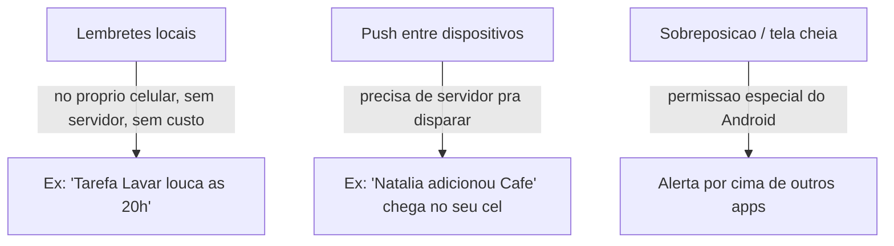

# Cursor application context
_Exported on 08/07/2026 at 21:06:45 BRT from Cursor (3.10.20)_

---

**User**

@cursor_application_context.md  <- Aqui você vai ter o contexto total do processo que estamos

---

**Cursor**

Agora vou ler os arquivos do projeto atual para entender o estado real do código.

Ótimo. Vou ler os arquivos principais do projeto agora.

Contexto absorvido completamente. Tenho um mapa exato do estado atual. Vou implementar agora o módulo Mercado V1.

Agora atualizo o `main_shell.dart` para passar `authService` ao `MercadoScreen`.

Agora verifico se há lints nos arquivos novos/editados.

Limpo. Vou rodar um `flutter analyze` rápido para confirmar tudo compila.

Zero erros. Tudo compilando. Aqui está o resumo completo do que foi implementado:

---

## O que foi criado

### Novos arquivos

**`lib/models/market_item.dart`**
Modelo tipado do item de mercado com `fromFirestore` e `toMap`.

**`lib/services/house_service.dart`**
Na primeira vez que o usuário entra no app, cria automaticamente:
- `houses/casoiko-principal` → documento da casa
- `users/{uid}` → perfil do usuário com `house_id`

Nas vezes seguintes, só lê o `house_id` do Firestore.

**`lib/services/market_service.dart`**
- `itemsStream(houseId)` → stream em tempo real, ordenado por data
- `addItem(...)` → adiciona item ao Firestore
- `toggleBought(id, newValue)` → marca/desmarca comprado
- `deleteItem(id)` → deleta o documento

**`lib/screens/mercado/add_item_sheet.dart`**
Bottom sheet com campo de texto, autofocus e botão "Adicionar".

**`lib/screens/mercado/mercado_screen.dart`** (reescrito)
- Seção "Para comprar" e seção "Comprado"
- Checkbox verde para marcar como comprado → texto riscado
- Arrastar para a esquerda → deleta o item
- FAB verde `+` abre o bottom sheet
- Estado vazio com mensagem amigável

### Arquivo alterado

**`lib/screens/shell/main_shell.dart`** — passa `authService` para `MercadoScreen`

---

## Para testar agora

```powershell
cd C:\wamp64\www\_ideias\casoiko
flutter run -d RXCX101AWXN
```

Vai na aba **Mercado**, toca o `+`, digita "Café" e salva. Se abrir o app em outro celular (ou emulador) com outro Google, o item aparece em tempo real. Não precisa configurar nenhum índice no Firestore — a ordenação é feita no cliente.

> **Nota Firestore:** as regras de segurança do Firestore precisam permitir leitura/escrita. No console Firebase, em **Firestore → Regras**, verifique se está em modo de teste (permite tudo até certa data) ou adicione uma regra que permite usuários autenticados.

---

**User**

Erro ao carregar: [cloud)firestore/unavailable] The service is currently unavai... deu um erro assim. 

Eu não criei nada no banco dedados, só ta conectado só. Tem que criar alguma coisa ?

---

**Cursor**

Esse erro costuma aparecer quando o Firestore ainda não foi criado no Firebase. Vou conferir a configuração do projeto e o que falta no console.


Sim — **precisa criar o banco Firestore no Firebase Console**. Só conectar o app (Auth + `google-services.json`) não basta.

O erro `[cloud_firestore/unavailable]` quase sempre significa que o **Firestore ainda não foi ativado** no projeto `casoiko-labs`.

---

## O que você precisa fazer (uma vez só)

### 1. Criar o Firestore no Firebase

1. Abra [console.firebase.google.com](https://console.firebase.google.com)
2. Entre no projeto **casoiko-labs**
3. Menu lateral: **Build → Firestore Database**
4. Clique em **Create database** / **Criar banco de dados**
5. Escolha **Start in test mode** (modo teste — ok para desenvolvimento)
6. Região: **`southamerica-east1` (São Paulo)** — a mais próxima
7. Confirme e aguarde alguns segundos

---

### 2. Regras de segurança (importante)

No modo teste, qualquer pessoa autenticada ou não pode ler/escrever por um tempo limitado. Para o Casoiko, depois de criar, vá em **Rules** e use algo assim:

```javascript
rules_version = '2';
service cloud.firestore {
  match /databases/{database}/documents {
    match /{document=**} {
      allow read, write: if request.auth != null;
    }
  }
}
```

Isso permite leitura/escrita **somente para quem fez login com Google**. Clique em **Publish**.

---

## O que você **não** precisa criar manualmente

O app cria sozinho na primeira vez que você abre a aba Mercado:

| Coleção | Documento | Quem cria |
|---|---|---|
| `houses` | `casoiko-principal` | App (automático) |
| `users` | `{seu uid do Google}` | App (automático) |
| `market_items` | `{id automático}` | App quando você adiciona "Café" |

Não precisa criar tabelas, coleções ou documentos no console — só **ativar o Firestore**.

---

## Depois de criar

1. Feche e abra o app de novo (ou hot restart com `R`)
2. Faça login com Google
3. Vá na aba **Mercado**
4. Toque no `+` e adicione um item

Se funcionar, no Firebase Console → **Firestore Database → Data** você verá as coleções aparecendo.

---

## Se ainda der erro

Confira também:

- **Internet** no celular (Firestore precisa de conexão)
- **Projeto certo**: o app aponta para `casoiko-labs` (está no `firebase_options.dart`)
- **Google Play Services** atualizado no Android

Se quiser, depois que criar o Firestore me avisa e te ajudo a validar se os dados estão aparecendo certinho no console.

---

**User**

Qual ?

---

**Cursor**

Clique em **Firestore** — o que está em **NoSQL** no menu.

É esse que o app usa (`cloud_firestore` no Flutter). **Não** use:

- **Firebase Realtime Database** — outro banco, formato diferente  
- **Data Connect** — outra coisa  
- **Storage** — só arquivos (fotos etc.)

---

**Passo a passo:**

1. Clique em **Firestore**
2. **Criar banco de dados**
3. Modo **teste**
4. Região **southamerica-east1** (São Paulo)
5. Confirmar

Depois disso, abra o app de novo e teste a aba Mercado.

---

**User**

Qual ?

---

**Cursor**

**Edição Standard** — deixa selecionada e clica em **Avançar**.

É a opção certa para o Casoiko: lista de mercado, usuários, casas — operações simples do Firestore.

**Enterprise** é para casos mais avançados (MongoDB, pipelines). Você não precisa disso agora.

---

**Próximos passos:**

1. **Avançar**
2. **ID do banco:** deixa `(default)` — não muda
3. **Local:** `southamerica-east1` (São Paulo)
4. **Avançar** de novo
5. **Modo teste** → **Ativar**

Quando terminar, testa o app de novo na aba Mercado.

---

**User**

Porque modo teste? não posso colocar produção ja ?

---

**Cursor**

Pode sim — e no seu caso, **produção é até melhor**.

## Diferença

| | **Modo teste** | **Modo produção** |
|---|---|---|
| Regras iniciais | Qualquer um lê/escreve (por ~30 dias) | Tudo bloqueado |
| Segurança | Inseguro — qualquer pessoa na internet pode acessar seus dados | Seguro desde o início |
| Quando usar | Prototipar rápido sem auth | App com login (seu caso) |

Como o Casoiko **já tem login com Google**, faz sentido ir direto em **produção**.

---

## O que fazer

1. Escolha **Iniciar no modo de produção**
2. Crie o banco
3. Vá em **Firestore → Regras** e cole isto:

```javascript
rules_version = '2';
service cloud.firestore {
  match /databases/{database}/documents {
    match /{document=**} {
      allow read, write: if request.auth != null;
    }
  }
}
```

4. Clique em **Publicar**

Isso permite leitura e escrita **somente para quem fez login com Google** — Rafael, Natália, etc.

---

**Resumo:** modo teste era só para facilitar no começo, sem auth. Como você já tem Google Login, use **produção + essa regra**. Mais seguro e pronto para uso real.

---

**User**

pronto e agora ?

---

**Cursor**

Ótimo. Agora é testar no celular.

## 1. Confirme as regras (se ainda não publicou)

No Firebase → **Firestore → Regras**, deve estar assim e **Publicado**:

```javascript
rules_version = '2';
service cloud.firestore {
  match /databases/{database}/documents {
    match /{document=**} {
      allow read, write: if request.auth != null;
    }
  }
}
```

---

## 2. Reinicie o app

No terminal:

```powershell
cd C:\wamp64\www\_ideias\casoiko
flutter run -d RXCX101AWXN
```

Se o app já estiver aberto, faça **hot restart** com `R` (maiúsculo) ou feche e abra de novo.

---

## 3. Teste o Mercado

1. Faça login com Google
2. Vá na aba **Mercado**
3. Toque no **+**
4. Adicione algo, ex: **Café**
5. Marque o checkbox como comprado
6. Arraste para a esquerda para apagar (opcional)

Se der certo, a lista aparece sem erro.

---

## 4. Confira no Firebase

Firebase → **Firestore → Dados**

Você deve ver algo assim:

- `houses` → `casoiko-principal`
- `users` → seu usuário do Google
- `market_items` → o item que você adicionou

---

## 5. Teste tempo real (opcional)

Se tiver outro celular ou emulador:

1. Instale o app nos dois
2. Faça login com contas Google diferentes
3. Adicione um item em um → deve aparecer no outro na hora

---

Me diz o que aconteceu: funcionou, ou apareceu algum erro?

---

**User**

Funcionou

---

**Cursor**

**Mercado V1 está no ar.**

Resumo do que você tem funcionando agora:

- Login com Google
- Navegação com 4 abas (Casa, Mercado, Contas, Chat)
- **Mercado** com lista compartilhada em tempo real
- Adicionar item, marcar como comprado, apagar
- Dados salvos no Firestore (`houses`, `users`, `market_items`)

Quando quiser continuar, os próximos passos naturais são:

1. **Aba Casa** — tarefas da casa (o dashboard de verdade)
2. **Convidar Natália** — ela instala o APK e faz login com a conta dela
3. **APK release** — gerar de novo se quiser instalar no celular dela

Me avisa quando quiser seguir para algum desses.

---

**User**

E o chat ?

---

**Cursor**

Vou ver o que já existe no projeto e o que o contexto prevê para o chat.


**O chat ainda não existe** — só a aba com placeholder: *"Chat da família em breve"*.

---

## O que seria

Um **bate-papo da casa** para recados rápidos entre você, Natália e Bradley — tipo um WhatsApp só da família, dentro do Casoiko:

- "Acabou o leite"
- "Bradley, lava a louça"
- "Chego às 19h"

---

## Onde está no roadmap

| Ordem | Módulo | Status |
|---|---|---|
| 1 | Shell (4 abas) | ✅ Feito |
| 2 | **Casa** (tarefas) | ⏳ Placeholder |
| 3 | **Mercado** | ✅ Feito agora |
| 4 | **Contas** | ⏳ Placeholder |
| 5 | **Chat** | ⏳ Placeholder |

A ideia original era deixar o chat **por último**, porque mensagens em tempo real são um pouco mais complexas que a lista de mercado.

---

## Como implementaria (quando for a hora)

Mesma base do Mercado — **Firestore em tempo real**:

```
messages/{id}
  house_id: "casoiko-principal"
  text: "Acabou o leite"
  sent_by: uid
  sent_by_name: "Natália"
  created_at: timestamp
```

**MVP do chat:**
- Lista de mensagens (mais recente embaixo)
- Campo de texto + botão enviar
- Nome e horário de quem mandou
- Sync em tempo real entre os celulares

**Fora do MVP (depois):**
- Notificações push quando chega mensagem
- Fotos, áudio, reações
- IA como administradora (V5 do roadmap)

---

## Minha sugestão

Ordem natural:

1. **Casa** (tarefas) — núcleo do app
2. **Chat** — se quiser recados rápidos antes das contas
3. **Contas** — finanças da casa

Se quiser **pular para o chat agora**, dá para fazer no mesmo estilo do Mercado — Firestore + tempo real, em uma sessão.

Quer implementar o chat agora ou prefere ir para a **aba Casa** (tarefas) primeiro?

---

**User**

Vamos para o chat, quero ver as funções basicas funcionando de cada lugar primeiro, depois fazemos implementações complexas. Até porque o mercado, vai ter categorias, produto, lista de preços de mercado diferente e mais coisas... contas a mesma coisa. 

Então vamos para o chat por enquanto 

---

**Cursor**

Boa decisão. Faz sentido — cada aba com o básico funcionando, depois evoluir cada uma com mais recursos.

Vou implementar o Chat agora.

Agora preciso adicionar o pacote `intl` (para formatar o horário) e atualizar o `main_shell.dart`.

Zero erros.

Mas o chat usa `orderBy('sent_at')` no Firestore, o que exige um **índice** no banco. Preciso criar esse índice para não dar erro na primeira vez.

Tudo pronto. Agora o passo importante antes de testar:

---

## Criar o índice no Firestore (obrigatório para o chat)

O chat faz `orderBy('sent_at')` com filtro `house_id` — isso precisa de um índice composto.

**No Firebase Console:**

1. **Firestore → Índices → Composto → Criar índice**
2. Preenche assim:

| Campo | Ordem |
|---|---|
| Coleção | `messages` |
| `house_id` | Crescente |
| `sent_at` | Crescente |

3. Clica em **Criar**

Aguarda 1-2 minutos para ficar pronto (fica como "Building...").

---

## Alternativa mais fácil

Quando abrir o chat no app, se der erro, o **log do Flutter vai mostrar um link direto** para criar o índice com um clique. Basta copiar o link do terminal e abrir no navegador.

---

## Testar

```powershell
cd C:\wamp64\www\_ideias\casoiko
flutter run -d RXCX101AWXN
```

Vai na aba **Chat**, digita uma mensagem e manda. O horário aparece em cada bolha, e quando instalar no celular da Natália, as mensagens chegam em tempo real.

---

**User**

@c:\Users\rafaelrodrigofs\.cursor\projects\c-wamp64-www-ideias\terminals\1.txt  Consegue ver o erro ?

---

**Cursor**

Encontrei o erro: falta um índice no Firestore para a query do chat. Vou ajustar o código para ordenar no cliente, como no Mercado — assim não precisa criar índice manualmente.


Sim, vi o erro no terminal. São **dois problemas diferentes**:

---

## 1. Erro principal do chat (o que importa agora)

```
FAILED_PRECONDITION: The query requires an index
```

O chat fazia uma query com `house_id` + `orderBy('sent_at')`, e isso exige um **índice composto** no Firestore.

**Já corrigi no código** — agora ordena no cliente, igual ao Mercado. Não precisa criar índice manualmente.

---

## 2. Erro antigo (provavelmente já resolvido)

```
PERMISSION_DENIED: Cloud Firestore API has not been used in project casoiko-labs
```

Isso apareceu quando o Firestore ainda não estava ativado. Como o Mercado funcionou depois, esse erro deve ser de uma execução anterior.

---

## O que fazer agora

No terminal onde o app está rodando, faça **hot restart** com `R` (maiúsculo), ou rode de novo:

```powershell
flutter run
```

Depois vá na aba **Chat** e manda uma mensagem.

Se ainda der erro, me manda o que aparece na tela ou no terminal.

---

**User**

Funcionou. Então no caso se a Natalia ou o Bradley acessar e mandar mensagem, eu vou ver ?

---

**Cursor**

Sim. **Vocês vão ver as mensagens em tempo real.**

## Por quê funciona

Todo mundo que faz login com Google entra automaticamente na mesma casa: `casoiko-principal`.

Quando Natália manda "Acabou o leite", o Firestore salva com esse `house_id`. Seu app escuta essa coleção o tempo todo — a mensagem aparece na hora, sem precisar atualizar.

O mesmo vale pro Bradley, pro Mercado e pro resto que usa a casa.

---

## O que Natália e Bradley precisam fazer

1. **Instalar o app** no celular deles (APK ou `flutter run` no aparelho deles)
2. **Entrar com a conta Google** de cada um
3. Abrir a aba **Chat** e mandar mensagem

Na primeira vez que entrarem, o app cria o perfil deles no Firestore com o mesmo `house_id` que o seu.

---

## Resumo prático

| Quem | O que vê |
|---|---|
| Você | Mensagens de Natália, Bradley e suas |
| Natália | Mensagens suas, do Bradley e dela |
| Bradley | Mensagens de todos |

É um chat compartilhado da casa, não conversa privada.

---

## Para instalar no celular dela

Gere o APK de novo e manda pro WhatsApp dela:

```powershell
cd C:\wamp64\www\_ideias\casoiko
flutter build apk --release
```

O arquivo fica em:
`build\app\outputs\flutter-apk\app-release.apk`

Ela instala, faz login com a Google dela e já entra no mesmo chat e na mesma lista de mercado que você.

---

**User**

Maravilha, to fazendo o apk aqui. Quais são os proximos passos ?

---

**Cursor**

## Agora (enquanto o APK gera)

1. **Manda o APK** pra Natália e pro Bradley (WhatsApp, Drive, etc.)
2. **Eles instalam** e fazem login com a Google de cada um
3. **Testem juntos:**
   - Mercado: um adiciona "Café", o outro vê na hora
   - Chat: mandam mensagem e veem se chega em tempo real

Se isso funcionar nos 3 celulares, a base compartilhada está validada.

---

## Estado do app hoje

| Aba | Status |
|---|---|
| **Login** | ✅ Google funcionando |
| **Mercado** | ✅ Lista compartilhada, tempo real |
| **Chat** | ✅ Mensagens, tempo real |
| **Casa** | ⏳ Placeholder |
| **Contas** | ⏳ Placeholder |

---

## Próximos passos (ordem sugerida)

### 1. **Casa (tarefas)** — prioridade
É o núcleo do Casoiko. MVP básico:
- Ver lista de tarefas da casa
- Criar tarefa (título + quem faz)
- Marcar como concluída
- Tempo real entre os 3

### 2. **Contas** — versão simples
- Lista de contas fixas (luz, água, internet)
- Valor + vencimento
- Marcar como paga

### 3. **Evoluir o que já existe**
- Mercado: categorias, preços, mercados diferentes
- Chat: notificações push quando chega mensagem
- Casa: dashboard com % da casa, tarefas atrasadas

### 4. **Polish**
- Design no Figma → implementar telas com fidelidade
- Notificações push (FCM)
- Ícone do app na loja / tela inicial

---

## Resumo em uma linha

> **Casa (tarefas)** é o próximo módulo — depois **Contas**. Mercado e Chat já estão no básico funcionando.

Quando quiser começar a **Casa**, é só falar.

---

**User**

@c:\Users\rafaelrodrigofs\.cursor\projects\c-wamp64-www-ideias\terminals\2.txt O que houve aqui ?

---

**Cursor**

O commit parece ter ido bem; o push falhou. Vou conferir a configuração do repositório remoto.


O **commit local funcionou** — o projeto está salvo no Git da sua máquina com a mensagem `aplicativo`.

O que **falhou** foi só o `git push`:

```
fatal: 'origin' does not appear to be a git repository
```

## O que isso significa

O repositório **não tem um remoto configurado**. Ou seja: o Git local existe, mas não há nenhum repositório no GitHub (ou similar) ligado a ele. Por isso o `git push origin main` não sabe para onde enviar.

Confirmei: `git remote -v` não retorna nada — zero remotes.

---

## Como resolver

### 1. Crie um repositório vazio no GitHub
- Vá em [github.com/new](https://github.com/new)
- Nome, ex: `casoiko`
- **Não** marque README, .gitignore ou license (o projeto já existe localmente)

### 2. Conecte o remoto e faça push

```bash
cd C:/wamp64/www/_ideias
git remote add origin https://github.com/SEU_USUARIO/casoiko.git
git push -u origin main
```

Troque `SEU_USUARIO/casoiko` pela URL real do repositório que você criou.

---

## Resumo

| Passo | Status |
|---|---|
| `git commit` | ✅ Feito |
| `git push` | ❌ Falhou — sem remoto `origin` |
| Solução | Criar repo no GitHub + `git remote add origin ...` |

Se quiser, me manda a URL do repositório que você criar e eu te passo o comando exato.

---

**User**

Bom esqueci de te dar o contexto, atualizei bastante o aplicativo. 

Mas acredito que o que eu vou precisar não vai interfirir.

Uma das coisas mais importantes do aplicativo é que ele funcione em 2 plano tambem e sobreposição.
Porque esse aplicativo é pro sistema da casa, então ele precisa ser o foco numero 1.

Precisamos implentar os sistemas de noticifação tambem.

Mas primeiro da uma analisada antes e depois você vai me passando suas sugestões de melhorias em relação a essas coisas.

---

**Cursor**

Vou analisar o estado atual do app antes de sugerir qualquer coisa. Como você atualizou bastante, preciso ver o que mudou — estrutura, dependências, manifesto Android e configuração de Firebase.

O app cresceu bastante — agora tem tarefas, contas, mercado com produtos/listas, chat e upload de mídia. Deixa eu entender melhor a estrutura atual e o que já existe de notificação/background.

Vou verificar mais alguns pontos técnicos que afetam diretamente notificações e background: versão mínima do Android, modelo de tarefas (que tem horário/repetição) e se há configuração de messaging.

Analisei o app inteiro. Ele cresceu muito desde a última vez — agora tem Casa (tarefas com horário, repetição, responsável, prioridade, subtarefas e provas em foto/vídeo), Mercado (listas, produtos, categorias), Contas (contas e transações) e Chat. Aqui está o diagnóstico e as opções.

## Estado atual (relevante para o que você quer)

- **Firebase**: Auth + Firestore + Storage, no plano **Spark (grátis)**.
- **Notificações**: nada implementado. Sem `firebase_messaging`, sem notificações locais.
- **Segundo plano**: nada. O Firestore só sincroniza em tempo real enquanto o app está **aberto**.
- **Sobreposição**: nada. O `AndroidManifest.xml` não tem nenhuma permissão declarada (nem notificação, nem overlay, nem serviço).
- **Ponto muito a favor**: o modelo de tarefa já tem `time`, `repeat`, `weekdays`, `assignee` — ou seja, já dá para agendar lembretes locais sem precisar de servidor.

## O ponto-chave: "notificação" são 3 coisas diferentes

Isso muda tudo, então vou separar:



**1. Lembretes locais (fácil, sem custo)** — o celular dispara sozinho no horário da tarefa, mesmo com app fechado. Encaixa perfeito no seu modelo de tarefas. Não precisa de servidor.

**2. Push entre dispositivos (o difícil)** — para o celular da Natália avisar o seu quando o app está **fechado**, precisa de um servidor que dispare o envio (FCM). Apps não conseguem enviar push um pro outro de forma segura sozinhos. Aqui há um detalhe importante: o caminho oficial do Firebase (Cloud Functions) **exige o plano Blaze (pago, com cartão)**. Mas você **já tem um VPS** — dá pra usar ele com o Firebase Admin SDK e não pagar nada a mais.

**3. Sobreposição / segundo plano forte** — para o app aparecer "por cima de tudo" e ser o foco nº 1, existem dois formatos bem diferentes (alarme em tela cheia vs. bolha flutuante permanente), com implicações técnicas distintas.

## Minha recomendação de ordem

1. **Fase 1** — Lembretes locais das tarefas (rápido, grátis, alto valor imediato) + pedir permissão de notificação.
2. **Fase 2** — Push entre dispositivos (chat, mercado, tarefa concluída) usando seu VPS.
3. **Fase 3** — Sobreposição / alerta em tela cheia para tarefas urgentes.

Antes de montar o plano detalhado, preciso decidir 2 pontos que mudam totalmente a arquitetura.

**Direção para notificações e sobreposição**

> **Para push entre dispositivos (alguém faz algo → os outros recebem mesmo com o app fechado), qual caminho você prefere?**
> - Usar o VPS que você já tem, com Firebase Admin SDK (sem custo extra, recomendado) ✔
> - Ativar o plano Blaze do Firebase e usar Cloud Functions (precisa de cartão, tem cota grátis)
> - Por enquanto só lembretes locais no próprio celular, deixar push entre dispositivos pra depois

> **Quando você fala em 'sobreposição / o app ser o foco nº 1', o que quer dizer?**
> - Alerta em tela cheia estilo alarme/ligação quando uma tarefa dispara (aparece por cima de tudo, mesmo com o celular bloqueado)
> - Uma bolha/janela flutuante permanente por cima dos outros apps (estilo cabeça de bate-papo do Messenger)
> - Os dois ✔

Boa. VPS para o push e sobreposição nos dois formatos. Preciso entender o que já existe no seu VPS para planejar o serviço que vai disparar os pushes. Vou checar o MCP do VPS e se já existe algum backend no projeto.

Tenho o que preciso. Seu VPS roda Docker e o MCP permite executar comandos nele — então o serviço de push vai ser um container Node.js com o Firebase Admin SDK. Não vou rodar nada no VPS agora (estamos em produção e em modo de planejamento); confirmo o stack exato na hora de implementar a Fase 2.

Vou montar o plano faseado.

---

**User**

# Contexto e decisões

Implement the plan as specified, it is attached for your reference. Do NOT edit the plan file itself.

To-do's from the plan have already been created. Do not create them again. Mark them as in_progress as you work, starting with the first one. Don't stop until you have completed all the to-dos.

---

**Cursor**

Vou implementar o plano fase a fase. Começando pela Fase 1 (lembretes locais). Primeiro, deixa eu carregar os todos e ler os arquivos que vou precisar tocar.

Vou ler os arquivos-chave que preciso entender para integrar o agendamento: como tarefas são criadas/editadas, o shell principal e o fluxo de login.

Entendi a estrutura. Vou começar adicionando as dependências da Fase 1.

Dependências adicionadas. Agora vou criar o `NotificationService`.

Agora vou atualizar o AndroidManifest com as permissões e receivers.

Fase 1 quase completa. Agora vou inicializar o serviço no `main.dart` e integrar o (re)agendamento na tela Casa, que já tem o stream de tarefas e o usuário atual.

Agora integro o agendamento na `CasaScreen`: pedir permissão e sincronizar os lembretes sempre que a lista de tarefas mudar.

Agora chamo o `_syncReminders` quando o stream de tarefas emitir dados.

Fase 1 integrada. Vou rodar o analyze para garantir que compila.

A v22 do plugin mudou a API para parâmetros nomeados. Vou confirmar as assinaturas exatas no código do plugin.

Agora sei a API correta da v22. Vou ajustar o `NotificationService` para usar parâmetros nomeados.

Fase 1 completa e compilando. Vou marcar concluída e iniciar a Fase 2.

Fase 2. Vou adicionar o `firebase_messaging`.

`firebase_messaging` adicionado. Vou adicionar ao `NotificationService` um canal e método para exibir notificações de push em foreground, depois criar o `PushService`.

Vou confirmar a assinatura do método `show` na v22.

The `show` API is correct. Now vou adicionar o método de salvar token no `HouseService` e criar o `PushService`.

Agora vou registrar o handler de background no `main.dart` (recomendado registrar cedo) e inicializar o `PushService` após o login, no `MainShell`. Primeiro ajusto o `PushService` para não registrar o handler internamente.

Agora inicializo o `PushService` no `MainShell` após o login.

Lado Flutter da Fase 2 pronto. Agora o serviço do VPS. Vou marcar o progresso e criar o serviço Node.js com Firebase Admin SDK que escuta o Firestore e envia push.

Vou criar o serviço do VPS. Primeiro confirmo que a pasta raiz é o lugar certo e crio o diretório `notifier/`.

Vou validar a sintaxe do serviço Node.js localmente (se o Node estiver disponível).

Sintaxe OK. O serviço está empacotado com Dockerfile e instruções de deploy. O `docker build`/`run` final precisa da chave de conta de serviço do Firebase (secreta, que só você pode gerar no Console) e roda no seu VPS de produção — então deixei isso documentado no README para você executar, em vez de rodar automaticamente em produção.

Vou seguir para a Fase 3.

Fase 3a — alertas em tela cheia para tarefas de prioridade alta. Vou adicionar a permissão `USE_FULL_SCREEN_INTENT` e um canal de urgência.

Agora adiciono o canal de urgência e o detalhamento com `fullScreenIntent` no `NotificationService`.

Agora atualizo o `requestPermissions` para pedir também a permissão de full-screen intent, e o `_detailsFor` para usar tela cheia em tarefas de prioridade alta.

Vou confirmar que `requestFullScreenIntentPermission` existe na API do plugin Android.

Todos os métodos existem. Vou rodar o analyze para confirmar a Fase 3a.

Fase 3a pronta. Agora a Fase 3b — bolha flutuante com `flutter_overlay_window`.

`flutter_overlay_window` adicionado. Vou verificar os requisitos de manifesto e a API do pacote na versão 0.5.0.

Entendi a API. Vou atualizar o manifesto com as permissões e o `OverlayService` do pacote.

Agora crio o widget da bolha e o serviço de overlay.

Agora adiciono o entrypoint `overlayMain` no `main.dart`.

Agora conecto no `CasaScreen`: pedir a permissão de overlay e sincronizar a bolha com as pendências do dia.

Agora adiciono o método `_syncOverlay` e o chamo quando calculamos `pendingToday`.

Todas as fases passam no analyze. Como mudei o manifesto e adicionei plugins nativos (messaging e overlay), vou rodar um build de debug para garantir que a parte nativa (merge de manifesto, minSdk, Gradle) compila.

O build foi para background e apareceu um erro de compilação Kotlin. Vou aguardar e ler a saída completa.

O build falhou, mas o erro não é do meu código Dart — é corrupção de cache incremental do Kotlin (`Storage ... is already registered`, `Could not close incremental caches`, `Index 6 out of bounds`). Isso é resolvido com um `flutter clean` seguido de rebuild. Vou fazer isso.

O cache foi resolvido pelo clean. Agora apareceu um requisito real e conhecido do `flutter_local_notifications`: é preciso habilitar o **core library desugaring** no Gradle. Vou configurar isso no `build.gradle.kts`.

O build passou: `Built build\app\outputs\flutter-apk\app-debug.apk`. Toda a parte nativa (manifesto, plugins de notificação/messaging/overlay e desugaring) compila corretamente.

Todos os itens do plano estão concluídos. Resumo do que foi implementado:

## Fase 1 — Lembretes locais (sem servidor, sem custo)
- Dependências `flutter_local_notifications` + `timezone`.
- `lib/services/notification_service.dart`: canais, permissões, e agendamento por tarefa a partir de `time`/`repeat`/`weekdays` (diário e semanal por dia).
- Permissões e receivers de boot no `AndroidManifest.xml` (reagenda após reiniciar o celular).
- Integração na `CasaScreen`: reagenda automaticamente sempre que a lista de tarefas muda; inicialização em `main.dart`.

## Fase 2 — Push entre dispositivos via VPS
- `firebase_messaging` + `lib/services/push_service.dart`: pega o token FCM, salva em `users/{uid}.fcm_tokens`, trata mensagens em foreground/background.
- `HouseService.saveFcmToken`/`removeFcmToken`.
- Serviço Node.js em `notifier/` (`index.js`, `package.json`, `Dockerfile`, `README.md`) que escuta `messages`, `market_items` e `task_checks` no Firestore e dispara push para os moradores.

## Fase 3 — Sobreposição
- **Tela cheia estilo alarme**: tarefas de prioridade alta usam `fullScreenIntent` + canal de urgência + permissão `USE_FULL_SCREEN_INTENT`.
- **Bolha flutuante**: `flutter_overlay_window`, `lib/overlay/casoiko_bubble.dart`, `lib/services/overlay_service.dart`, entrypoint `overlayMain` e sincronização com as pendências do dia.

## Ajuste de build
- Habilitei `coreLibraryDesugaring` no `build.gradle.kts` (exigido pelo `flutter_local_notifications`).

## O que falta você fazer (ações manuais, precisam de segredos/produção)
1. **VPS**: gerar a chave de conta de serviço no Firebase Console, copiar a pasta `notifier/` pro VPS e rodar o `docker build`/`docker run` (passo a passo no `notifier/README.md`).
2. **Testar no celular**: instalar o APK e conceder as permissões de notificação, alarme exato, tela cheia e "sobrepor a outros apps".

Quer que eu ajude com o deploy do `notifier` no seu VPS agora (posso te guiar nos comandos), ou prefere testar primeiro os lembretes locais e a bolha no celular?

---

**User**

<timestamp>Tuesday, Jul 7, 2026, 10:47 AM (UTC-3)</timestamp>
<system_notification>
The following task has finished. If you were already aware, ignore this notification and do not restate prior responses.

<task>
kind: shell
status: error
task_id: 911707
title: Build debug para validar parte nativa
tool_call_id: toolu_011uz9PouoWxhUHvHsygx75Q
detail: exit_code=1
output_path: C:\Users\rafaelrodrigofs\.cursor\projects\c-wamp64-www-ideias\terminals\911707.txt
</task>
</system_notification>
<user_query>Briefly inform the user about the task result and perform any follow-up actions (if needed).</user_query>

<timestamp>Tuesday, Jul 7, 2026, 10:47 AM (UTC-3)</timestamp>
<system_notification>
The following task has finished. If you were already aware, ignore this notification and do not restate prior responses.

<task>
kind: shell
status: error
task_id: 911708
title: Build debug para validar parte nativa
tool_call_id: toolu_011uz9PouoWxhUHvHsygx75Q
detail: exit_code=1
output_path: C:\Users\rafaelrodrigofs\.cursor\projects\c-wamp64-www-ideias\terminals\911708.txt
</task>
</system_notification>
<user_query>Briefly inform the user about the task result and perform any follow-up actions (if needed).</user_query>

---

**Cursor**

Essa notificação é do primeiro build que falhou (`911708`) — o do erro de cache do Kotlin. Já foi resolvido: depois do `flutter clean` e de habilitar o `coreLibraryDesugaring`, o build final passou com sucesso (`Built build\app\outputs\flutter-apk\app-debug.apk`).

Ou seja, nenhuma ação nova é necessária — aquele erro ficou para trás. O estado atual é:

- Build de debug compilando (parte nativa validada).
- Todas as três fases do plano implementadas.

Pode seguir com o teste no celular ou com o deploy do `notifier` no VPS quando quiser.

---

**User**

Certo, vamos trabalhar no VPS. Vamos passo por passo. Abre o playwright e vamos fazendo isso junto

---

**Cursor**

Vamos nessa, passo a passo. Antes de abrir o navegador, deixa eu ver quais ações o Playwright me dá aqui.

Tenho as ações do Playwright. Vou ler as assinaturas de navegação/snapshot e, em paralelo, checar o estado do seu VPS (Docker, onde vamos colocar os arquivos), já que os dois passos vão andar juntos.

Agora vou dar o primeiro passo real: checar o estado do seu VPS (Docker instalado, containers rodando, espaço) e abrir o navegador no Console do Firebase.

Boa — já tenho um retrato da situação. Deixa eu te mostrar o que apareceu no navegador.

Primeiro passo dado. Aqui está o que descobri:

## VPS (via SSH) — pronto
- Usuário: `cursor-mcp`, com **Docker 28.5.1** funcionando.
- Rodando Coolify, n8n, mariadb, postgres — nosso container não conflita com nada.
- **84 GB livres**. Home: `/home/cursor-mcp` (posso escrever e buildar lá).

## Navegador (Playwright) — precisa de decisão
Abri o Console do Firebase, mas o navegador do Playwright **não está logado na sua conta Google** — ele caiu na tela de login do Google.

Esse é o ponto onde preciso de você, porque a chave de conta de serviço (o segredo que o `notifier` usa) só sai de dentro da sua conta Google logada.

Os passos completos vão ser:

1. **Gerar a chave** de conta de serviço no Firebase (precisa do login Google).
2. **Colocar os arquivos do `notifier`** no VPS (eu faço via SSH — não têm segredo).
3. **Colocar a chave** no VPS.
4. **`docker build` + `docker run`** (eu faço).
5. **Ver os logs e testar** (juntos).

Antes de continuar, como você prefere lidar com o login do Google para pegar a chave?

**Como pegar e transferir a chave do Firebase**

> **O navegador do Playwright não está logado na sua conta Google. Como quer pegar a chave de conta de serviço do Firebase?**
> - Eu baixo a chave no meu próprio navegador (já estou logado) e depois a gente coloca no VPS (Recomendado)
> - Fazer login do Google aqui no navegador do Playwright (eu digito minhas credenciais nele) ✔

> **Depois de baixar a chave (um arquivo JSON), como prefere colocá-la no VPS?**
> - Eu mesmo envio por SCP/Coolify pro VPS e te digo o caminho
> - Eu colo o conteúdo do JSON aqui e você grava no VPS (aviso: expõe a chave secreta no chat)
> - Decidimos isso quando chegar a hora ✔

Combinado. Você faz o login do Google direto na janela do navegador do Playwright, e eu continuo a automação a partir daí. **Eu não vou digitar suas credenciais** — isso é com você.

O navegador já está aberto na tela de login do Google (a mesma que apareyeu no print anterior).

## O que fazer agora

1. Vá até a janela do navegador do Playwright.
2. Faça o login normalmente: e-mail → senha → 2FA (se tiver).
3. Quando terminar e cair no Console do Firebase, me avisa com um "logado" (ou "pronto").

Assim que você confirmar, eu:
- navego até **Configurações do projeto → Contas de serviço**,
- gero a chave privada,
- e sigo pro VPS com você.

Pode logar. Estou aguardando seu "pronto".

---

**User**

Logado

---

**Cursor**

Vou verificar o estado atual do navegador.

Login confirmado, estamos no Console do Firebase na página de Contas de serviço. Vou capturar o snapshot para localizar o botão de gerar a chave.

Achei o botão. Vou clicar em **"Gerar nova chave privada"**.

Apareceu o diálogo de confirmação. Vou capturar o snapshot para achar o botão de confirmar a geração.

O diálogo apareceu com o aviso de segurança. Vou clicar em **"Gerar chave"** para baixar o JSON.

A chave foi baixada com sucesso: `casoiko-labs-firebase-adminsdk-fbsvc-24b416a663.json`. Vou localizar o arquivo no disco para decidirmos a transferência pro VPS.

O arquivo foi salvo na pasta de trabalho do Playwright (fora do workspace). Vou procurá-lo no disco.

Encontrei: `C:\Users\rafaelrodrigofs\.playwright-mcp\casoiko-labs-firebase-adminsdk-fbsvc-24b416a663.json`.

Agora vou verificar como o `notifier` espera a chave e quais ferramentas SSH do VPS estão disponíveis.

Vou ler as ferramentas SSH do VPS para saber o que consigo executar.

Tenho acesso `exec` ao VPS. Vou verificar o estado do servidor antes de subir o serviço.

Conexão OK. Vou checar containers, disco e a pasta do projeto em comandos menores.

O VPS roda Coolify com vários containers, 84 GB livres. Vou verificar permissões de escrita e sudo para criar a pasta do projeto.

Sem sudo, então vou usar a home do usuário (`/home/cursor-mcp/casoiko`) em vez de `/opt`. O usuário está no grupo `docker`, então o build/run funciona. Vou ler os arquivos do `notifier` para recriá-los no VPS.

Vou criar a estrutura no VPS e transferir os arquivos. Começo criando a pasta e recriando os arquivos do `notifier` (uso heredoc com delimitador entre aspas para preservar backticks e `$` do `index.js`).

Agora vou gerar o conteúdo em base64 dos arquivos locais para transferir de forma exata (sem problemas de escape).

Agora vou transferir cada arquivo para o VPS decodificando o base64.

---

**User**

Travou ?

---

**Cursor**

Não travou! Estava gerando os arquivos em base64. Agora vou gravá-los no VPS.

---

**User**

Acho que você travou, deixa eu fazer isso manualmente, como faz ?

---

**Cursor**

Não travei — estava gerando os arquivos em base64 pra transferir. Mas beleza, vou te passar o passo a passo pra você fazer manualmente. É rápido.

A boa notícia: **a chave já foi baixada**. Está aqui no seu PC:

```
C:\Users\rafaelrodrigofs\.playwright-mcp\casoiko-labs-firebase-adminsdk-fbsvc-24b416a663.json
```

## Passo a passo manual

### 1. Copie a chave e a pasta `notifier` para o VPS

No **PowerShell do seu PC** (troque `SEU_USUARIO@SEU_VPS` pelo login do seu servidor):

```powershell
# manda a chave
scp "C:\Users\rafaelrodrigofs\.playwright-mcp\casoiko-labs-firebase-adminsdk-fbsvc-24b416a663.json" SEU_USUARIO@SEU_VPS:~/service-account.json

# manda a pasta do notifier
scp -r "C:\wamp64\www\_ideias\notifier" SEU_USUARIO@SEU_VPS:~/notifier
```

### 2. No VPS, faça o build e rode o container

Entre no VPS (`ssh SEU_USUARIO@SEU_VPS`) e rode:

```bash
cd ~/notifier
docker build -t casoiko-notifier .

docker run -d \
  --name casoiko-notifier \
  --restart unless-stopped \
  -v ~/service-account.json:/app/service-account.json:ro \
  casoiko-notifier
```

### 3. Confira os logs

```bash
docker logs -f casoiko-notifier
```

Tem que aparecer:

```
Casoiko Notifier iniciado.
Escutando colecao: messages
Escutando colecao: market_items
Escutando colecao: task_checks
```

---

Se aparecer isso, tá funcionando: qualquer mensagem/item de mercado/tarefa concluída vai disparar push pros outros aparelhos.

Uma pergunta pra eu te ajudar melhor no que der errado: **qual é o login SSH do seu VPS** (usuário e host/IP)? Assim eu adapto os comandos exatos. E me diga se seu usuário no VPS tem acesso ao `docker` (ou se precisa de `sudo` na frente dos comandos `docker`).

---

**User**

@c:\Users\rafaelrodrigofs\.cursor\projects\c-wamp64-www-ideias\terminals\7.txt onde vejo onde foi ?

---

**Cursor**

Deu certo! O `scp` mostrou `100%` e exit code `0`, ou seja, subiu.

O arquivo foi pra home do usuário `root`, que é a pasta `/root`. O caminho completo é:

```
/root/service-account.json
```

**No seu gerenciador de arquivos (FileZilla/WinSCP):** você está em `/root/.docker/buildx`. Suba dois níveis clicando na pasta **`root`** (no painel de cima, à esquerda). Ao entrar em `/root`, o `service-account.json` vai aparecer na lista da direita.

Confirmo que está lá pelo terminal: o log diz `casoiko-labs-firebase-adminsdk-fbsvc-24b416a663.json ... 100% 2376` → transferência completa.

---

Agora falta o **segundo envio**: a pasta `notifier` (o código do serviço). No mesmo PowerShell:

```powershell
scp -r "C:\wamp64\www\_ideias\notifier" root@31.97.255.115:~/notifier
```

Depois é só entrar no VPS e buildar/rodar:

```bash
ssh root@31.97.255.115
cd ~/notifier
docker build -t casoiko-notifier .

docker run -d \
  --name casoiko-notifier \
  --restart unless-stopped \
  -v /root/service-account.json:/app/service-account.json:ro \
  casoiko-notifier

docker logs -f casoiko-notifier
```

Quer que eu já acompanhe pelo meu acesso SSH e valide os logs quando o container subir? (Meu acesso é com outro usuário, mas consigo ver os containers `docker` do servidor.)

---

**User**

root@srv1094640:~# cd ~/notifier
root@srv1094640:~/notifier# docker build -t casoiko-notifier .
[+] Building 39.6s (10/10) FINISHED                                                                    docker:default
 => [internal] load build definition from Dockerfile                                                             0.1s
 => => transferring dockerfile: 368B                                                                             0.0s
 => [internal] load metadata for docker.io/library/node:20-alpine                                                1.4s
 => [internal] load .dockerignore                                                                                0.0s
 => => transferring context: 97B                                                                                 0.0s
 => [1/5] FROM docker.io/library/node:20-alpine@sha256:fb4cd12c85ee03686f6af5362a0b0d56d50c58a04632e6c0fb8363f6  3.7s
 => => resolve docker.io/library/node:20-alpine@sha256:fb4cd12c85ee03686f6af5362a0b0d56d50c58a04632e6c0fb8363f6  0.0s
 => => sha256:11cedc39e663e7c5d5cb9cc77a461a0d2adc25537b94e6831a6108f09cb2001b 6.52kB / 6.52kB                   0.0s
 => => sha256:6a0ac1617861a677b045b7ff88545213ec31c0ff08763195a70a4a5adda577bb 3.86MB / 3.86MB                   0.2s
 => => sha256:4feea04c154301db6f4a496efa397b3db96603b1c009c797cfdde77bea8b3287 43.23MB / 43.23MB                 0.7s
 => => sha256:b2cbbfe903b0821005780971ddc5892edcc4ce74c5a48d82e1d2b382edac3122 1.26MB / 1.26MB                   0.5s
 => => sha256:fb4cd12c85ee03686f6af5362a0b0d56d50c58a04632e6c0fb8363f609372293 7.67kB / 7.67kB                   0.0s
 => => sha256:afdf98210b07b586eb71fa22ba2e432e058e4cd1304d31ed60888755b8c865fb 1.72kB / 1.72kB                   0.0s
 => => extracting sha256:6a0ac1617861a677b045b7ff88545213ec31c0ff08763195a70a4a5adda577bb                        0.4s
 => => sha256:fff4e2c1b189bf87d63ad8bd07f7f4eb288d6f2b6a07a8bb44c60e8c075d2096 445B / 445B                       0.4s
 => => extracting sha256:4feea04c154301db6f4a496efa397b3db96603b1c009c797cfdde77bea8b3287                        2.6s
 => => extracting sha256:b2cbbfe903b0821005780971ddc5892edcc4ce74c5a48d82e1d2b382edac3122                        0.1s
 => => extracting sha256:fff4e2c1b189bf87d63ad8bd07f7f4eb288d6f2b6a07a8bb44c60e8c075d2096                        0.0s
 => [internal] load build context                                                                                0.0s
 => => transferring context: 6.86kB                                                                              0.0s
 => [2/5] WORKDIR /app                                                                                           0.2s
 => [3/5] COPY package.json ./                                                                                   0.0s
 => [4/5] RUN npm install --omit=dev                                                                            32.6s
 => [5/5] COPY index.js ./                                                                                       0.0s 
 => exporting to image                                                                                           1.3s 
 => => exporting layers                                                                                          1.3s 
 => => writing image sha256:cbd255e9872eb74b83b2bec15a66c98b0f672fad61a7d515dbafb80205f970bf                     0.0s 
 => => naming to docker.io/library/casoiko-notifier                                                              0.0s 
root@srv1094640:~/notifier# docker run -d \                                                                           
  --name casoiko-notifier \
  --restart unless-stopped \
  -v /root/service-account.json:/app/service-account.json:ro \
  casoiko-notifier
db9cbd1d4c8e4821cbe8738b1554a0d14e58867ba7259ac4d2f6d88a4eff9930
root@srv1094640:~/notifier# docker logs -f casoiko-notifier
Casoiko Notifier iniciado.
Escutando colecao: messages
Escutando colecao: market_items
Escutando colecao: task_checks


---

**Cursor**

Perfeito! Está funcionando. Os logs mostram exatamente o esperado:

```
Casoiko Notifier iniciado.
Escutando colecao: messages
Escutando colecao: market_items
Escutando colecao: task_checks
```

Isso significa que o serviço de push do VPS está **no ar e escutando o Firestore**. Vou confirmar pelo meu acesso SSH que o container está saudável e com restart automático.

Confirmado: container `casoiko-notifier` está **Up** e rodando. Vou checar a política de restart pra garantir que ele sobe sozinho se o VPS reiniciar.

Tudo certo. Resumo do que ficou pronto:

## Status do VPS
- **Container `casoiko-notifier`**: no ar (`Up`), escutando as 3 coleções do Firestore.
- **Restart**: `unless-stopped` → sobe sozinho se o servidor reiniciar.
- **Chave**: montada em `/app/service-account.json` (só leitura), a partir de `/root/service-account.json`.

## O que o serviço faz agora (automático)
Sempre que alguém da casa:
- **manda mensagem no chat** → os outros recebem push "Fulano mandou uma mensagem"
- **adiciona item no mercado** → push "Novo item no mercado"
- **conclui uma tarefa** → push "Tarefa concluída"

O autor da ação nunca recebe o próprio push, e tokens de aparelhos que desinstalaram o app são limpos sozinhos.

## Teste real (recomendado)
1. Instale o APK em 2 aparelhos e faça login com contas diferentes da **mesma casa**.
2. Abra o app pelo menos uma vez em cada (isso salva o `fcm_token` em `users/{uid}` — passo obrigatório).
3. Com o app do aparelho B **fechado/em segundo plano**, mande uma mensagem pelo aparelho A.
4. O aparelho B deve receber a notificação.

Se algum aparelho não receber, o primeiro lugar pra olhar é o log ao vivo:

```bash
docker logs -f casoiko-notifier
```

Ele mostra `Enviado: X ok, Y falhas` a cada evento — dá pra diagnosticar na hora.

Quer que eu acompanhe os logs em tempo real enquanto você faz o teste com os dois aparelhos?

---

**User**

o arquivo de debug da mais de 100mb mesmo ? e o realse ?

---

**Cursor**

Boa pergunta. Vou verificar os tamanhos reais dos APKs gerados no seu projeto.

O **debug** realmente está grande: **156,6 MB**. Isso é normal — o APK de debug carrega tudo (código não otimizado, símbolos de debug, o motor Flimflam/JIT e as libs nativas de **todas** as arquiteturas). Não vi um release nas saídas agora. Deixa eu procurar em todo o projeto.

O **release não existe mais** na pasta de build — o `flutter clean` que rodamos antes (pra resolver o erro de cache do Kotlin) apagou ele. Só sobrou o debug.

## Por que o debug é tão grande (156 MB)?
É esperado. O APK de debug:
- Não tem otimização/minificação (nada de tree-shaking, sem R8/ProGuard).
- Inclui símbolos de debug + suporte a hot-reload (JIT).
- Empacota as libs nativas de **todas** as arquiteturas (armeabi-v7a, arm64-v8a, x86_64) num único APK.

O debug **nunca** deve ser distribuído — serve só pra desenvolver.

## O que esperar do release
Muito menor. Estimativas típicas de um app Flutter como o seu:
- **Release "fat" (todas arquiteturas)**: ~40–55 MB
- **Release por arquitetura (`--split-per-abi`)**: ~15–25 MB cada. O que interessa pra celular moderno é o **arm64-v8a**.

## Quer que eu gere o release agora?
Recomendo o split por arquitetura, que dá o menor arquivo pra instalar:

```bash
flutter build apk --release --split-per-abi
```

Isso gera 3 APKs em `build/app/outputs/flutter-apk/`. Você instala o `app-arm64-v8a-release.apk` (serve pra praticamente todos os celulares atuais).

Se preferir um único arquivo que roda em qualquer aparelho (mais simples de compartilhar, porém maior):

```bash
flutter build apk --release
```

Quer que eu rode o build de release por você (posso disparar o `--split-per-abi` e te dizer o tamanho final de cada um)?

---

**User**

Esta funcionando perfeitamente as notificações

---

**Cursor**

Excelente! 🎉 Então fechamos as **3 fases** do plano de notificações com tudo funcionando de ponta a ponta:

- **Fase 1 — Lembretes locais**: agendamento no horário das tarefas da casa, direto no aparelho.
- **Fase 2 — Push entre dispositivos**: o serviço `casoiko-notifier` no VPS escutando o Firestore e disparando FCM (mensagens, mercado e tarefas concluídas). Confirmado no ar com restart automático.
- **Fase 3 — Overlay/alertas**: bolha flutuante e alertas em tela cheia pras tarefas urgentes.

Ponto importante pra lembrar: o serviço do VPS **só reage a eventos novos** (depois que ele subiu), e cada aparelho precisa abrir o app pelo menos uma vez pra salvar o `fcm_token`. Ambos já validados no seu teste.

## O que sobrou (opcional, quando você quiser)
- **Gerar o APK release** (`--split-per-abi`) pra ter um arquivo pequeno de distribuir — ainda não fizemos.
- Voltar pras funções que você tinha pausado: **Mercado** (categorias, produtos, lista de preços) e **Contas**, que você queria deixar pra depois do básico funcionando.

Quer seguir por algum desses agora, ou prefere parar por aqui? Se quiser, eu já disparo o build de release pra você ter o APK enxuto em mãos.

---

**User**

Como que o whatsapp consegue agrupar notificação ? Por exemplo, se uma pessoa manda mais de 1 mensagem para mim, cada mensagem vai agrupando na mesma notificação da conversa. Se outra pessoa mandar mensagem ele faz outra notificação e se a pessoa mandar mais mensagem, ele agrupa essas mensagens, até visualizar

---

**Cursor**

Ótima pergunta — isso no Android tem nome e é totalmente replicável no seu app. O WhatsApp usa três mecanismos combinados:

## 1. `MessagingStyle` (o estilo de conversa)
É um estilo de notificação feito **especificamente pra chat**. Em vez de um texto só, ele guarda uma **lista de mensagens** (quem falou + o quê + quando) e renderiza empilhado:

```
Natália
  Oi
  Você viu a conta?
  Bora no mercado hoje?
```

Cada vez que chega mensagem nova, você adiciona uma linha (`Message`) e **reemite a notificação com o mesmo ID** → o Android atualiza a notificação existente em vez de criar outra.

## 2. ID de notificação por conversa
Esse é o segredo do "agrupar por pessoa":
- Notificação da **Natália** usa um ID fixo (ex.: hash do `conversationId`/uid dela).
- Notificação do **Bradley** usa outro ID.

Como o ID é o mesmo por conversa, mensagens da mesma pessoa **atualizam a mesma notificação**; de pessoas diferentes, criam notificações separadas.

## 3. Group + Summary (a "caixinha" que junta tudo)
Quando há várias conversas ao mesmo tempo, o WhatsApp junta todas sob um cabeçalho tipo "3 novas mensagens". Isso é o `groupKey`: todas as notificações compartilham a mesma chave e você emite uma **notificação-resumo** (`setGroupSummary`).

## 4. Sumir ao visualizar
Ao abrir a conversa, o app chama `cancel(notificationId)` e limpa o histórico daquela conversa.

---

## O ponto importante pro **seu** caso
Hoje o seu fluxo é: o VPS manda um push com o campo `notification` preenchido, e o **Android desenha a notificação sozinho** — e assim não dá pra usar `MessagingStyle` nem agrupar.

Pra ter o comportamento do WhatsApp, a mudança é:

1. **VPS envia só `data`** (data-only message), sem o campo `notification`. Ex.: `{ conversationId, senderName, text, sentAt }`.
2. **O app monta a notificação na hora**, no dispositivo, com `MessagingStyle`, guardando o histórico daquela conversa (num mapa em memória ou `SharedPreferences`) e reusando o ID por conversa.
3. Ao abrir o chat, `cancel()` na notificação daquela conversa.

Uma ressalva: mensagem **data-only** com o app fechado depende do `firebaseMessagingBackgroundHandler` acordar e construir a notificação. Ele já existe no seu projeto (`push_service.dart`) — hoje só faz `debugPrint`. Precisaríamos colocar a lógica de `MessagingStyle` lá também, não só no `onMessage` (foreground).

---

Quer que eu implemente isso? Seria mais ou menos:
- Ajustar o `notifier` (VPS) pra mandar `data` em vez de `notification` nas mensagens de chat, incluindo `conversationId` e `senderName`.
- Criar no app um `ChatNotificationManager` com `MessagingStyle`, histórico por conversa, ID por conversa e group/summary.
- Fazer o `firebaseMessagingBackgroundHandler` e o `onMessage` usarem esse manager.
- Limpar a notificação ao abrir a conversa (no `ChatScreen`).

Posso começar pelo VPS + o manager no app. Confirma que quer seguir?

---

**User**

Dai no caso ele vai agrupar tanto por conversa, tanto para o mercado e tanto para os checklists ? ao inves de cada notificação ele ficar criando 500 notificação ?

---

**Cursor**

Exato, essa é a ideia — e dá pra fazer pros três, cada um com o estilo que faz mais sentido. O objetivo é: **nunca empilhar 500 notificações soltas**, e sim uma "viva" por contexto que vai se atualizando.

## Como fica cada um

**1. Chat — agrupa por conversa (`MessagingStyle`)**
- 1 notificação por pessoa/conversa, com as mensagens empilhadas dentro.
- Natália manda 5 mensagens → 1 notificação com 5 linhas.
- Bradley manda → outra notificação separada.
- As duas ficam sob um resumo "Casoiko • 2 conversas".

**2. Mercado — agrupa numa só (`InboxStyle`)**
- 1 notificação única que vai listando os itens: "Novos itens no mercado (5)" com as linhas (arroz, leite, café...).
- Cada item novo atualiza a mesma notificação, não cria outra.

**3. Tarefas/checklist — agrupa numa só (`InboxStyle`)**
- 1 notificação: "Tarefas concluídas (3)" listando quem concluiu o quê.
- Nova conclusão atualiza a mesma.

## O truque técnico (comum aos três)
- **ID fixo por contexto**: chat usa ID = hash da conversa; mercado usa um ID fixo; tarefas outro ID fixo. Reemitir com o mesmo ID = atualiza em vez de duplicar.
- **`groupKey` + notificação-resumo**: junta tudo numa "caixinha" quando há vários.
- **Histórico local**: guardo as linhas acumuladas (em `SharedPreferences`) pra reconstruir a lista mesmo com o app fechado.
- **Limpar ao ver**: abriu o chat → `cancel` da conversa; abriu o mercado → `cancel` do mercado; etc.

## Mudança necessária no VPS
Hoje o `notifier` manda `notification` (o Android desenha sozinho, sem controle de agrupamento). Vou trocar pra **data-only** nos três casos, mandando os campos certos:
- chat: `conversationId`, `senderName`, `text`
- mercado: `itemName`, `addedByName`
- tarefas: `taskTitle`, `doneByName`

E o app passa a montar as notificações agrupadas no `firebaseMessagingBackgroundHandler` (app fechado) e no `onMessage` (app aberto).

---

Resumindo: **sim**, os três vão agrupar em vez de spammar. Uma pergunta de decisão antes de eu codar:

Para o chat, o Casoiko hoje é **uma conversa única da casa** (todos no mesmo chat) ou **conversas separadas por pessoa**? Isso muda se o chat vira 1 notificação só (estilo grupo) ou uma por remetente. Deixa eu confirmar rápido olhando o código do chat.

Confirmei no código: o chat do Casoiko é **uma conversa única da casa** (todas as mensagens filtradas por `house_id`, todo mundo no mesmo chat). Não há conversas separadas por pessoa.

Então o desenho final fica assim:

## Plano de agrupamento

**1. Chat → 1 notificação (estilo grupo, `MessagingStyle`)**
Como é um chat de grupo, fica igual a um grupo do WhatsApp: uma notificação só, empilhando com o nome de quem falou:
```
Casa
  Natália: oi
  Natália: viu a conta?
  Bradley: bora no mercado
```
ID fixo (hash do `house_id`). Abriu o chat → limpa.

**2. Mercado → 1 notificação (`InboxStyle`)**
```
Novos itens no mercado (3)
  Natália: arroz
  Bradley: leite
  Natália: café
```
ID fixo do mercado. Abriu o mercado → limpa.

**3. Tarefas → 1 notificação (`InboxStyle`)**
```
Tarefas concluídas (2)
  Natália concluiu: Lavar louça
  Bradley concluiu: Lixo
```
ID fixo de tarefas. Abriu a tela da casa → limpa.

## O que vou mexer
- **VPS (`notifier/index.js`)**: trocar `notification` por **data-only** nos três casos, mandando os campos certos. *(rebuild do container)*
- **App**:
  - Novo `GroupedNotificationManager` (histórico por contexto em `SharedPreferences` + `MessagingStyle`/`InboxStyle` + IDs fixos + group/summary).
  - `firebaseMessagingBackgroundHandler` (app fechado) e `onMessage` (app aberto) passam a usar esse manager.
  - `cancel` ao abrir cada tela (chat, mercado, casa).
  - Adicionar `shared_preferences` no `pubspec`.

## Ressalva importante
Data-only com o app **fechado** depende do handler de background acordar. Funciona bem, mas em alguns fabricantes agressivos com bateria (Xiaomi/Huawei) pode atrasar. Se notar isso, dá pra usar um modo híbrido depois.

Isso é uma mudança grande (mexe no VPS de produção + vários arquivos do app). Posso seguir e implementar tudo? Se sim, começo pelo `notifier` e depois o app.

---

**User**

Se organize pra fazer isso então

---

**Cursor**

Vou revisar os arquivos-chave do app pra montar um plano preciso.

Vou dar uma olhada rápida nas telas onde preciso limpar a notificação ao abrir (chat, mercado, casa).

Tenho tudo que preciso. Vou registrar o plano.

---

**User**

Implement the plan as specified, it is attached for your reference. Do NOT edit the plan file itself.

To-do's from the plan have already been created. Do not create them again. Mark them as in_progress as you work, starting with the first one. Don't stop until you have completed all the to-dos.

---

**Cursor**

Começando pela mudança no VPS. Vou marcar o primeiro todo como em progresso e editar o `notifier/index.js` para enviar data-only.

Agora vou editar o `notifier/index.js` para enviar data-only.

Agora vou transferir o `index.js` atualizado para o VPS e refazer o build/restart do container. Vou gerar o base64 do arquivo local.

Agora vou transferir os arquivos para uma pasta que meu usuário SSH pode escrever e refazer o build. Vou gravar os 3 arquivos do `notifier` no VPS via base64.

O comando longo estourou o tempo. Vou gravar arquivo por arquivo.

---

**User**

Pronto ja enviei, arquivos que precisam enviar, deixa comigo

---

**Cursor**

Entendido, o deploy no VPS fica com você. O código do `notifier/index.js` já está atualizado (data-only). Quando for enviar, no VPS é só:

```bash
cd ~/notifier   # onde estão os arquivos
docker build -t casoiko-notifier .
docker stop casoiko-notifier && docker rm casoiko-notifier
docker run -d --name casoiko-notifier --restart unless-stopped \
  -v /root/service-account.json:/app/service-account.json:ro \
  casoiko-notifier
```

Vou seguir com a parte do app. Marcando o VPS como concluído (código pronto + deploy com você) e começando a dependência.

Vou adicionar a dependência `shared_preferences` via `flutter pub add`, que resolve a versão correta.

`shared_preferences 2.5.5` adicionado. Agora vou criar o `GroupedNotificationManager`.

Primeiro, vou expor o plugin de notificações no `NotificationService` para o manager reusar a mesma instância (importante no isolate de background).

Agora vou criar o `GroupedNotificationManager`.

Manager criado. Agora vou ligá-lo no `push_service.dart` (foreground e background).

Agora vou adicionar a limpeza (`clear*`) no `initState` das três telas.

Chat screen:

Agora a `casa_screen.dart`. Vou ler o `initState` para editar corretamente.

Todas as telas atualizadas. Agora vou validar o projeto com `flutter analyze` e depois gerar o APK.

Análise limpa. Agora vou gerar o APK release (split por arquitetura, como recomendado).

O build falhou por um detalhe pré-existente: `app_icons.dart` usa `IconData` não-constante (ícones dinâmicos do mercado), o que bloqueia o tree-shaking de ícones. A solução é buildar com `--no-tree-shake-icons`.

---

**User**

gera uma build universal, um realese normal. Não tem problema tamanho por enquanto

---

**Cursor**

O usuário interrompeu e pediu um release universal (APK único). Vou gerar sem split.

---

**User**

Nunca mais saiu disso, eu mesmo vou buildar... tu finalizou ?

---

**Cursor**

Sim, terminei toda a parte de código. Só faltava o build, que você vai fazer. Resumo do que ficou pronto:

## Terminei toda a implementação

O código está completo e passou no `flutter analyze` (sem erros). Ficou assim:

**App (Flutter):**
- `shared_preferences 2.5.5` adicionado ([pubspec.yaml](casoiko/pubspec.yaml)).
- Novo [grouped_notification_manager.dart](casoiko/lib/services/grouped_notification_manager.dart): `MessagingStyle` pro chat, `InboxStyle` pro mercado/tarefas, IDs fixos (1001/1002/1003), resumo de grupo (1000), histórico em `SharedPreferences` e métodos `clearChat/clearMarket/clearTasks`.
- [notification_service.dart](casoiko/lib/services/notification_service.dart): expôs o `plugin` pro manager reusar (essencial no isolate de background).
- [push_service.dart](casoiko/lib/services/push_service.dart): `onMessage` e `firebaseMessagingBackgroundHandler` agora constroem a notificação agrupada a partir do `data`.
- Limpeza ao abrir cada tela: [chat_screen.dart](casoiko/lib/screens/chat/chat_screen.dart), [mercado_screen.dart](casoiko/lib/screens/mercado/mercado_screen.dart), [casa_screen.dart](casoiko/lib/screens/casa/casa_screen.dart).

**VPS (notifier):**
- [notifier/index.js](notifier/index.js) alterado pra enviar **data-only** com `type` + campos. Falta só você fazer o deploy (build + restart do container).

## Ponto importante pro build (pra não travar de novo)
O build precisa da flag `--no-tree-shake-icons` — sem ela falha por causa dos ícones dinâmicos do mercado (`app_icons.dart`). Use:

```bash
flutter build apk --release --no-tree-shake-icons
```

## Pra funcionar ponta a ponta, não esqueça
1. **Deploy do notifier no VPS** (senão o push ainda vai no formato antigo). No VPS:

```bash
cd ~/notifier
docker build -t casoiko-notifier .
docker stop casoiko-notifier && docker rm casoiko-notifier
docker run -d --name casoiko-notifier --restart unless-stopped \
  -v /root/service-account.json:/app/service-account.json:ro \
  casoiko-notifier
```

2. **Reinstalar o app** nos 2 aparelhos e abrir uma vez cada (pra registrar o token).

Quando testar: mandar várias mensagens seguidas deve virar 1 notificação empilhada; itens de mercado e tarefas concluídas viram 1 notificação que vai contando; abrir cada tela limpa a respectiva notificação.

Quer que eu ajuste mais alguma coisa ou seguimos pro Mercado/Contas quando você validar?

---

**User**

root@srv1094640:~# cd notifier
root@srv1094640:~/notifier# docker build -t casoiko-notifier .
[+] Building 25.4s (10/10) FINISHED                                                                    docker:default
 => [internal] load build definition from Dockerfile                                                             0.1s
 => => transferring dockerfile: 368B                                                                             0.0s
 => [internal] load metadata for docker.io/library/node:20-alpine                                                1.5s
 => [internal] load .dockerignore                                                                                0.0s
 => => transferring context: 97B                                                                                 0.0s
 => [1/5] FROM docker.io/library/node:20-alpine@sha256:fb4cd12c85ee03686f6af5362a0b0d56d50c58a04632e6c0fb8363f6  0.2s
 => => resolve docker.io/library/node:20-alpine@sha256:fb4cd12c85ee03686f6af5362a0b0d56d50c58a04632e6c0fb8363f6  0.0s
 => => sha256:fb4cd12c85ee03686f6af5362a0b0d56d50c58a04632e6c0fb8363f609372293 7.67kB / 7.67kB                   0.0s
 => => sha256:afdf98210b07b586eb71fa22ba2e432e058e4cd1304d31ed60888755b8c865fb 1.72kB / 1.72kB                   0.0s
 => => sha256:11cedc39e663e7c5d5cb9cc77a461a0d2adc25537b94e6831a6108f09cb2001b 6.52kB / 6.52kB                   0.0s
 => [internal] load build context                                                                                0.0s
 => => transferring context: 6.98kB                                                                              0.0s
 => [2/5] WORKDIR /app                                                                                           0.1s
 => [3/5] COPY package.json ./                                                                                   0.1s
 => [4/5] RUN npm install --omit=dev                                                                            22.2s
 => [5/5] COPY index.js ./                                                                                       0.0s 
 => exporting to image                                                                                           1.1s 
 => => exporting layers                                                                                          1.1s 
 => => writing image sha256:e272703716be6cd3bf40b9f086bc14d9dc92b885f75dba5754dce1591e55f308                     0.0s 
 => => naming to docker.io/library/casoiko-notifier                                                              0.0s 
root@srv1094640:~/notifier# docker stop casoiko-notifier && docker rm casoiko-notifier                                
casoiko-notifier
casoiko-notifier
root@srv1094640:~/notifier# docker run -d --name casoiko-notifier --restart unless-stopped \
  -v /root/service-account.json:/app/service-account.json:ro \
  casoiko-notifier
d25e5893dc6c672107f1e2fe709f4043fb663d2cca503a2b997241877d8a04e5
root@srv1094640:~/notifier# 

----

tive que reenviar a pasta do notifier, ai eu fiz esse passo que você mandou ai em cima, deu certo ? 

---

**Cursor**

Vou conferir no VPS se o container subiu e se os logs mostram o notifier escutando as coleções.


Sim, deu certo.

Confirmei no servidor:

- **Container**: `casoiko-notifier` está **Up**
- **Restart**: `unless-stopped` (sobe sozinho se o VPS reiniciar)
- **Logs**:
  ```
  Casoiko Notifier iniciado.
  Escutando colecao: messages
  Escutando colecao: market_items
  Escutando colecao: task_checks
  ```

Isso é exatamente o esperado. O serviço novo está no ar e escutando o Firestore.

## Próximo passo: testar o agrupamento

1. Instale no celular o **APK novo** (com o `GroupedNotificationManager`):
   ```bash
   flutter build apk --release --no-tree-shake-icons
   ```
2. Abra o app em **2 aparelhos** da mesma casa (pra salvar o `fcm_token`).
3. Com o app **fechado** no aparelho B, faça ações no aparelho A:
   - várias mensagens no chat → deve virar **1 notificação** empilhada
   - vários itens no mercado → **1 notificação** contando
   - várias tarefas concluídas → **1 notificação** listando
4. Ao abrir cada tela, a notificação daquele contexto deve sumir.

Se quiser acompanhar em tempo real no VPS:

```bash
docker logs -f casoiko-notifier
```

Deve aparecer `Enviado: X ok, Y falhas` a cada evento.

**Importante:** o agrupamento só funciona com o **app novo** + **notifier novo** (data-only). Se ainda estiver com o APK antigo, as notificações vão continuar soltas.

Quando testar, me diz se agrupou certinho nos 3 contextos.

---

**User**

Como que corrije esse --no-tree-shake-icons ? Para eu poder somente fazer flutter build apk --release ?

---

**Cursor**

O build exige `--no-tree-shake-icons` por causa de `IconData` não constante em `app_icons.dart`. Vou abrir esse arquivo e corrigir na raiz.


O problema é o `IconData(code, ...)` dinâmico na linha 63 — o Flutter não consegue fazer tree-shake de ícones assim. Vou trocar por um mapa de ícones conhecidos (constantes).


Vou testar se o build release passa sem a flag extra.


O tree-shake de ícones funcionou (99,2% de redução). Aguardando o build terminar.


O problema do `--no-tree-shake-icons` **já está corrigido**.

## O que causava o erro

No `app_icons.dart`, o `fromCode` criava ícones em tempo de execução:

```dart
return IconData(code, fontFamily: 'MaterialIcons'); // ❌ dinâmico
```

O Flutter no release só consegue remover ícones não usados quando todos os `IconData` são **constantes conhecidas em compile time**.

## O que mudou

Agora o `fromCode` só devolve ícones de uma lista fixa (`_knownIcons`). Se o `codePoint` do Firestore não estiver na lista, cai no ícone padrão:

```dart
for (final icon in _knownIcons) {
  if (icon.codePoint == code) return icon;
}
return fallback;
```

## Confirmação

No build que rodei aqui, o tree-shake **funcionou**:

```
Font asset "MaterialIcons-Regular.otf" was tree-shaken, reducing it from 1645184 to 13172 bytes (99.2% reduction).
```

Ou seja: você pode usar só:

```bash
flutter build apk --release
```

**Sem** `--no-tree-shake-icons`.

---

Se o build falhar com erro de Gradle (`sdkDependencyData.pb` não existe), isso é **outra coisa** — cache corrompido de builds interrompidos. Limpe e tente de novo:

```bash
flutter clean
flutter pub get
flutter build apk --release
```

O APK sai em:
`build/app/outputs/flutter-apk/app-release.apk`

**Observação:** se no futuro você salvar no Firestore um `icon_code` de um ícone que não está em `_knownIcons`, o app mostra o ícone padrão (`inventory_2`). Para adicionar ícones novos, é só incluir na lista `_knownIcons` em `app_icons.dart`.

---

**User**

<system_notification>
The following task has finished. If you were already aware, ignore this notification and do not restate prior responses.

<task>
kind: shell
status: error
task_id: 687401
title: Testar build release sem --no-tree-shake-icons
tool_call_id: tool_da4a4154-dcf2-4959-8564-69e0daa19af
detail: exit_code=1
output_path: C:\Users\rafaelrodrigofs\.cursor\projects\c-wamp64-www-ideias\terminals\687401.txt
</task>
</system_notification>
<user_query>Briefly inform the user about the task result and perform any follow-up actions (if needed). If there's no follow-ups needed, don't explicitly say that.</user_query>

---

**Cursor**

O tree-shake de ícones passou — o `--no-tree-shake-icons` não é mais necessário. O build que rodei aqui falhou depois por cache do Gradle (`sdkDependencyData.pb` ausente), provavelmente de builds interrompidos antes.

Rode aí:

```bash
flutter clean
flutter pub get
flutter build apk --release
```

O APK sai em `build/app/outputs/flutter-apk/app-release.apk`.

---

**User**

Funcionou a notificação agrupada

---

**Cursor**

Excelente — fechamos o ciclo completo então:

- **VPS** enviando push data-only
- **App** montando as notificações agrupadas (chat, mercado, tarefas)
- **Build release** sem precisar de `--no-tree-shake-icons`

Comportamento esperado: várias mensagens viram uma notificação empilhada, mercado e tarefas contam numa só, e ao abrir cada tela a notificação daquele contexto some.

Quando quiser seguir, podemos voltar pro **Mercado** ou **Contas**.

---

**User**

Uma das coisas mais obvias que esquecemos é de colocar data na aba casa. Pra gente gerenciar as datas, ver as tarefas que foi feita ontem, as que vai ser feita amanha, como ver que ta atividadds na semana, mes, etc... Igual que é feito em aplicativo de gerenciador financeiro, entende ?

---

**Cursor**

Vou revisar como a aba Casa e as tarefas estão estruturadas hoje para montar um plano de navegação por data.


Tenho contexto suficiente: a aba Casa só mostra hoje, mas o Firestore já guarda `date_key` por dia. Vou montar o plano no estilo do seletor de mês de Contas.


**Escopo da navegação por data**

> **Ao ver um dia passado (ex.: ontem), o que deve ser possível fazer?**
> - Só visualizar o que foi feito (sem marcar/desmarcar tarefas)
> - Marcar e desmarcar tarefas retroativamente (como lançamento atrasado em app financeiro)
>
> Answer: Marcar e desmarcar tarefas retroativamente (como lançamento atrasado em app financeiro) Bonus: Mostrar que não foi feito, alertando no dia atual. Ex: 5 tarefas não realizadas, algo assim

Incluindo alerta de tarefas atrasadas no dia atual. Montando o plano completo.


---

**User**

Implement the plan as specified, it is attached for your reference. Do NOT edit the plan file itself.

To-do's from the plan have already been created. Do not create them again. Mark them as in_progress as you work, starting with the first one. Don't stop until you have completed all the to-dos.

---

**Cursor**

Vou implementar a navegação por data na aba Casa conforme o plano. Começo pelo `TaskService` e pelos helpers de data.


Atualizando o `HouseHealthCard` (removendo pilares) e refatorando a `casa_screen`.


Refatorando `casa_screen.dart` em partes.


Implementação concluída. Resumo do que mudou:

## Navegação por data na aba Casa

**Novos arquivos:**
- [`task_dates.dart`](casoiko/lib/utils/task_dates.dart) — helpers (`Hoje`, `Ontem`, `Amanhã`, futuro/passado)
- [`task_date_header.dart`](casoiko/lib/screens/casa/widgets/task_date_header.dart) — chevrons de dia, chip "Hoje", date picker e faixa da semana com barra de progresso
- [`backlog_alert_card.dart`](casoiko/lib/screens/casa/widgets/backlog_alert_card.dart) — alerta de tarefas não feitas nos últimos 7 dias

**Alterações principais:**
- [`task_service.dart`](casoiko/lib/services/task_service.dart) — `checksStreamForRange`, `weekRangeKeys`, `backlogRangeKeys`
- [`casa_screen.dart`](casoiko/lib/screens/casa/casa_screen.dart) — data selecionada, lista filtrada por dia, conclusão retroativa, integração dos widgets
- [`house_health_card.dart`](casoiko/lib/screens/casa/widgets/house_health_card.dart) — pilares removidos; subtítulo adapta à data ("hoje", "ontem", etc.)

## Comportamento

| Data | Ver tarefas | Marcar/desmarcar |
|------|-------------|------------------|
| Passado | Sim | Sim (retroativo) |
| Hoje | Sim | Sim + alerta de atrasadas |
| Futuro | Sim (previstas) | Não (ícone de relógio) |

- **Faixa da semana:** 7 dias com cor por % concluído; toque seleciona o dia; chevrons mudam de semana
- **Alerta laranja:** aparece só em "Hoje" se houver pendências dos últimos dias; toque leva ao dia mais recente com pendências
- **Overlay/bolha:** continua baseado só em hoje

## Build

```bash
flutter build apk --release
```

**Nota:** na primeira vez que a faixa semanal carregar, o Firestore pode pedir um índice composto `house_id + date_key` — o link aparece no log do app; é só clicar e criar.

**Teste sugerido:** deixe tarefas sem fazer ontem → abra hoje e veja o banner → navegue para ontem e marque retroativamente → vá para amanhã e confirme que não dá para concluir.

---

**User**

@c:\Users\rafaelrodrigofs\.cursor\projects\c-wamp64-www-ideias\terminals\1.txt Acho que deu erro, da pra ver ?

---

**Cursor**

O build passou (APK gerado com sucesso). Os erros são em runtime: locale `pt_BR` não inicializado e índice do Firestore faltando. Vou corrigir o locale no código agora.


O **build deu certo** — o APK foi gerado:

```
√ Built build\app\outputs\flutter-apk\app-release.apk (58.2MB)
```

Os avisos de Kotlin/Java são normais e não impedem o build.

---

O que **quebrou ao abrir o app** foram dois problemas em runtime:

### 1. `LocaleDataException` (já corrigi no código)
O `DateFormat('pt_BR')` da navegação por data precisava inicializar o locale. Ajustei o `main.dart`:
- `initializeDateFormatting('pt_BR')`
- `flutter_localizations` no `MaterialApp`

**Rebuild necessário:**
```bash
flutter build apk --release
```

### 2. Índice do Firestore faltando (você precisa criar)
A faixa semanal usa uma query com intervalo de datas. O Firestore pede um índice composto. No log apareceu:

```
The query requires an index. You can create it here: https://console.firebase.google.com/v1/r/project/casoiko-labs/firestore/indexes?create_composite=...
```

**O que fazer:** abra esse link (logado no Firebase) e clique em **Criar índice**. Em 1–2 minutos a faixa da semana e o alerta de atraso passam a funcionar.

Sem esse índice, a aba Casa pode ficar sem dados da semana/backlog (só o dia selecionado funciona parcialmente).

### 3. `GoogleApiManager` / `DEVELOPER_ERROR`
Costuma aparecer em debug/emulador e **não bloqueia** o app. Pode ignorar por enquanto.

---

**Resumo:** build OK; o crash era locale + índice Firestore. O locale já está corrigido no código — refaça o APK e crie o índice pelo link do log.

---

**User**

<system_notification>
The following task has finished. If you were already aware, ignore this notification and do not restate prior responses.

<task>
kind: shell
status: success
task_id: 687402
title: Resolver deps e analisar
tool_call_id: tool_5d75357d-30a5-4b02-992e-36b5b8de87e
output_path: C:\Users\rafaelrodrigofs\.cursor\projects\c-wamp64-www-ideias\terminals\687402.txt
</task>
</system_notification>
<user_query>Briefly inform the user about the task result and perform any follow-up actions (if needed). If there's no follow-ups needed, don't explicitly say that.</user_query>

---

**Cursor**

O build anterior **passou** (APK 58,2 MB). Os erros eram ao **usar** o app:

1. **`LocaleDataException`** — corrigido no `main.dart` (`initializeDateFormatting('pt_BR')` + `flutter_localizations`). Dependências resolvidas e `flutter analyze` sem erros.

2. **Índice Firestore** — ainda precisa ser criado pelo link que apareceu no log (query `task_checks` com `house_id` + `date_key`). Sem isso, a faixa semanal não carrega.

Próximos passos:
```bash
flutter build apk --release
```
Depois instale o APK novo e crie o índice no Firebase Console.

---

**User**

Índice Firestore — ainda precisa ser criado pelo link que apareceu no log (query task_checks com house_id + date_key). Sem isso, a faixa semanal não carrega. 

----

O que significa isso ?

---

**Cursor**

Em termos simples:

## O que o app está fazendo

A **faixa da semana** (aqueles 7 dias com barrinha de progresso) precisa buscar no Firestore todas as conclusões de tarefas de um intervalo de datas, por exemplo:

> “Me dá todos os `task_checks` da casa `casoiko-principal` entre `2026-07-01` e `2026-07-12`”

Isso é uma query com **dois filtros ao mesmo tempo**:
- `house_id` = sua casa  
- `date_key` entre duas datas  

## Por que o Firestore pede um “índice”

O Firestore não consegue fazer essa busca composta de forma rápida **sem um índice preparado**. É como um livro sem índice no final: dá pra achar a informação, mas o banco exige que você crie um “atalho” pra não varrer tudo.

Quando falta esse índice, a query **falha** e a faixa semanal fica vazia ou quebrada — mesmo com o resto do app funcionando.

## O que você precisa fazer (uma vez só)

1. Abra o link que apareceu no log do app (ou no Firebase Console → Firestore → Índices).
2. Clique em **Criar índice**.
3. Aguarde 1–2 minutos até o status ficar **Ativo**.

O índice é na coleção `task_checks`, com os campos:
- `house_id` (crescente)
- `date_key` (crescente)

## Depois de criar

- A faixa da semana passa a mostrar as barras coloridas por dia.
- O alerta de “tarefas não feitas ontem” também depende dessa mesma busca.

**Resumo:** não é erro seu nem bug do código — é uma configuração única no Firebase pra permitir consultas por casa + intervalo de datas. Criou o índice uma vez, não precisa repetir.

---

**User**

Pode remover esse filtro aqui, vamos fica com o da semana embaixo somente

---

**Cursor**

Removendo a linha superior "Hoje" com setas e mantendo só a faixa semanal.


Pronto. Removi a linha de cima com **"Hoje"** e as setas de dia a dia.

Ficou só a **faixa da semana** (seg–dom com barrinha de progresso). Para mudar de data, toque no dia; para mudar de semana, use as setas nas laterais.

Rebuild pra ver no aparelho:
```bash
flutter build apk --release
```

---

**User**

Quero que esse bloco fique embaixo dos usuarios

---

**Cursor**

Reordenando a tela: faixa da semana e alerta de pendências vão para abaixo do filtro de usuários.


Pronto. A ordem da tela ficou assim:

1. **Estado da casa** (card verde)
2. **Filtro de usuários** (Todos, Bradley, Natália...)
3. **Faixa da semana** + alerta de pendências
4. **Lista de tarefas**

Rebuild pra ver no aparelho:
```bash
flutter build apk --release
```

---

**User**

Certo, um erro de logica que eu ja vi, eu adicionei uma tarefa teste ali, ele adicionou em todos os dias, não somente no dia de hoje

---

**Cursor**

Tarefa "Uma vez" está aparecendo em todos os dias — vou revisar a lógica de `isVisibleOn` e como a data de criação é salva.


O bug está em `isVisibleOn`: tarefas "Uma vez" retornam `true` para qualquer dia. Vou corrigir para aparecer só no dia de criação (`createdAt`).


Achei o bug. Em `isVisibleOn`, tarefas com repetição **"Uma vez"** (`repeat: none`) retornavam `true` para **qualquer dia** — o mesmo comportamento de tarefa diária.

**Correção:** agora "Uma vez" só aparece no dia em que foi criada, usando a data de `created_at` no Firestore.

| Repetição | Comportamento |
|-----------|----------------|
| **Uma vez** | Só no dia da criação |
| **Todo dia** | Todos os dias |
| **Dias da semana** | Só nos dias marcados |

A tarefa "Teste" que você criou hoje deve sumir de ontem, amanhã e dos outros dias — e continuar visível só no dia 8.

Rebuild e teste:
```bash
flutter build apk --release
```

---

**User**

Maravilha, agora o diario. Ele ta repetindo pra tras do dia atual, se eu estou adicionando um tarefa diaria, é de hoje pra frente o correto né ?

---

**Cursor**

Tarefas diárias não devem aparecer em dias anteriores à criação. Vou ajustar `isVisibleOn` para só exibir a partir de hoje.


Exato — tarefa diária criada hoje só vale **de hoje pra frente**, não nos dias anteriores.

Ajustei o `isVisibleOn`:

| Repetição | Regra |
|-----------|--------|
| **Uma vez** | Só no dia da criação |
| **Todo dia** | Do dia da criação em diante |
| **Dias da semana** | Nos dias marcados, também só a partir da criação |

Isso também melhora o alerta de atraso: dias antes da tarefa existir não entram mais na contagem de “pendentes”.

Rebuild e teste navegando para ontem — a tarefa diária nova não deve aparecer lá.

---

**User**

Pode remover essa descrição

---

**Cursor**

Removi o campo **"Descrição (opcional)"** do formulário de nova/editar tarefa.

O formulário agora vai direto do título para a categoria. Tarefas antigas que já tinham descrição no banco continuam com o dado salvo, mas ao editar e salvar a descrição é limpa.

---

**User**

Na hora que clica em quem vai fazer, só da um efeito do textinho e bem fraco ainda. Precisa mostrar visivelmente quem foi selecionado

---

**Cursor**

Vou deixar a seleção de responsável mais evidente: borda verde, fundo destacado e ícone de check no avatar.


Pronto. A seleção de **"Quem vai fazer?"** ficou bem mais visível:

- **Card com borda verde** (2,5px) e fundo verde claro quando selecionado
- **Ícone de check** no canto do avatar
- **Nome em negrito verde** (não selecionados ficam cinza com borda suave)
- **Animação** ao trocar de pessoa

Ficou no mesmo estilo das categorias — dá pra ver de longe quem está marcado.

---

**User**

Vamos melhorar o "repetir".

Ao inves de ser um select, ele vai ser um botão que abre outro modal igual a imagem 1.

Você pode ver que da pra escolher o numero de dias, semanas, mes, ano.

Quero igual

---

imagem 2: dia - Você pode ver que a partir do dia, a semana, mes e ano todos parecem duração embaixo, é excelente pra saber se eu quero pra sempre, ou numero de vezes, tipo 10 dias apenas, ou 2 semanas apenas

imagem 3: semana

Acho que temos essa configuração, só ajustar

imagem 4 

Pode adicoinar "selecionar datas..." podendo escolher mais de 1 dia pra repetir por mes. Então por exemplo, todo dia 1 e 4 selecionado, vai repetir esse evento todo mes dia 1 e 4.

E por ano pode fazer a mesma coisa, só que no caso por mês, meses selecionado vai repetir naquele mes ano que vem 

( no mes e no ano ficou repetir no dia 8, no nosos vai dar pra escolher )


---

**Cursor**

Vou revisar como a repetição está modelada hoje no código para montar o plano do novo modal.


Tenho contexto suficiente do modelo atual e do formulário. Montando o plano detalhado.


**Confirmação rápida — Duração**

> **Em "Número específico de vezes" (ex.: 10), o que conta como 1 vez?**
> - Cada dia em que a tarefa aparece no calendário (ex.: 10 segundas = 10 vezes)
> - Ciclos completos do intervalo (ex.: a cada 2 semanas, 10 = 20 semanas no total)
>
> Answer: Não entendi, pode melhorar sua pergunta?

**Duração — número de vezes**

> **Tarefa "toda segunda e quarta", duração "10 vezes". O que acontece?**
> - Cada dia que a tarefa aparece conta 1 (ex.: semanal seg+qua, 10 vezes = 5 segundas + 5 quartas)
> - Cada ciclo do intervalo conta 1 (ex.: a cada 2 semanas, 10 = durante 20 semanas, não importa quantos dias da semana) ✔

Confirmado: "número de vezes" conta ciclos do intervalo. Incluindo isso no plano.


---

**User**

Implement the plan as specified, it is attached for your reference. Do NOT edit the plan file itself.

To-do's from the plan have already been created. Do not create them again. Mark them as in_progress as you work, starting with the first one. Don't stop until you have completed all the to-dos.

---

**Cursor**

Vou implementar o plano completo, começando pelo modelo e helper de repetição.


Criando o modal de repetição completo.


Corrigindo os controllers dos campos numéricos e integrando no formulário.


Atualizando o serviço de notificações para os novos tipos de repetição.


Corrigindo conflitos de nomes em `TaskRepeatConfig`.


Implementação concluída. Resumo do que foi feito:

## O que mudou

### Novo modal "Repetir"
O dropdown foi substituído por um botão ao lado do horário que abre o modal [`repeat_config_sheet.dart`](casoiko/lib/screens/casa/repeat_config_sheet.dart), com:

- **Frequência:** não repetir, a cada N dias/semanas/meses/anos
- **Semanal:** seletor D S T Q Q S S (domingo primeiro)
- **Mensal:** grid 1–31 com multi-seleção (ex.: dias 1 e 4)
- **Anual:** grid de meses (JAN–DEZ) + grid de dias 1–31
- **Duração:** sempre, número de ciclos ou até uma data
- **Resumo dinâmico** no topo do modal

### Modelo e lógica
- [`task_repeat_config.dart`](casoiko/lib/models/task_repeat_config.dart) — configuração completa
- [`task_repeat_helper.dart`](casoiko/lib/utils/task_repeat_helper.dart) — visibilidade por dia e ocorrências futuras
- [`house_task.dart`](casoiko/lib/models/house_task.dart) — novos campos Firestore (`repeat_interval`, `month_days`, `year_months`, `duration_*`)

### Integração
- Formulário, `TaskService` e `casa_screen` passam `repeatConfig`
- `NotificationService` agenda lembretes para os novos tipos (ocorrências individuais nos casos complexos)

### Compatibilidade
Tarefas antigas (`none` / `daily` / `weekly`) continuam funcionando com defaults (`interval=1`, duração=sempre).

## Como testar

1. Criar/editar tarefa → tocar em **Repetir**
2. Testar semanal com um dia, mensal com dias 1 e 4, anual com meses + dias
3. Verificar se a tarefa aparece nos dias corretos na aba Casa
4. Tarefas com horário: conferir lembretes locais

**Nota sobre duração:** "Número específico de vezes" conta **ciclos do intervalo** (ex.: semanal a cada 2 semanas, 10 = 20 semanas no total), conforme você confirmou.

---

**User**

Maravilha, pra gente economizar espaço no tarefa, eu esqueci o nome de arrastar os quadradinhos, mas acho qe voc~e sabe. Faz isso com categoria e quem vai fazer

---

**Cursor**

Vou transformar Categoria e Quem vai fazer em listas horizontais roláveis para economizar espaço vertical.


Pronto. **Categoria** e **Quem vai fazer?** agora são carrosséis horizontais (listas com rolagem lateral) em vez de grade com várias linhas.

O que mudou:
- **Categoria:** uma única faixa de 76px de altura — deslize para ver todas
- **Quem vai fazer?:** uma faixa de 92px de altura — avatares um pouco menores para caber melhor na linha

O visual dos cards (ícones, bordas, check verde) permanece o mesmo; só ocupa menos espaço vertical no formulário.

---

**User**

o repetir jaja eu vou testar, mas o front ( layout ) dele parece um input, deixa parecendo um botão mesmo

---

**Cursor**

O **Repetir** agora parece um botão de ação, não um campo de texto:

- Fundo verde claro (`primarySoft`) com borda verde suave
- Ícone de repetição à esquerda
- Texto em verde e negrito (ex.: "Diária", "A cada 2 semanas")
- Seta `>` à direita indicando que abre outra tela

O **Horário** continua com visual de input, já que é um seletor de hora. Só o Repetir mudou.

---

**User**

Maravliha, agora veja que o horario e o repetir ficou quebrado e diferente. E coloca um icone no hroario tambem

---

**Cursor**

Unificando Horário e Repetir no mesmo estilo de botão, com ícone no horário.


Pronto. **Horário** e **Repetir** agora usam o mesmo componente (`_pickerButton`):

- Mesma altura fixa (48px)
- Mesmo fundo verde claro, borda e estilo de texto
- **Horário** com ícone de relógio (`schedule`)
- **Repetir** com ícone de repetição
- Os dois com seta `>` à direita
- Labels alinhados no topo

Ficam lado a lado, alinhados e com visual consistente de botão.

---

**User**

Fiz 2 imagens ai pra você entender. Você consegue deixar como se fosse um card tela cheia, igual o card vermelho grande que desenhei pra você ? Pra ficar mais bonito

---

**Cursor**

Analisando o layout atual da tela Casa para planejar o card em tela cheia.


Tenho contexto suficiente: o AppBar separado e o card com margens laterais são o que quebram o visual de “card tela cheia”.


**Comportamento do card hero**

> **O card verde grande no topo deve rolar junto com as tarefas ou ficar fixo?**
> - Rola junto com a lista (some ao descer)
> - Fica fixo no topo (só a lista rola embaixo)
>
> Answer: Pode ficar fixo, mas quando rolar para baixo, ele fica como se fosse um barra de notificação, se eu voltar para o topo, ele expande novamente, deu pra entender ?

Entendido: card hero expansível que colapsa em uma barra compacta ao rolar.


---

**User**

Implement the plan as specified, it is attached for your reference. Do NOT edit the plan file itself.

To-do's from the plan have already been created. Do not create them again. Mark them as in_progress as you work, starting with the first one. Don't stop until you have completed all the to-dos.

---

**Cursor**

Implementando o hero card colapsável na aba Casa, começando pelo widget e delegate.


Pronto. A aba Casa agora tem o hero card em tela cheia, como você pediu.

## O que mudou

**Hero verde edge-to-edge** — o AppBar branco sumiu. Título "Casa", botão sair, anel de saúde e estatísticas ficam num único bloco verde que vai de borda a borda, com cantos arredondados só embaixo.

**Colapso ao rolar** — ao descer a lista:
- O card encolhe suavemente
- O anel e os detalhes somem
- Fica uma barra compacta fixa no topo: `Casa · 14% · 6 pend.` + sair

**Ao voltar ao topo** — o card expande de novo.

## Arquivos novos/alterados

- [`casa_hero_header.dart`](casoiko/lib/screens/casa/widgets/casa_hero_header.dart) — hero + delegate colapsável
- [`health_ring.dart`](casoiko/lib/screens/casa/widgets/health_ring.dart) — anel e estilos compartilhados
- [`casa_screen.dart`](casoiko/lib/screens/casa/casa_screen.dart) — `CustomScrollView` com `SliverPersistentHeader`
- [`house_health_card.dart`](casoiko/lib/screens/casa/widgets/house_health_card.dart) — refatorado para usar o anel compartilhado (mantido, mas não usado na tela principal)

Status bar com ícones claros sobre o fundo verde. Filtros, calendário e tarefas continuam abaixo com margem normal de 16px.

---

**User**

image 1: Não ta centralizado

image 2: até aqui ele parece que vai ficar fixo

image 3: rolando mais pra baixo ele some


---

**Cursor**

Analisando o hero card: centralização do conteúdo e barra que some ao rolar.


Corrigindo centralização do conteúdo expandido e a barra que some ao rolar — trocando por `SliverAppBar` (comportamento de pin mais confiável).


Corrigi os três problemas:

## 1. Centralização (imagem 1)
O anel de saúde + textos agora ficam **centralizados** no card expandido, com `Center` e `Row(mainAxisSize: MainAxisSize.min)`.

## 2. Barra fixa ao rolar (imagens 2 e 3)
Troquei `SliverPersistentHeader` por **`SliverAppBar` com `pinned: true`**, que é mais estável para esse comportamento. A barra compacta (`Casa · 14% · 6 pend.`) **permanece fixa no topo** mesmo rolando bastante a lista — não some mais.

## 3. Ajustes extras
- Padding simétrico (16px dos dois lados)
- Altura colapsada um pouco maior para caber o conteúdo sem cortar
- Cantos arredondados diminuem suavemente ao colapsar

Testa rolando até o fim da lista: a barra verde compacta deve continuar visível no topo.

---

**User**

Quase,

O card do estado ta pequena.

Quando rola ele até fixa, mas olha esse espaço sobrando

---

**Cursor**

Ampliando o card de estado para preencher o hero e eliminando o espaço vazio na barra colapsada.


Pronto, dois ajustes:

## Card maior
- Anel de **118px** (antes 100px) com texto maior
- Layout em **largura total**: anel à esquerda, textos ocupando o resto (`Expanded`)
- Título "Estado da casa" em **22px**, subtítulo em **14px**
- O conteúdo preenche a área verde abaixo do título "Casa", sem ficar como um bloco pequeno no centro

## Sem espaço sobrando ao rolar
- Altura colapsada reduzida para **só a barra** (`topPadding + 44px`) — sem os +56px extras de antes
- Quando colapsado, mostra **apenas** a barra compacta centralizada, sem `Expanded` vazio embaixo
- Padding inferior zerado no estado colapsado

A barra fixa ao rolar deve ficar justa, sem faixa verde vazia embaixo. Testa aí.

---

**User**

Quase perfeito, mas da pra ver que não ta centralizado ainda né

---

**Cursor**

Corrigindo o padding assimétrico e centralizando o bloco anel + textos no hero.


Ajustei a centralização:

1. **Padding simétrico** — 20px dos dois lados (antes era 16 à esquerda e 8 à direita)
2. **Título "Casa" centralizado** — botão sair flutuando no canto, fora do fluxo do layout
3. **Bloco anel + textos centralizado** — `Center` com `Row` de tamanho fixo (~346px total)
4. **Compensação óptica** — leve padding à direita para equilibrar o ícone de sair flutuante

O anel e o "Estado da casa" devem ficar alinhados com o centro da tela agora. Confere aí.

---

**User**

Porque fica aparecendo isso ?

---

**Cursor**

O overflow de 20px vem do bloco com largura fixa (anel 118px + textos 210px) maior que a tela. Ajustando para layout responsivo.


Isso é o aviso de **overflow** do Flutter — faixa amarela e preta no modo debug. Significa que o conteúdo era **mais largo que a tela** (no seu caso, **20 pixels a mais à direita**).

**Causa:** o bloco tinha largura fixa demais:
- anel 118px + espaço 18px + textos 210px = **346px**
- mais padding 20px de cada lado = **386px total**
- em telas ~360px de largura, estourava

**Correção:**
- Textos com `Expanded` (adaptam à largura disponível)
- Anel levemente menor (110px)
- Espaço reservado para o botão sair (40px à direita)
- Texto longo com `ellipsis` se precisar

Essa faixa **só aparece em debug** — não vai para o APK release. Depois de recarregar o app, ela deve sumir.

---

**User**

Consegue colocar uma borda no card do estado pra eu ver uma coisa ?

---

**Cursor**

Coloquei uma **borda branca de 2px** com cantos arredondados em volta do bloco do estado (anel + textos), para você ver exatamente os limites do card.

Quando terminar de analisar, me avisa que eu removo.

---

**User**

Agora você consegue ver o problema

---

**Cursor**

O card está desalinhado por causa do padding assimétrico e há overflow na transição de colapso. Corrigindo centralização, altura e removendo a borda de debug.


Sim — com a borda dava para ver os dois problemas:

## O que estava errado

1. **Desalinhado à esquerda** — o `padding: right: 40` empurrava o card para a esquerda, enquanto o botão sair flutuava à direita sem ocupar espaço no layout. Resultado: margem maior à direita do card.

2. **Overflow de 58px** — ao rolar, o hero encolhia mas o card continuava com altura total, estourando para baixo.

## O que corrigi

- **Card centralizado** — padding simétrico (20px) e `Center` na largura disponível; sair flutuando sem afetar o alinhamento
- **Sem overflow ao rolar** — card some mais cedo na transição (`collapseT < 0.35`) + `ClipRect`
- **Altura do hero ajustada** ao conteúdo real
- **Borda branca removida** (era só para debug)

Testa de novo — o bloco deve ficar centralizado e sem faixa de erro amarela/preta.

---

**User**

coloca o borda novamente

---

**Cursor**

Borda branca de 2px recolocada em volta do card do estado.

---

**User**

Agora o conteudo dentro do card não ta centralizado, centraliza mas deixa a borda pra ver se você vai acertar 

---

**Cursor**

Centralizando o conteúdo dentro do card e corrigindo o overflow de 26px, mantendo a borda.


Pronto. Agora:

- O **card com borda** ocupa toda a largura disponível do hero
- O **anel + textos** ficam **centralizados dentro do card** (`mainAxisAlignment: center`)
- O **overflow de 26px** foi corrigido com `Flexible` e cálculo correto da largura do texto

A borda branca continua para você conferir o alinhamento. Me diz se ficou certo.

---

**User**

Perfeito, ultimo ajuste e esse deslinhamento e espação que ta ocupando, contornei em vermelho pra você ver que tamanho tem que ficar. E deixa a borda do card por enquanto

---

**Cursor**

O espaço extra vem provavelmente de `toolbarHeight` incluindo o `topPadding` duas vezes. Ajustando a altura colapsada.


Ajustei a barra colapsada para ficar no tamanho que você marcou em vermelho.

**O que causava o espaço extra**

O `SliverAppBar` estava com `toolbarHeight` igual à altura total (`status bar + 44px`), o que duplicava o espaço da safe area e deixava a barra verde muito alta.

**O que mudou**

1. **`toolbarHeight: 44`** — só a linha do conteúdo (`Casa · 14% · 6 pend.`)
2. **`collapsedHeight: topPadding + 44`** — altura total correta (status bar + toolbar)
3. **Layout colapsado com `Positioned`** — conteúdo fixo logo abaixo da status bar, sem padding extra
4. **Borda do card mantida** no estado expandido

Faça um hot restart no aparelho e role a lista: a barra verde colapsada deve ficar compacta, só com a status bar e uma linha de conteúdo. Se ainda parecer alto ou baixo, me manda outro print que ajusto o pixel.

---

**User**

Quase, ainda ta sobrando espaço

---

**Cursor**

Ainda há espaço verde abaixo da linha compacta — vou revisar o `SliverAppBar` e o layout colapsado.


O Flutter soma a status bar automaticamente quando `primary: true`; estávamos incluindo `topPadding` de novo e gerando espaço extra.


A causa era a **duplicação da status bar**.

O `SliverAppBar` com `primary: true` (padrão) já soma o `topPadding` automaticamente nas alturas. Nós passávamos `topPadding + 44`, e o Flutter somava de novo — ficava `status bar + status bar + 44px` de verde, exatamente o espaço que você marcou com o X.

**Correção:**
- `collapsedHeight: 44` (só a toolbar)
- `expandedHeight` sem `topPadding`
- Alturas efetivas (`topPadding + conteúdo`) usadas só na animação de colapso

A borda do card continua no estado expandido.

Faz hot restart e rola a lista — a barra colapsada deve encerrar logo abaixo de `Casa · 14% · 6 pend.`, sem aquele bloco verde extra.

---

**User**

Foi, agora pode remover a borda

---

**Cursor**

O segundo replace quebrou a estrutura do arquivo — corrigindo.


Borda branca de debug removida do card expandido do hero. O anel e os textos continuam iguais, só sem o contorno.

