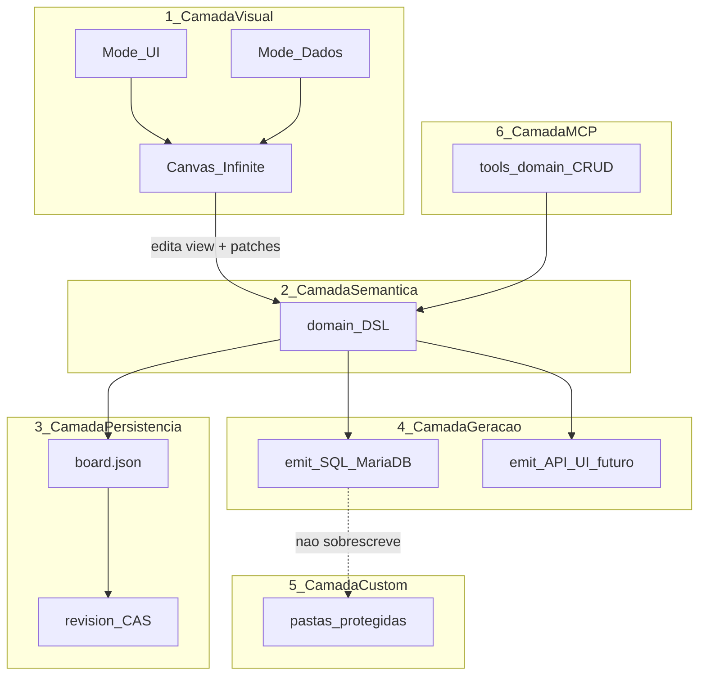

# Arquitetura: modelo visual executável (Fase 1 PoC)

## Decisões travadas

- **1C** — Híbrido: modelo controla o estrutural; código customizado protegido (sincronização código→modelo fora do MVP).
- **3B** — DSL/schema semântico versionável; SQL MariaDB/MySQL é **projeção**, não o centro.
- **4B** — Um projeto, um modelo semântico; modos de view (`UI` | `Dados` na Fase 1).
- Fase 1 prova a arquitetura maior; não é o produto final.

## Princípio

O canvas **apresenta** e **edita** o modelo. A fonte estrutural do sistema é o **modelo semântico (DSL)**. Telas, SQL, APIs futuras e código gerado são **projeções** ou **bindings** desse modelo.



---

## 1. Modelo de dados interno (DSL semântico)

Novo namespace no board: `domain` (não misturar com `screens[].nodes` de UI).

### Forma Fase 1 (extensível)

```js
domain: {
  version: 1,                    // schema do DSL (não confundir com board.version)
  dialectHints: { sql: 'mariadb' }, // só dica de projeção; tipos canônicos são neutros
  entities: [
    {
      id: 'ent_client',
      name: 'Client',              // nome lógico
      tableName: 'clients',        // projeção SQL (opcional; default snake_case)
      fields: [
        {
          id: 'fld_id',
          name: 'id',
          type: 'uuid',            // tipo canônico (não VARCHAR)
          primaryKey: true,
          nullable: false,
          unique: false,
          default: null,
          // futuro: validation, uiWidget, apiExpose
        },
        { id: 'fld_name', name: 'name', type: 'string', nullable: false, length: 120 }
      ]
    }
  ],
  relationships: [
    {
      id: 'rel_order_client',
      type: 'manyToOne',           // oneToOne | oneToMany | manyToOne | manyToMany
      fromEntityId: 'ent_order',
      toEntityId: 'ent_client',
      fromFieldId: 'fld_client_id', // FK no lado "many" (quando aplicável)
      toFieldId: 'fld_id',
      onDelete: 'restrict'         // restrict | cascade | setNull
    }
  ],
  // stubs vazios reservados (Fase 2+) — arrays vazios, não omitir a chave após v1
  apis: [],
  rules: [],
  functions: [],
  bindings: []                   // Screen→Entity, Field→EntityField, etc.
}
```

### Tipos canônicos (DB-agnósticos)

`uuid | string | text | int | bigint | decimal | boolean | date | datetime | json | enum`

Mapeamento para MariaDB vive **só** no emissor SQL (`string`→`VARCHAR(n)`, `uuid`→`CHAR(36)`, etc.).

### Constraints na Fase 1

- Por campo: `primaryKey`, `unique`, `nullable`, `length` / `precision`+`scale`, `default`
- Por relationship: cardinalidade + `onDelete`
- Índices compostos / checks custom: reservar `entity.indexes[]` e `entity.checks[]` (podem ficar vazios)

**Não** colocar SQL cru no DSL. **Não** acoplar nomes de coluna MySQL como identidade — `id` lógico é estável; `tableName`/`columnName` são projeções.

---

## 2. Papel do board JSON atual

O [board](figmashow/packages/core/src/schema.js) continua sendo o **documento de projeto** (CAS via `revision`):

| Parte atual | Papel |
|-------------|--------|
| `screens`, `components`, `prototypes`, `comments`, `tokens` | Camada visual / UI + protótipo |
| `revision`, `version`, `versions[]` | Persistência, sync UI↔MCP, snapshots |
| **`domain` (novo)** | Modelo semântico único do projeto |

Regra: **UI nodes não são a fonte de entidades.** Um “frame de entidade” no modo Dados é **vista** do `domain.entities[i]`, não um `BoardNode` retângulo genérico que “significa” tabela.

Compat: `normalizeBoard` inicializa `domain` vazio se ausente; projetos antigos abrem sem quebrar.

Snapshots (`versions[]`) devem incluir `domain` (igual screens hoje), para o modelo semântico versionar junto com o projeto.

---

## 3. Visual ↔ semântico (contrato)

### Dois espaços no mesmo canvas (modo 4B)

- **Modo UI**: mostra `screens` (comportamento atual).
- **Modo Dados**: mostra **views de domínio** — artefatos posicionados no canvas ligados por id semântico.

### Representação visual sugerida

```js
// no board, ao lado de screens — layout só do modo Dados
domainViews: {
  entities: [
    { entityId: 'ent_client', x: 100, y: 80, width: 280, height: 320 }
  ],
  // arestas podem ser derivadas de relationships + posições; cache opcional
}
```

- Mover/redimensionar card de entidade → altera só `domainViews` (visual).
- Renomear entidade / adicionar campo → altera `domain` (semântico) e a view re-renderiza.
- Deletar entidade no modo Dados → remove de `domain` + `domainViews` + relationships órfãs (scrub).

### Separação estrita

| Ação do usuário | Escreve em |
|-----------------|------------|
| Pan/zoom, posição do card | `domainViews` |
| Nome, campos, tipos, FKs | `domain` |
| Desenhar tela UI | `screens` |
| Futuro: “este form edita Client” | `domain.bindings[]` |

Fase 1: **sem** bindings obrigatórios entre UI e Dados; só coexistência no mesmo board.

---

## 4. Versionamento do DSL

Três eixos distintos:

1. **`domain.version`** — versão do *formato* do DSL (migrations de shape: v1→v2 adiciona `apis`).
2. **`board.revision`** — CAS de escrita (UI e MCP); qualquer patch em `domain` incrementa revision como hoje.
3. **`board.versions[]`** — snapshots nomeados do usuário (incluem `domain` + `domainViews`).

Evolução do formato: `normalizeDomain(raw)` no core (como `normalizePrototypes`), defaults e stubs (`apis: []`, …) para forward-compat.

---

## 5. SQL como projeção (camada 4)

Pipeline:

```
domain (canônico)
  → validateDomain()
  → projectToSqlModel({ dialect: 'mariadb' })
  → emitSqlDDL() | emitMigrationDiff(previousDomain, nextDomain)
```

- **Output Fase 1**: arquivo(s) gerados (ex. `generated/db/schema.sql` e/ou migrations timestamped) em pasta marcada como **gerada**.
- Diff incremental (desejável no PoC): comparar domain anterior vs novo → `ALTER` quando possível; senão documento “breaking, recreate”.
- Dialect só no projector; trocar para Postgres depois = novo projector, **mesmo** `domain`.

Contrato: regenerar SQL **nunca** escreve em pastas de custom code.

---

## 6. MCP (camada 6)

Tools de domínio (espelham a UI; não editam SQL à mão como fonte):

| Tool | Efeito |
|------|--------|
| `list_entities` / `get_entity` | Lê `domain` |
| `create_entity` / `update_entity` / `delete_entity` | Mutação semântica + view default |
| `add_field` / `update_field` / `remove_field` | |
| `add_relationship` / `delete_relationship` | |
| `set_editor_mode` | `ui` \| `data` (opcional) |
| `generate_sql` | Dispara projeção; retorna path + preview |

Todas passam pelo mesmo `commitBoard` / operations + `revision` (evitar last-write-wins UI vs MCP — já é a onda de confiança do produto).

Proibido no MCP Fase 1: “criar tabela” via SQL string como fonte de verdade.

---

## 7. Evolução sem quebrar a Fase 1

Estender **por adição** no mesmo `domain`:

| Fase | Acrescenta em `domain` | Nova projeção | Modo view |
|------|------------------------|---------------|-----------|
| 1 | `entities`, `relationships` | SQL | Dados |
| 2 | `apis[]` (recursos CRUD ligados a entityId) | OpenAPI / handlers | API |
| 3 | `bindings[]` (screenId/nodeId ↔ entityId/fieldId) | scaffold de tela CRUD | UI+Dados ligados |
| 4 | `rules[]`, `functions[]` | validadores / jobs | Fluxos |
| 5 | pacote de geração de app | projeto executável + custom zones | — |

Views novas (`domainViews.apis`, etc.) sem migrar entidades existentes.

Bindings exemplo (futuro, já reservado):

```js
{ id: 'bind_1', type: 'formEditsEntity', screenId: '...', nodeId: '...', entityId: 'ent_client' }
```

---

## Contratos das 6 camadas (resumo)

1. **Visual** — Canvas + modos; só layout/views; não define tipos de campo.
2. **Semântica** — `domain` canônico; única fonte estrutural.
3. **Persistência** — `board.json` + `revision` + snapshots; inclui `domain` + `domainViews`.
4. **Geração** — funções puras `domain → artefatos`; idempotentes o quanto possível; pasta `generated/`.
5. **Custom** — pastas/arquivos marcados (`custom/`, ou regiões `// @figmashow-managed` vs `// @figmashow-custom`); gerador não sobrescreve.
6. **MCP** — CRUD do `domain` + `generate_*`; mesmo pipeline da UI.

---

## Pacotes sugeridos (quando for implementar — fora deste plano de execução)

- `packages/core/src/domain/` — tipos, `normalizeDomain`, `validateDomain`, scrub refs
- `packages/core/src/generate/sql/` — projector MariaDB
- UI: toggle modo + `EntityFrame` no canvas (só modo Dados)
- MCP: tools acima em [createServer.js](figmashow/packages/mcp/src/createServer.js)

## Fora da Fase 1

Bidirecional código→modelo; multiplayer; Auto Layout; Smart Animate; OutSystems-like full; bindings UI↔Entity funcionais.

## Critério de sucesso do PoC

1. Criar 2 entidades + 1 relacionamento no modo Dados.
2. Persistidos em `domain` no board (não só como retângulos).
3. `generate_sql` produz DDL MariaDB coerente.
4. Modo UI inalterado para telas existentes.
5. Snapshot de versão restaura `domain`.
6. Documento de arquitetura (este plano) ainda descreve Fase 2+ sem refactor de identidade dos `entity.id`.
